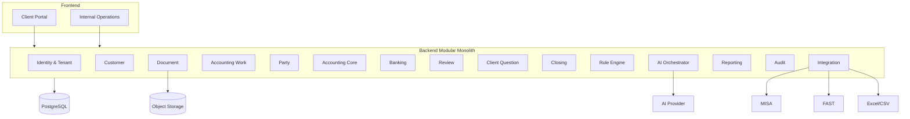
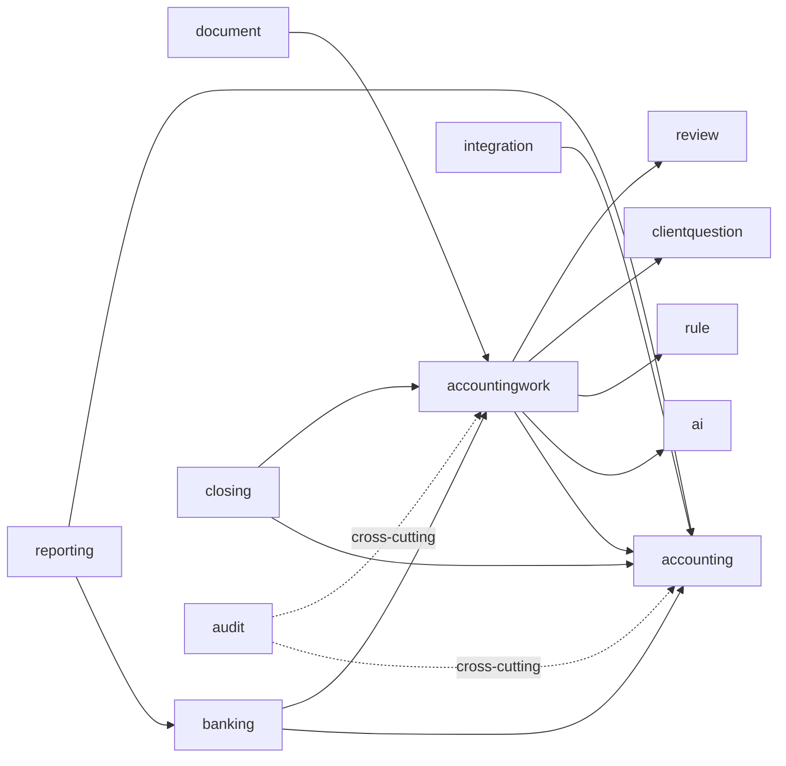
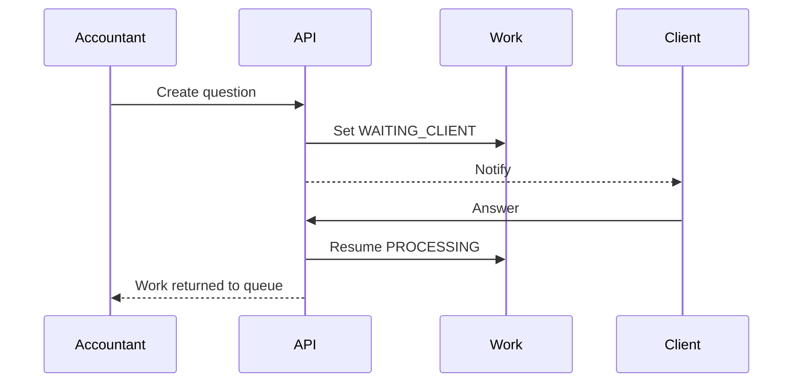
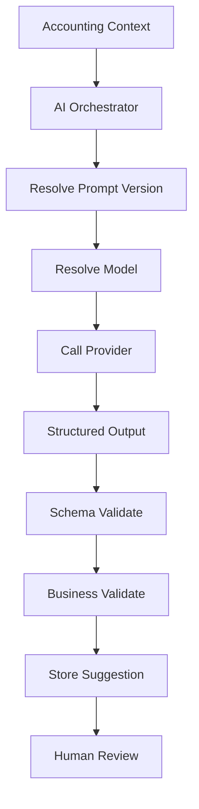
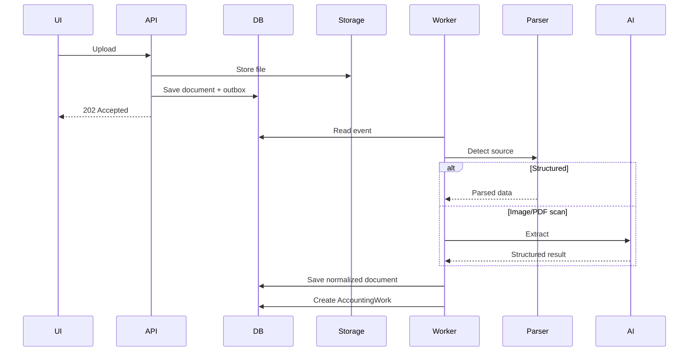
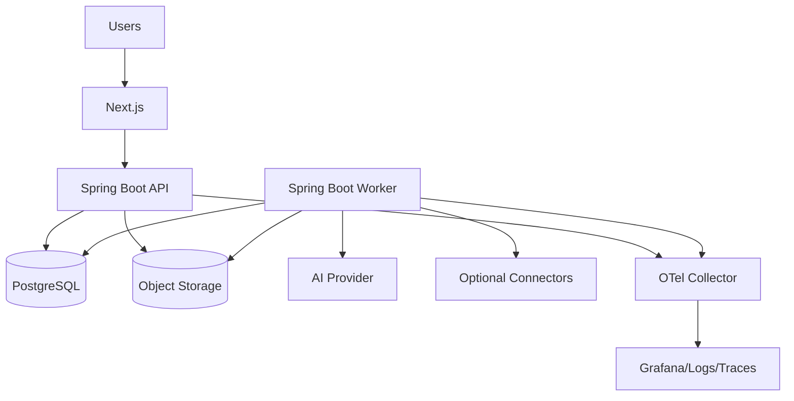
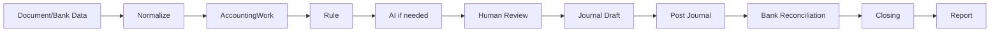

# TECHNICAL IMPLEMENTATION DESIGN
# Accounting Service Operating System
## Thiết kế kỹ thuật chi tiết để triển khai từ TDD nghiệp vụ

**Phiên bản:** 1.0  
**Trạng thái:** Implementation Design  
**Đối tượng đọc:** Backend, Frontend, QA, DevOps, Tech Lead  
**Kiến trúc mục tiêu:** Modular Monolith trước, tách service sau nếu có lý do rõ ràng  
**Ngôn ngữ đề xuất:** Java 21 + Spring Boot + Gradle + jOOQ  
**Database:** PostgreSQL  
**Frontend:** React / Next.js / TypeScript  
**Storage:** S3-compatible  
**Async:** PostgreSQL Outbox + Worker  
**Observability:** OpenTelemetry

---

# 1. Mục tiêu tài liệu

Tài liệu này không giải thích lại nghiệp vụ kế toán.

Nó giả định TDD nghiệp vụ đã xác định flow:

```text
Khách gửi dữ liệu
↓
Hệ thống đọc
↓
Rule / AI gợi ý
↓
Kế toán review
↓
Accounting Core ghi nhận
↓
Đối chiếu
↓
Closing
↓
Báo cáo
```

Tài liệu này trả lời:

```text
Code chia module thế nào?
DB gồm bảng gì?
Transaction boundary ở đâu?
Service nào gọi service nào?
State được lưu thế nào?
API ra sao?
Async xử lý thế nào?
AI nằm ở đâu?
Rule Engine thiết kế sao?
Audit thế nào?
Multi-tenant thế nào?
Test ra sao?
```

---

# 2. Kiến trúc tổng thể



---

# 3. Vì sao chọn Modular Monolith

Không microservice ngay.

Lý do:

```text
- domain còn thay đổi nhiều;
- team ban đầu nhỏ;
- transaction nghiệp vụ cần đơn giản;
- cần debug nhanh;
- tránh distributed transaction;
- tránh message broker complexity;
- dễ refactor boundary khi domain rõ hơn.
```

Nguyên tắc:

> Module boundary phải rõ như service boundary, dù cùng chạy trong một process.

---

# 4. Module Boundary

Đề xuất:

```text
identity
tenant
customer
document
accountingwork
party
accounting
banking
review
clientquestion
closing
rule
ai
reporting
integration
audit
notification
```

Dependency rule:

```text
UI/API
↓
Application Service
↓
Domain
↓
Repository/Adapter
```

Không cho module tùy tiện query bảng module khác.

---

# 5. Dependency Map



---

# 6. Package Structure

```text
com.company.accountingos
├── identity
├── tenant
├── customer
├── document
├── accountingwork
├── party
├── accounting
├── banking
├── review
├── clientquestion
├── closing
├── rule
├── ai
├── reporting
├── integration
├── audit
└── shared
```

Mỗi module:

```text
<module>/
├── api/
├── application/
├── domain/
└── infrastructure/
```

Ví dụ:

```text
document/
├── api/
│   └── DocumentController.java
├── application/
│   └── DocumentService.java
├── domain/
│   ├── Document.java
│   └── DocumentRepository.java
└── infrastructure/
    ├── JooqDocumentRepository.java
    └── S3DocumentStorage.java
```

---

# 7. Database Strategy

Dùng một PostgreSQL database.

MVP:

```text
shared database
shared schema
tenant_id trên business table
```

Không dùng database-per-tenant ngay.

Mọi business table:

```text
tenant_id UUID NOT NULL
```

Index thường xuyên:

```text
(tenant_id, id)
(tenant_id, status)
(tenant_id, created_at)
```

---

# 8. Base Table Conventions

Mọi aggregate table nên có:

```text
id UUID PK
tenant_id UUID NOT NULL
created_at timestamptz NOT NULL
created_by UUID NULL
updated_at timestamptz NOT NULL
updated_by UUID NULL
version BIGINT NOT NULL DEFAULT 0
```

`version` dùng optimistic locking.

Không dùng soft delete cho mọi thứ mặc định.

Chỉ dùng khi business cần.

---

# 9. Tenant Tables

## tenants

```sql
CREATE TABLE tenants (
    id UUID PRIMARY KEY,
    code VARCHAR(50) NOT NULL UNIQUE,
    legal_name VARCHAR(255) NOT NULL,
    tax_code VARCHAR(50),
    base_currency VARCHAR(3) NOT NULL DEFAULT 'VND',
    timezone VARCHAR(50) NOT NULL DEFAULT 'Asia/Ho_Chi_Minh',
    status VARCHAR(30) NOT NULL,
    created_at TIMESTAMPTZ NOT NULL,
    updated_at TIMESTAMPTZ NOT NULL
);
```

## users

```sql
CREATE TABLE users (
    id UUID PRIMARY KEY,
    email VARCHAR(255) NOT NULL UNIQUE,
    name VARCHAR(255) NOT NULL,
    status VARCHAR(30) NOT NULL,
    created_at TIMESTAMPTZ NOT NULL,
    updated_at TIMESTAMPTZ NOT NULL
);
```

## tenant_memberships

```sql
CREATE TABLE tenant_memberships (
    tenant_id UUID NOT NULL,
    user_id UUID NOT NULL,
    role VARCHAR(50) NOT NULL,
    status VARCHAR(30) NOT NULL,
    PRIMARY KEY (tenant_id, user_id)
);
```

---

# 10. Customer Module

Nếu mỗi tenant tương ứng một customer company thì `tenant` có thể chính là customer.

Nếu sau này một tenant chứa nhiều legal entity:

```text
tenant
└── legal_entities
```

MVP đơn giản:

> 1 tenant = 1 customer company.

Không tạo thêm `customer` table nếu chưa cần.

---

# 11. Document Tables

## documents

```sql
CREATE TABLE documents (
    id UUID PRIMARY KEY,
    tenant_id UUID NOT NULL,
    document_type VARCHAR(50),
    source VARCHAR(50) NOT NULL,
    original_filename VARCHAR(500),
    mime_type VARCHAR(100),
    storage_key VARCHAR(1000) NOT NULL,
    sha256 VARCHAR(64) NOT NULL,
    status VARCHAR(30) NOT NULL,
    uploaded_by UUID,
    uploaded_at TIMESTAMPTZ NOT NULL,
    created_at TIMESTAMPTZ NOT NULL,
    updated_at TIMESTAMPTZ NOT NULL
);

CREATE INDEX idx_documents_tenant_status
ON documents(tenant_id, status);

CREATE UNIQUE INDEX uq_documents_tenant_sha256
ON documents(tenant_id, sha256);
```

---

# 12. document_versions

Nếu cho phép version:

```sql
CREATE TABLE document_versions (
    id UUID PRIMARY KEY,
    tenant_id UUID NOT NULL,
    document_id UUID NOT NULL,
    version_no INT NOT NULL,
    storage_key VARCHAR(1000) NOT NULL,
    sha256 VARCHAR(64) NOT NULL,
    created_at TIMESTAMPTZ NOT NULL,
    UNIQUE(document_id, version_no)
);
```

---

# 13. normalized_documents

Không nhét toàn bộ parsed data vào `documents`.

```sql
CREATE TABLE normalized_documents (
    id UUID PRIMARY KEY,
    tenant_id UUID NOT NULL,
    document_id UUID NOT NULL UNIQUE,
    schema_version VARCHAR(20) NOT NULL,
    data JSONB NOT NULL,
    extraction_method VARCHAR(30) NOT NULL,
    confidence NUMERIC(5,4),
    created_at TIMESTAMPTZ NOT NULL,
    updated_at TIMESTAMPTZ NOT NULL
);
```

`data` JSONB chứa canonical structure.

---

# 14. Accounting Work

Đây là bảng trung tâm của workflow.

```sql
CREATE TABLE accounting_works (
    id UUID PRIMARY KEY,
    tenant_id UUID NOT NULL,
    work_type VARCHAR(50) NOT NULL,
    source_type VARCHAR(50),
    source_id UUID,
    status VARCHAR(30) NOT NULL,
    priority VARCHAR(20) NOT NULL,
    risk_level VARCHAR(20),
    assigned_to UUID,
    accounting_period DATE,
    title VARCHAR(500),
    description TEXT,
    created_at TIMESTAMPTZ NOT NULL,
    updated_at TIMESTAMPTZ NOT NULL,
    version BIGINT NOT NULL DEFAULT 0
);
```

Status MVP:

```text
NEW
PROCESSING
WAITING_CLIENT
WAITING_REVIEW
APPROVED
DONE
FAILED
```

---

# 15. Accounting Work Event

Lưu lịch sử event riêng.

```sql
CREATE TABLE accounting_work_events (
    id UUID PRIMARY KEY,
    tenant_id UUID NOT NULL,
    accounting_work_id UUID NOT NULL,
    event_type VARCHAR(50) NOT NULL,
    actor_type VARCHAR(30) NOT NULL,
    actor_id UUID,
    payload JSONB,
    created_at TIMESTAMPTZ NOT NULL
);
```

Không dùng bảng này thay cho current state.

Current state ở `accounting_works.status`.

---

# 16. State Transition Service

Không cho controller set status tự do.

Tạo:

```java
public interface AccountingWorkStateMachine {
    AccountingWork transition(
        AccountingWork work,
        AccountingWorkEvent event
    );
}
```

Pseudo:

```java
switch (work.status()) {
    case NEW -> ...
    case PROCESSING -> ...
    case WAITING_CLIENT -> ...
}
```

Invalid transition:

```text
409 CONFLICT
```

---

# 17. Party Module

```sql
CREATE TABLE parties (
    id UUID PRIMARY KEY,
    tenant_id UUID NOT NULL,
    party_type VARCHAR(30) NOT NULL,
    code VARCHAR(100),
    name VARCHAR(255) NOT NULL,
    tax_code VARCHAR(50),
    normalized_name VARCHAR(255),
    status VARCHAR(30) NOT NULL,
    metadata JSONB,
    created_at TIMESTAMPTZ NOT NULL,
    updated_at TIMESTAMPTZ NOT NULL
);
```

Types:

```text
CUSTOMER
SUPPLIER
EMPLOYEE
PARTNER
OTHER
```

---

# 18. Accounting Core — Chart of Accounts

```sql
CREATE TABLE accounts (
    id UUID PRIMARY KEY,
    tenant_id UUID NOT NULL,
    account_code VARCHAR(50) NOT NULL,
    account_name VARCHAR(255) NOT NULL,
    account_type VARCHAR(50),
    parent_id UUID,
    allow_posting BOOLEAN NOT NULL DEFAULT TRUE,
    status VARCHAR(30) NOT NULL,
    created_at TIMESTAMPTZ NOT NULL,
    updated_at TIMESTAMPTZ NOT NULL,
    UNIQUE(tenant_id, account_code)
);
```

---

# 19. Accounting Period

```sql
CREATE TABLE accounting_periods (
    id UUID PRIMARY KEY,
    tenant_id UUID NOT NULL,
    period_start DATE NOT NULL,
    period_end DATE NOT NULL,
    status VARCHAR(20) NOT NULL,
    closed_at TIMESTAMPTZ,
    closed_by UUID,
    UNIQUE(tenant_id, period_start, period_end)
);
```

Status:

```text
OPEN
CLOSING
CLOSED
```

---

# 20. Journal Draft

```sql
CREATE TABLE journal_drafts (
    id UUID PRIMARY KEY,
    tenant_id UUID NOT NULL,
    accounting_work_id UUID NOT NULL,
    status VARCHAR(30) NOT NULL,
    source VARCHAR(30) NOT NULL,
    risk_level VARCHAR(20),
    description TEXT,
    created_at TIMESTAMPTZ NOT NULL,
    updated_at TIMESTAMPTZ NOT NULL,
    version BIGINT NOT NULL DEFAULT 0
);
```

---

# 21. Journal Draft Line

```sql
CREATE TABLE journal_draft_lines (
    id UUID PRIMARY KEY,
    tenant_id UUID NOT NULL,
    journal_draft_id UUID NOT NULL,
    line_no INT NOT NULL,
    account_id UUID NOT NULL,
    party_id UUID,
    debit NUMERIC(20,2) NOT NULL DEFAULT 0,
    credit NUMERIC(20,2) NOT NULL DEFAULT 0,
    currency VARCHAR(3) NOT NULL DEFAULT 'VND',
    description TEXT,
    metadata JSONB,
    UNIQUE(journal_draft_id, line_no)
);
```

---

# 22. Journal Entry

Sau khi approve, tạo immutable journal entry.

```sql
CREATE TABLE journal_entries (
    id UUID PRIMARY KEY,
    tenant_id UUID NOT NULL,
    accounting_work_id UUID,
    journal_no VARCHAR(100) NOT NULL,
    posting_date DATE NOT NULL,
    accounting_period_id UUID NOT NULL,
    description TEXT,
    status VARCHAR(20) NOT NULL,
    created_at TIMESTAMPTZ NOT NULL,
    created_by UUID,
    UNIQUE(tenant_id, journal_no)
);
```

Status:

```text
POSTED
REVERSED
```

Không update line sau khi POSTED.

---

# 23. Journal Entry Line

```sql
CREATE TABLE journal_entry_lines (
    id UUID PRIMARY KEY,
    tenant_id UUID NOT NULL,
    journal_entry_id UUID NOT NULL,
    line_no INT NOT NULL,
    account_id UUID NOT NULL,
    party_id UUID,
    debit NUMERIC(20,2) NOT NULL DEFAULT 0,
    credit NUMERIC(20,2) NOT NULL DEFAULT 0,
    currency VARCHAR(3) NOT NULL DEFAULT 'VND',
    description TEXT,
    metadata JSONB,
    UNIQUE(journal_entry_id, line_no)
);
```

---

# 24. Journal Posting Transaction

Posting phải trong một DB transaction:

```text
lock draft
↓
validate draft status
↓
validate period OPEN
↓
validate debit == credit
↓
create journal_entry
↓
copy draft lines
↓
mark draft APPROVED/POSTED
↓
update AccountingWork
↓
write event
↓
write audit
↓
commit
```

Không gọi external connector trong transaction.

---

# 25. Journal Validation Service

```java
public interface JournalValidator {
    ValidationResult validate(JournalDraft draft);
}
```

Validators:

```text
BalancedJournalValidator
OpenPeriodValidator
AccountExistsValidator
PostingAllowedValidator
AmountValidator
PartyRequiredValidator
```

Dùng composite pattern:

```java
List<JournalValidationRule>
```

---

# 26. Review Module

```sql
CREATE TABLE reviews (
    id UUID PRIMARY KEY,
    tenant_id UUID NOT NULL,
    accounting_work_id UUID NOT NULL,
    review_type VARCHAR(30) NOT NULL,
    required_role VARCHAR(50),
    status VARCHAR(20) NOT NULL,
    decision VARCHAR(20),
    assigned_to UUID,
    reviewed_by UUID,
    comment TEXT,
    created_at TIMESTAMPTZ NOT NULL,
    reviewed_at TIMESTAMPTZ
);
```

States:

```text
OPEN
IN_REVIEW
APPROVED
REJECTED
CANCELLED
```

---

# 27. Review Service

```java
public interface ReviewService {
    Review createReview(CreateReviewCommand cmd);
    ReviewDecisionResult decideReview(DecideReviewCommand cmd);
}
```

Review approve không tự động post journal nếu business chưa muốn.

Có thể tách:

```text
Approve Review
→ AccountingWork APPROVED
→ PostingService.post(...)
```

---

# 28. Client Question

```sql
CREATE TABLE client_questions (
    id UUID PRIMARY KEY,
    tenant_id UUID NOT NULL,
    accounting_work_id UUID NOT NULL,
    question_type VARCHAR(30) NOT NULL,
    question TEXT NOT NULL,
    status VARCHAR(20) NOT NULL,
    due_at TIMESTAMPTZ,
    assigned_user_id UUID,
    answer TEXT,
    answered_at TIMESTAMPTZ,
    created_at TIMESTAMPTZ NOT NULL
);
```

---

# 29. Client Question Flow



---

# 30. Banking Tables

## bank_accounts

```sql
CREATE TABLE bank_accounts (
    id UUID PRIMARY KEY,
    tenant_id UUID NOT NULL,
    bank_name VARCHAR(100),
    account_number_masked VARCHAR(100),
    currency VARCHAR(3) NOT NULL,
    status VARCHAR(20) NOT NULL,
    created_at TIMESTAMPTZ NOT NULL
);
```

## bank_transactions

```sql
CREATE TABLE bank_transactions (
    id UUID PRIMARY KEY,
    tenant_id UUID NOT NULL,
    bank_account_id UUID NOT NULL,
    external_id VARCHAR(255),
    transaction_date DATE NOT NULL,
    value_date DATE,
    amount NUMERIC(20,2) NOT NULL,
    currency VARCHAR(3) NOT NULL,
    description TEXT,
    counterparty VARCHAR(255),
    reference VARCHAR(255),
    fingerprint VARCHAR(128) NOT NULL,
    status VARCHAR(20) NOT NULL,
    created_at TIMESTAMPTZ NOT NULL,
    UNIQUE(tenant_id, bank_account_id, fingerprint)
);
```

---

# 31. Reconciliation

```sql
CREATE TABLE reconciliations (
    id UUID PRIMARY KEY,
    tenant_id UUID NOT NULL,
    bank_transaction_id UUID NOT NULL,
    target_type VARCHAR(30) NOT NULL,
    target_id UUID NOT NULL,
    match_score NUMERIC(5,4),
    status VARCHAR(20) NOT NULL,
    confirmed_by UUID,
    confirmed_at TIMESTAMPTZ,
    created_at TIMESTAMPTZ NOT NULL
);
```

Target có thể:

```text
JOURNAL_ENTRY
RECEIVABLE
PAYABLE
```

---

# 32. Matching Service

```java
public interface BankMatchingService {
    List<MatchCandidate> findCandidates(BankTransaction tx);
}
```

Signals:

```text
amount
party
date
reference
description
invoice number
```

Scoring deterministic trước.

AI chỉ dùng semantic fallback.

---

# 33. Receivable

```sql
CREATE TABLE receivables (
    id UUID PRIMARY KEY,
    tenant_id UUID NOT NULL,
    party_id UUID NOT NULL,
    source_journal_entry_id UUID,
    invoice_ref VARCHAR(255),
    due_date DATE,
    original_amount NUMERIC(20,2) NOT NULL,
    paid_amount NUMERIC(20,2) NOT NULL DEFAULT 0,
    outstanding_amount NUMERIC(20,2) NOT NULL,
    status VARCHAR(20) NOT NULL,
    created_at TIMESTAMPTZ NOT NULL,
    updated_at TIMESTAMPTZ NOT NULL
);
```

---

# 34. Payable

Cấu trúc tương tự:

```sql
CREATE TABLE payables (
    id UUID PRIMARY KEY,
    tenant_id UUID NOT NULL,
    party_id UUID NOT NULL,
    source_journal_entry_id UUID,
    invoice_ref VARCHAR(255),
    due_date DATE,
    original_amount NUMERIC(20,2) NOT NULL,
    paid_amount NUMERIC(20,2) NOT NULL DEFAULT 0,
    outstanding_amount NUMERIC(20,2) NOT NULL,
    status VARCHAR(20) NOT NULL,
    created_at TIMESTAMPTZ NOT NULL,
    updated_at TIMESTAMPTZ NOT NULL
);
```

---

# 35. Closing Tables

## closing_months

```sql
CREATE TABLE closing_months (
    id UUID PRIMARY KEY,
    tenant_id UUID NOT NULL,
    accounting_period_id UUID NOT NULL,
    status VARCHAR(30) NOT NULL,
    started_at TIMESTAMPTZ,
    ready_for_review_at TIMESTAMPTZ,
    approved_at TIMESTAMPTZ,
    approved_by UUID,
    closed_at TIMESTAMPTZ,
    UNIQUE(tenant_id, accounting_period_id)
);
```

---

# 36. closing_tasks

```sql
CREATE TABLE closing_tasks (
    id UUID PRIMARY KEY,
    tenant_id UUID NOT NULL,
    closing_month_id UUID NOT NULL,
    task_key VARCHAR(100) NOT NULL,
    title VARCHAR(255) NOT NULL,
    status VARCHAR(30) NOT NULL,
    blocker BOOLEAN NOT NULL DEFAULT FALSE,
    assigned_to UUID,
    evidence JSONB,
    completed_at TIMESTAMPTZ,
    created_at TIMESTAMPTZ NOT NULL,
    UNIQUE(closing_month_id, task_key)
);
```

---

# 37. Closing Template

Không hard-code checklist trong Java.

Tạo config:

```yaml
default_service_company:
  - key: DOCUMENT_COMPLETE
    blocker: true
  - key: BANK_RECONCILED
    blocker: true
  - key: AR_REVIEWED
    blocker: false
  - key: AP_REVIEWED
    blocker: false
  - key: PAYROLL_RECORDED
    blocker: true
  - key: SENIOR_REVIEW
    blocker: true
```

Sau này có thể chuyển DB.

---

# 38. Rule Engine Tables

## rules

```sql
CREATE TABLE rules (
    id UUID PRIMARY KEY,
    tenant_id UUID,
    rule_key VARCHAR(100) NOT NULL,
    scope VARCHAR(30) NOT NULL,
    status VARCHAR(20) NOT NULL,
    created_at TIMESTAMPTZ NOT NULL
);
```

`tenant_id NULL` = global rule.

---

# 39. rule_versions

```sql
CREATE TABLE rule_versions (
    id UUID PRIMARY KEY,
    rule_id UUID NOT NULL,
    version_no INT NOT NULL,
    condition_json JSONB NOT NULL,
    action_json JSONB NOT NULL,
    effective_from TIMESTAMPTZ,
    effective_to TIMESTAMPTZ,
    approved_by UUID,
    created_at TIMESTAMPTZ NOT NULL,
    UNIQUE(rule_id, version_no)
);
```

---

# 40. Rule Engine Design

MVP không cần Drools.

Tạo simple interpreter:

```java
public interface RuleEvaluator {
    RuleEvaluationResult evaluate(
        AccountingContext context,
        RuleVersion rule
    );
}
```

Condition JSON ví dụ:

```json
{
  "all": [
    {
      "field": "vendor.taxCode",
      "operator": "EQ",
      "value": "031..."
    },
    {
      "field": "document.type",
      "operator": "EQ",
      "value": "PURCHASE_INVOICE"
    }
  ]
}
```

Action JSON:

```json
{
  "category": "CLOUD_SERVICE",
  "accountCode": "642",
  "riskLevel": "LOW"
}
```

---

# 41. Rule Evaluation Order

```text
tenant-specific rule
↓
global exact rule
↓
historical mapping
↓
AI suggestion
↓
human review
```

Không để AI override exact rule.

---

# 42. Historical Mapping

Bảng đơn giản:

```sql
CREATE TABLE accounting_mappings (
    id UUID PRIMARY KEY,
    tenant_id UUID NOT NULL,
    mapping_type VARCHAR(30) NOT NULL,
    source_key VARCHAR(255) NOT NULL,
    target_json JSONB NOT NULL,
    usage_count BIGINT NOT NULL DEFAULT 0,
    last_used_at TIMESTAMPTZ,
    created_at TIMESTAMPTZ NOT NULL,
    UNIQUE(tenant_id, mapping_type, source_key)
);
```

Ví dụ:

```text
VENDOR_TAX_CODE
031...
→ account 642
```

---

# 43. AI Orchestrator

Không call OpenAI trực tiếp từ business module.

Tạo abstraction:

```java
public interface AiGateway {
    <T> AiResult<T> execute(AiRequest<T> request);
}
```

Các use case:

```text
DOCUMENT_EXTRACTION
ACCOUNTING_CLASSIFICATION
SEMANTIC_MATCHING
ANOMALY_EXPLANATION
CLIENT_SUMMARY
```

---

# 44. AI Suggestion Table

```sql
CREATE TABLE ai_suggestions (
    id UUID PRIMARY KEY,
    tenant_id UUID NOT NULL,
    accounting_work_id UUID,
    use_case VARCHAR(50) NOT NULL,
    provider VARCHAR(50) NOT NULL,
    model VARCHAR(100) NOT NULL,
    prompt_version VARCHAR(50) NOT NULL,
    input_hash VARCHAR(64) NOT NULL,
    output_json JSONB NOT NULL,
    confidence NUMERIC(5,4),
    status VARCHAR(20) NOT NULL,
    created_at TIMESTAMPTZ NOT NULL
);
```

---

# 45. Prompt Registry

Prompt không hard-code lung tung.

Có thể bắt đầu file-based:

```text
prompts/
├── document-extraction/
│   └── v1.md
├── accounting-classification/
│   └── v1.md
└── client-summary/
    └── v1.md
```

Metadata:

```yaml
key: accounting-classification
version: v1
model_policy: smart
schema: AccountingClassificationResult
```

---

# 46. AI Processing Flow



---

# 47. AI Failure

Nếu:

```text
timeout
invalid JSON
schema fail
provider fail
```

Flow:

```text
limited retry
↓
fallback provider/model nếu có
↓
mark AI_FAILED
↓
route human review
```

Không block workflow vô hạn.

---

# 48. Background Job Model

Bảng:

```sql
CREATE TABLE jobs (
    id UUID PRIMARY KEY,
    tenant_id UUID,
    job_type VARCHAR(50) NOT NULL,
    payload JSONB NOT NULL,
    status VARCHAR(20) NOT NULL,
    attempts INT NOT NULL DEFAULT 0,
    max_attempts INT NOT NULL DEFAULT 3,
    run_after TIMESTAMPTZ NOT NULL,
    locked_at TIMESTAMPTZ,
    locked_by VARCHAR(100),
    last_error TEXT,
    created_at TIMESTAMPTZ NOT NULL,
    updated_at TIMESTAMPTZ NOT NULL
);
```

Worker dùng:

```sql
SELECT ...
FOR UPDATE SKIP LOCKED
```

---

# 49. Outbox

```sql
CREATE TABLE outbox_events (
    id UUID PRIMARY KEY,
    aggregate_type VARCHAR(50) NOT NULL,
    aggregate_id UUID NOT NULL,
    event_type VARCHAR(100) NOT NULL,
    payload JSONB NOT NULL,
    status VARCHAR(20) NOT NULL,
    created_at TIMESTAMPTZ NOT NULL,
    processed_at TIMESTAMPTZ
);
```

Use:

```text
business transaction
+
outbox write
=
same transaction
```

---

# 50. Domain Events

Ví dụ:

```text
DocumentUploaded
DocumentNormalized
AccountingWorkCreated
ClientQuestionCreated
ClientQuestionAnswered
ReviewRequested
ReviewApproved
JournalPosted
BankTransactionImported
ReconciliationConfirmed
ClosingStarted
ClosingCompleted
```

---

# 51. Application Service Example

Ví dụ `DocumentApplicationService`:

```java
@Transactional
public DocumentId upload(UploadDocumentCommand cmd) {
    tenantGuard.check(cmd.tenantId());

    var stored = storage.store(cmd.file());

    var doc = documentFactory.create(
        cmd.tenantId(),
        stored,
        sha256(cmd.file())
    );

    documentRepository.insert(doc);

    outboxRepository.add(
        DocumentUploadedEvent.of(doc)
    );

    return doc.id();
}
```

Không call AI trong transaction.

---

# 52. Worker Example

```java
public void handle(DocumentUploadedEvent event) {
    var document = documentRepository.get(event.documentId());

    var normalized = documentProcessor.process(document);

    normalizedDocumentRepository.save(normalized);

    accountingWorkService.createFromDocument(normalized);
}
```

---

# 53. Transaction Boundary

Nguyên tắc:

Một transaction chỉ bao một consistency boundary trong DB.

Được:

```text
create document
+
outbox
```

Được:

```text
approve review
+
update AccountingWork
+
audit
```

Không:

```text
DB transaction
+
OpenAI call
+
MISA call
+
email
```

---

# 54. API Conventions

Base:

```text
/api/v1
```

Response:

```json
{
  "data": {},
  "meta": {},
  "error": null
}
```

Error:

```json
{
  "data": null,
  "error": {
    "code": "INVALID_STATE_TRANSITION",
    "message": "..."
  }
}
```

---

# 55. Document API

```http
POST /api/v1/documents
GET  /api/v1/documents/{id}
GET  /api/v1/documents
```

Upload trả:

```json
{
  "id": "...",
  "status": "RECEIVED"
}
```

---

# 56. Accounting Work API

```http
GET /api/v1/accounting-works
GET /api/v1/accounting-works/{id}
POST /api/v1/accounting-works/{id}/assign
POST /api/v1/accounting-works/{id}/retry
```

Filters:

```text
status
risk
assignedTo
period
workType
```

---

# 57. Review API

```http
POST /api/v1/reviews/{id}/approve
POST /api/v1/reviews/{id}/reject
```

Payload:

```json
{
  "comment": "..."
}
```

---

# 58. Client Question API

```http
POST /api/v1/accounting-works/{id}/questions
POST /api/v1/client-questions/{id}/answer
GET  /api/v1/client-questions?status=OPEN
```

---

# 59. Banking API

```http
POST /api/v1/bank-imports
GET  /api/v1/bank-transactions
GET  /api/v1/bank-transactions/{id}/matches
POST /api/v1/reconciliations/{id}/confirm
```

---

# 60. Closing API

```http
POST /api/v1/closing-months
GET  /api/v1/closing-months/{id}
POST /api/v1/closing-months/{id}/tasks/{taskId}/complete
POST /api/v1/closing-months/{id}/submit-review
POST /api/v1/closing-months/{id}/approve
```

---

# 61. Auth

MVP:

```text
OIDC/JWT
```

JWT claims:

```text
sub
tenant_ids
roles
```

Backend resolve:

```text
RequestContext
- userId
- activeTenantId
- roles
```

---

# 62. Tenant Resolution

Frontend gửi:

```http
X-Tenant-Id
```

Backend verify user thuộc tenant đó.

Không lấy tenant ID từ body để authorize.

---

# 63. RBAC

Roles:

```text
CLIENT_OWNER
CLIENT_STAFF
ACCOUNTANT
SENIOR_ACCOUNTANT
ACCOUNTING_MANAGER
SYSTEM_ADMIN
```

Permission mapping:

```text
DOCUMENT_READ
DOCUMENT_UPLOAD
WORK_READ
WORK_ASSIGN
REVIEW_APPROVE
JOURNAL_POST
CLOSING_APPROVE
REPORT_VIEW
```

Role → permission trong code/config.

---

# 64. Audit

Bảng:

```sql
CREATE TABLE audit_events (
    id UUID PRIMARY KEY,
    tenant_id UUID NOT NULL,
    actor_type VARCHAR(30) NOT NULL,
    actor_id UUID,
    event_type VARCHAR(100) NOT NULL,
    entity_type VARCHAR(50) NOT NULL,
    entity_id UUID NOT NULL,
    before_json JSONB,
    after_json JSONB,
    reason TEXT,
    created_at TIMESTAMPTZ NOT NULL
);
```

Không log secret.

---

# 65. Audit Interceptor

Không nên audit mọi field tự động kiểu generic.

Audit business-critical action tại application service:

```text
review approve
journal post
rule change
period close
permission change
client answer
```

---

# 66. Optimistic Locking

Dùng `version`.

Update:

```sql
UPDATE accounting_works
SET status = ?, version = version + 1
WHERE id = ?
  AND version = ?;
```

Nếu rowcount = 0:

```text
409 CONFLICT
```

---

# 67. Idempotency

Upload/import API nhận:

```http
Idempotency-Key
```

Bảng:

```sql
CREATE TABLE idempotency_keys (
    tenant_id UUID NOT NULL,
    idempotency_key VARCHAR(255) NOT NULL,
    request_hash VARCHAR(64) NOT NULL,
    response_json JSONB,
    created_at TIMESTAMPTZ NOT NULL,
    PRIMARY KEY (tenant_id, idempotency_key)
);
```

---

# 68. File Storage

Object key:

```text
/{tenantId}/{yyyy}/{MM}/{documentId}/{version}
```

Không expose bucket path thật.

Download qua signed URL.

---

# 69. Document Processing Pipeline



---

# 70. Logging

Structured JSON logs:

```text
timestamp
level
trace_id
span_id
tenant_id
user_id
module
event
entity_id
```

Không log:

```text
password
token
full bank credential
raw restricted PII
```

---

# 71. OpenTelemetry

Signals:

```text
traces
metrics
logs
```

Trace important flows:

```text
document.upload
document.normalize
ai.extract
rule.evaluate
journal.post
bank.match
closing.complete
```

---

# 72. Metrics

Technical:

```text
http_server_duration
job_duration
job_failures
ai_request_duration
ai_request_cost
db_query_duration
```

Business:

```text
accounting_work_open
accounting_work_waiting_client
review_queue_size
automation_rate
human_review_rate
closing_duration
```

---

# 73. Health Checks

```text
/readiness
/liveness
```

Readiness check:

```text
DB
storage
```

Không bắt AI provider phải healthy để app ready.

AI là dependency degrade được.

---

# 74. Caching

MVP gần như chưa cần cache.

Có thể cache:

```text
chart of accounts
rule versions
permission mappings
```

Không cache workflow state nếu chưa cần.

---

# 75. Search

Postgres trước.

Search:

```text
document filename
party name
invoice ref
work title
```

Dùng:

```text
ILIKE
GIN trigram nếu cần
```

Không Elasticsearch sớm.

---

# 76. Reporting

Reporting query không nên join mọi table trực tiếp từ controller.

Tạo read model/service.

Ví dụ:

```text
OwnerDashboardQueryService
AccountantWorkQueueQueryService
ClosingOverviewQueryService
```

Có thể dùng SQL optimized riêng.

---

# 77. CQRS mức nhẹ

Không cần full CQRS.

Nhưng nên tách:

```text
Command Service
Query Service
```

Command giữ domain rule.

Query tối ưu cho UI.

---

# 78. Error Model

Codes:

```text
DOCUMENT_DUPLICATE
INVALID_STATE_TRANSITION
JOURNAL_NOT_BALANCED
PERIOD_CLOSED
REVIEW_REQUIRED
TENANT_ACCESS_DENIED
AI_PROCESSING_FAILED
BANK_TRANSACTION_DUPLICATE
CLOSING_BLOCKED
```

---

# 79. Validation Layers

## API validation

```text
required fields
format
length
```

## Domain validation

```text
state
business rule
period
permissions
```

## DB constraints

```text
unique
not null
fk
check
```

Không dựa vào một layer duy nhất.

---

# 80. Check Constraints

Ví dụ journal line:

```sql
CHECK (debit >= 0)
CHECK (credit >= 0)
CHECK (NOT (debit > 0 AND credit > 0))
```

Bank:

```sql
CHECK (amount <> 0)
```

---

# 81. Foreign Keys

MVP nên có FK cho core consistency.

Không bỏ FK chỉ vì "microservice future".

---

# 82. DB Index Strategy

Quan trọng:

```text
tenant_id + status
tenant_id + period
tenant_id + assigned_to
tenant_id + created_at
```

JSONB chỉ index key thật sự query.

Không GIN tất cả JSONB.

---

# 83. Database Migration

Dùng Flyway hoặc Liquibase.

Nguyên tắc:

```text
migration đã chạy không sửa
forward-only
backward-compatible khi release
```

---

# 84. Repository Pattern

Domain không phụ thuộc jOOQ generated class.

Ví dụ:

```java
public interface AccountingWorkRepository {
    Optional<AccountingWork> findById(
        TenantId tenantId,
        AccountingWorkId id
    );

    void save(AccountingWork work);
}
```

Infrastructure dùng jOOQ.

---

# 85. DTO vs Domain

API DTO khác domain model.

Không expose DB record thẳng ra API.

Ví dụ:

```text
DocumentResponse
AccountingWorkResponse
ReviewResponse
```

---

# 86. Command Objects

Ví dụ:

```java
public record ApproveReviewCommand(
    UUID tenantId,
    UUID reviewId,
    UUID actorId,
    String comment
) {}
```

Giúp application service rõ use case.

---

# 87. Domain Value Objects

Nên có:

```text
Money
AccountingPeriod
RiskLevel
TenantId
AccountCode
JournalNumber
DocumentHash
```

Không lạm dụng primitive.

---

# 88. Money

Không dùng `double`.

Java:

```java
BigDecimal
```

DB:

```text
NUMERIC(20,2)
```

Sau này multi-currency cần:

```text
amount
currency
base_amount
exchange_rate
```

---

# 89. Date/Time

DB:

```text
timestamptz
```

Business date:

```text
date
```

Không lưu local datetime không timezone cho event.

---

# 90. Integration Layer

Interface:

```java
public interface AccountingConnector {
    ConnectorType type();
    ExportResult exportJournal(...);
    ImportResult importData(...);
}
```

Implement:

```text
MisaConnector
FastConnector
ExcelConnector
```

Không cho domain import class của connector.

---

# 91. Integration Failure

Connector job async.

Flow:

```text
journal posted internally
↓
create integration job
↓
connector sync
↓
success/fail
```

Failure không rollback accounting core.

---

# 92. Notification

Interface:

```java
public interface NotificationGateway {
    void send(Notification notification);
}
```

MVP:

```text
email
in-app
```

Sau:

```text
Zalo OA
SMS
Teams
```

---

# 93. Security Boundaries

Internal staff có thể access nhiều tenant.

Client user chỉ tenant của mình.

Mọi query repository phải nhận tenant.

Sai:

```java
findById(id)
```

Đúng:

```java
findById(tenantId, id)
```

---

# 94. Sensitive Data

Classification:

```text
NORMAL
CONFIDENTIAL
RESTRICTED
```

Restricted:

```text
salary
personal ID
bank credential
secret
```

Có thể encrypt application-level cho một số field.

---

# 95. Testing Pyramid

## Unit

Nhiều nhất.

```text
state machine
rule engine
journal validation
risk logic
```

## Integration

```text
PostgreSQL
S3 adapter
AI contract
connector
```

## E2E

Ít nhưng critical.

```text
invoice flow
unknown bank transaction flow
closing flow
```

---

# 96. Testcontainers

Backend integration tests:

```text
PostgreSQL Testcontainers
LocalStack/MinIO nếu cần object storage
```

Không mock DB cho repository integration tests.

---

# 97. Golden Tests cho Accounting

Lấy case được Accounting Lead xác nhận.

Ví dụ:

```text
input/
expected-normalized.json
expected-journal.json
expected-risk.json
```

Regression khi đổi:

```text
rule
prompt
model
code
```

---

# 98. AI Eval

Metrics:

```text
field extraction accuracy
classification acceptance rate
human correction rate
schema failure
false positive
false negative
```

Không chỉ check "AI trả JSON".

---

# 99. Contract Test cho AI

AI response luôn qua JSON Schema.

Ví dụ:

```text
AccountingClassificationResult
```

Nếu fail schema:

```text
không cho đi tiếp vào accounting core
```

---

# 100. Performance Targets

MVP:

```text
CRUD p95 < 500ms
Work queue p95 < 1s
Document upload ACK < 2s
Document processing async
AI async
```

Không optimize trước khi đo.

---

# 101. Concurrency

Case hay xảy ra:

```text
2 accountant cùng approve
```

Giải bằng:

```text
optimistic lock
unique business constraints
idempotent command
```

Không dựa vào UI disable button.

---

# 102. Deployment

MVP:

```text
web
backend
worker
postgres
object storage
```

Có thể backend + worker cùng codebase, khác profile.

```text
SPRING_PROFILES_ACTIVE=api
SPRING_PROFILES_ACTIVE=worker
```

---

# 103. Deployment Diagram



---

# 104. Environment

```text
local
dev
staging
production
```

Không dùng production data thật ở local/dev.

Seed synthetic accounting data.

---

# 105. Feature Flags

Dùng cho:

```text
AI classification
auto matching
MISA connector
new closing flow
```

Không cần platform feature flag phức tạp.

DB/config đủ lúc đầu.

---

# 106. Recommended Implementation Order

## Sprint 1

```text
tenant
auth context
document upload
object storage
audit
```

## Sprint 2

```text
AccountingWork
state machine
work queue
client question
```

## Sprint 3

```text
normalized document
document parser
AI extraction
```

## Sprint 4

```text
party
accounts
journal draft
journal validation
review
```

## Sprint 5

```text
journal posting
accounting period
basic reporting
```

## Sprint 6

```text
bank import
bank matching
reconciliation
```

## Sprint 7

```text
AR/AP
```

## Sprint 8

```text
closing
```

---

# 107. MVP Technical Boundary

MVP được xem là đủ khi chạy được end-to-end:

```text
Upload invoice
↓
Normalize
↓
Create AccountingWork
↓
Rule/AI suggestion
↓
JournalDraft
↓
Review
↓
Post JournalEntry
↓
Show in Work Queue
↓
Audit complete
```

Sau đó mới làm reconciliation.

---

# 108. Không nên làm ngay

Không build:

```text
Kafka
Redis cluster
Elasticsearch
Kubernetes phức tạp
microservices
event sourcing
workflow engine BPMN
Drools
full DDD ceremony
```

trừ khi có pain thực tế.

---

# 109. ADR bắt buộc

```text
ADR-001 Modular Monolith
ADR-002 PostgreSQL
ADR-003 jOOQ
ADR-004 Accounting Core Owned Internally
ADR-005 MISA/FAST as Optional Connectors
ADR-006 Rule Before AI
ADR-007 Human Review Before High-Risk Posting
ADR-008 Immutable Posted Journal
ADR-009 Tenant Isolation
ADR-010 Async External Calls
```

---

# 110. Definition of Done của backend feature

```text
[ ] API contract
[ ] domain rule
[ ] DB migration
[ ] tenant isolation
[ ] authorization
[ ] audit
[ ] metrics
[ ] unit test
[ ] integration test
[ ] error code
[ ] idempotency nếu cần
[ ] documentation
```

---

# 111. Code Review Checklist

Reviewer hỏi:

```text
Có bypass tenant không?
Có business logic trong controller không?
Có external call trong transaction không?
Có update posted journal không?
Có thiếu audit không?
Có xử lý concurrent update không?
Có dùng double cho tiền không?
AI output có validate schema không?
Rule có version không?
```

---

# 112. Data Flow Cuối Cùng



---

# 113. Kết luận kỹ thuật

Core implementation nên được nhìn thành 5 lớp:

```text
1. Workflow
   AccountingWork + State Machine

2. Accounting Core
   Account + Journal + Period + AR/AP

3. Human Control
   Review + ClientQuestion + Closing

4. Automation
   Rule Engine + AI + Matching

5. Platform
   Tenant + Audit + Jobs + Security + Observability
```

Nếu 5 lớp này rõ, team có thể implement dần mà không phải hiểu toàn bộ ngành kế toán ngay lập tức.

Nguyên tắc kỹ thuật cuối cùng:

> **Accounting Core của mình là nguồn nghiệp vụ chính. Rule xử lý cái chắc chắn. AI xử lý cái mơ hồ. Human chịu trách nhiệm quyết định. External connector không được làm core phụ thuộc.**
