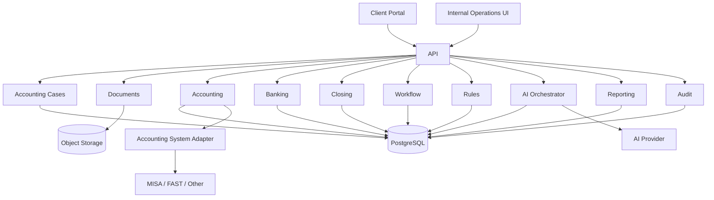

# DESIGN DOCUMENT
# Accounting Service Operating System
## Business-Workflow-First Design for Small Service Companies

**Version:** 2.0  
**Status:** Proposed  
**Audience:** Founder / Product / Engineering / Accounting Lead  
**Primary user:** Internal accounting team serving many small service companies  
**Secondary user:** Business owner / customer  
**Design principle:** Understand the accounting workflow first. Code second.

---

# 1. Why This Document Exists

This system must not be designed from technical modules first.

The correct order is:

```text
What happens in real accounting work?
        ↓
Who performs each step?
        ↓
What data enters each step?
        ↓
What decision must be made?
        ↓
What can be automated?
        ↓
What requires accountant judgment?
        ↓
What state does the work move to?
        ↓
Then design software
```

The product is not initially an accounting ERP.

The product is an:

> **Accounting Service Operating System**

Its job is to help an outsourced accounting company operate many small customers consistently, transparently, and efficiently.

The first customer segment is:

- service company;
- 1–20 employees;
- low accounting complexity;
- no manufacturing;
- no complex inventory;
- roughly 10–200 accounting documents per month;
- typically uses MISA, FAST, Excel or outsourced accounting already.

---

# 2. The Simplest Mental Model

For a small service company, accounting operations can be understood as five loops:

```text
1. Collect
   Get documents and transaction data.

2. Understand
   Determine what each document/transaction means.

3. Record
   Prepare the accounting treatment.

4. Reconcile
   Check that accounting records agree with reality.

5. Close & Report
   Finish the month, tax obligations, and reports.
```

Everything in the system should support one of those five loops.

---

# 3. People in the System

There are only five important actors initially.

## 3.1 Client Owner

The business owner.

They care about:

- what they need to provide;
- what tax/payment is due;
- whether the month is completed;
- whether there is a serious problem;
- simple financial visibility.

They do **not** need to see accounting implementation details.

---

## 3.2 Client Staff

An employee of the customer who may:

- upload documents;
- confirm transactions;
- provide contracts;
- answer accounting questions.

---

## 3.3 Accountant

Performs daily accounting work.

Typical work:

- review documents;
- classify transactions;
- create accounting drafts;
- reconcile bank;
- follow up missing information;
- execute closing checklist.

---

## 3.4 Senior Accountant / Chief Accountant

Handles judgment and risk.

Typical work:

- unusual accounting treatment;
- tax-sensitive issues;
- large transactions;
- final closing review;
- final report review.

---

## 3.5 System

The software.

It should:

- collect;
- parse;
- normalize;
- detect duplicates;
- match;
- apply deterministic rules;
- generate suggestions;
- create tasks;
- monitor deadlines;
- surface exceptions.

The system must not silently make high-risk accounting decisions.

---

# 4. What a Real Month Looks Like

Assume customer:

```text
ABC Digital Co., Ltd.
15 employees
service company
2 bank accounts
80 invoices/documents per month
uses MISA
```

A typical month is:

```text
During month
├── sales invoices happen
├── purchase invoices arrive
├── bank transactions happen
├── employees spend money
├── payroll happens
├── customer payments arrive
└── supplier payments happen

Month end
├── check all documents are collected
├── check bank transactions
├── check receivables
├── check payables
├── check payroll
├── check revenue/expense completeness
├── prepare tax
├── review anomalies
├── senior review
└── close month
```

The system must represent this workflow explicitly.

---

# 5. Core Business Object: Accounting Case

The most useful abstraction is not "invoice".

It is an:

> **Accounting Case**

A case represents one piece of accounting work that must eventually be resolved.

Examples:

```text
Purchase invoice received
Bank transaction received
Sales invoice issued
Missing contract
Unknown bank transfer
Payroll file uploaded
Refund
Foreign payment
```

Every case moves through a lifecycle.

---

# 6. Accounting Case Lifecycle

```text
NEW
↓
DATA_READY
↓
UNDERSTOOD
↓
ACCOUNTING_PREPARED
↓
REVIEW_REQUIRED / READY
↓
APPROVED
↓
RECORDED
↓
RECONCILED
↓
CLOSED
```

Possible exception states:

```text
WAITING_CLIENT
NEED_ACCOUNTANT
NEED_SENIOR
BLOCKED
REJECTED
```

This state machine should be central to the implementation.

---

# 7. Step 1 — COLLECT

Goal:

> Get all source data required to account for the company's activities.

Sources:

```text
Sales invoices
Purchase invoices
Bank statements
Contracts
Payroll
Receipts
Payment requests
Acceptance records
Other supporting documents
```

Data may come from:

```text
Upload
Email
MISA export
FAST export
Bank CSV/XLSX
E-invoice XML
Manual entry
API
```

---

# 8. Collection Workflow

```text
Source arrives
    ↓
Create Intake Record
    ↓
Store original file/data
    ↓
Calculate fingerprint
    ↓
Duplicate?
 ┌──┴───┐
Yes     No
 ↓       ↓
Link   Continue
        ↓
Identify document/source type
        ↓
Create Accounting Case
```

Important:

The original source must never be lost.

---

# 9. Duplicate Handling

Example:

Client uploads the same invoice three times.

System behavior:

```text
Invoice A
same XML invoice number
same seller tax code
same date
same amount
        ↓
duplicate candidate
        ↓
do NOT create three accounting entries
```

Possible result:

```text
ORIGINAL
DUPLICATE_REFERENCE
```

An accountant may override if needed.

---

# 10. Step 2 — UNDERSTAND

Now the system answers:

> "What is this?"

Example purchase invoice:

```text
Vendor: AWS
Amount: 22,000,000
Description: cloud services
VAT: ...
Date: ...
```

The system needs to identify:

```text
document type
counterparty
amount
currency
invoice number
date
tax
business description
related contract/project if any
```

---

# 11. Structured Data First

If the source is XML/API/CSV:

```text
parse deterministically
```

If it is image/scanned PDF:

```text
use document extraction / AI
```

Never use AI where a reliable structured source exists.

Order:

```text
XML
→ API
→ CSV/XLSX
→ searchable PDF
→ scan
→ image
```

---

# 12. Normalized Document

All sources become one canonical structure.

Example:

```json
{
  "type": "PURCHASE_INVOICE",
  "invoiceNumber": "000123",
  "documentDate": "2026-09-05",
  "seller": {
    "name": "ABC Cloud",
    "taxCode": "031..."
  },
  "currency": "VND",
  "subtotal": 20000000,
  "tax": 2000000,
  "total": 22000000,
  "description": "Cloud service",
  "sourceDocumentId": "..."
}
```

The normalized document is not yet an accounting entry.

It only represents:

> "What does the source document say?"

---

# 13. Validation After Extraction

System performs deterministic checks:

```text
required fields exist?
subtotal + tax = total?
invoice number exists?
date valid?
currency valid?
seller identifiable?
```

If invalid:

```text
NEED_ACCOUNTANT
```

or:

```text
WAITING_CLIENT
```

depending on the issue.

---

# 14. Step 3 — DETERMINE ACCOUNTING MEANING

Now the question changes from:

> "What is this document?"

to:

> "How should this be accounted for?"

Example:

```text
AWS invoice
→ cloud service expense
→ software / IT operating expense
→ payable to vendor
```

This is accounting classification.

---

# 15. Accounting Decision Layers

Use this order:

```text
1. Exact known rule
2. Historical mapping
3. Deterministic business rule
4. AI suggestion
5. Accountant judgment
6. Senior judgment
```

Never jump directly to AI.

---

# 16. Example Classification Flow

```text
Purchase invoice received
        ↓
Vendor already known?
        │
   ┌────┴────┐
  Yes        No
   ↓          ↓
Known mapping AI/rule suggests
   ↓          ↓
Amount unusual?
   │
┌──┴──┐
No    Yes
↓      ↓
Ready Review Required
```

---

# 17. Journal Draft

The system must never treat an AI answer as a posted accounting entry.

It creates a:

```text
Journal Draft
```

Example:

```text
Debit: Expense
Credit: Accounts Payable
Amount: 22,000,000
Vendor: AWS
Source: invoice 000123
Reason: vendor rule CLOUD_PROVIDER
```

Draft means:

> proposed accounting treatment.

---

# 18. Journal Draft Validation

Before review:

```text
Debit == Credit
Account exists
Account is active
Period is open
Party exists if required
Amount matches source
Tax fields are valid
```

If validation fails:

```text
BLOCKED
```

---

# 19. Risk Classification

Every case gets a risk level.

## Low

Examples:

```text
known recurring vendor
same account as previous months
small amount
complete supporting documents
```

## Medium

Examples:

```text
new vendor
unusual amount
new expense type
missing optional context
```

## High

Examples:

```text
foreign transaction
related-party transaction
refund
large manual journal
tax-sensitive issue
revenue adjustment
unusual contract
```

---

# 20. Review Routing

```text
LOW
→ accountant quick review

MEDIUM
→ accountant full review

HIGH
→ senior/chief accountant review
```

The goal is:

> humans spend time where risk is highest.

---

# 21. Client Question Flow

Sometimes accounting cannot continue without the customer.

Example bank transaction:

```text
Transfer OUT: 18,000,000
Description: "CK THANH TOAN"
No matching invoice
Unknown counterparty
```

System creates:

```text
Client Action
```

Example:

> "Please confirm what the 18,000,000 VND bank transfer on 12 Sep was for."

Case becomes:

```text
WAITING_CLIENT
```

When customer answers:

```text
case resumes
```

---

# 22. Client Action Is a First-Class Object

Fields:

```text
id
tenant_id
case_id
action_type
question
status
due_date
assigned_client_user
response
created_at
resolved_at
```

States:

```text
OPEN
ANSWERED
RESOLVED
CANCELLED
```

---

# 23. Step 4 — BANK RECONCILIATION

Bank reconciliation means:

> Make sure movements in the bank account are explained by accounting records.

Bank data:

```text
10 Sep +55,000,000 ABC Client
12 Sep -18,000,000 XYZ
15 Sep -5,200,000 AWS
```

Accounting data:

```text
Invoice receivable ABC 55m
Supplier invoice AWS 5.2m
Unknown XYZ
```

Expected result:

```text
ABC → MATCHED
AWS → MATCHED
XYZ → UNMATCHED
```

---

# 24. Bank Matching Flow

```text
Bank transaction
      ↓
Find candidates
      ↓
Compare:
- amount
- party
- invoice number
- date
- description
      ↓
Generate match score
      ↓
High confidence?
 ┌────┴────┐
Yes        No
↓           ↓
Suggest   Review Queue
```

The system should not hide unmatched transactions.

Unmatched = exception.

---

# 25. Accounts Receivable Flow

AR means:

> Money customers owe the company.

Example:

```text
Invoice to Customer A: 100m
Payment received: 60m
Outstanding: 40m
```

The system tracks:

```text
invoice
customer
due date
original amount
paid amount
outstanding amount
days overdue
```

States:

```text
OPEN
PARTIALLY_PAID
PAID
OVERDUE
WRITTEN_OFF
```

---

# 26. Accounts Payable Flow

AP means:

> Money company owes suppliers.

Same concept:

```text
Supplier invoice
↓
amount due
↓
payment
↓
remaining payable
```

---

# 27. Payroll Input Flow

MVP should not calculate payroll from scratch.

It receives approved payroll information.

```text
Payroll source
↓
validate totals
↓
create accounting case
↓
prepare payroll accounting draft
↓
review
```

Payroll-sensitive fields may need stronger access controls.

---

# 28. Expense Flow

Typical service company expense:

```text
Invoice/receipt
↓
Who is vendor?
↓
What is expense?
↓
Is it business-related?
↓
Supporting evidence complete?
↓
Accounting treatment
↓
Review
```

Missing evidence creates action rather than silently posting.

---

# 29. Revenue Flow

Typical service company:

```text
contract / order
↓
service delivered
↓
sales invoice
↓
receivable
↓
customer payment
```

MVP should track basic completeness.

Complex revenue recognition can be deferred or routed to senior review.

---

# 30. Month-End Closing

Closing is the central monthly process.

Closing means:

> Confirm that the month's accounting data is sufficiently complete and reviewed before reports/tax are finalized.

---

# 31. Month-End Closing Workflow

```text
START MONTH CLOSE
      ↓
1. Documents complete?
      ↓
2. Bank reconciled?
      ↓
3. AR reviewed?
      ↓
4. AP reviewed?
      ↓
5. Payroll recorded?
      ↓
6. Revenue complete?
      ↓
7. Expenses complete?
      ↓
8. Tax checklist complete?
      ↓
9. Exceptions resolved?
      ↓
10. Senior review
      ↓
CLOSE MONTH
```

Each step is a checklist item with evidence.

---

# 32. Closing State Machine

```text
NOT_STARTED
↓
IN_PROGRESS
↓
WAITING_CLIENT
↓
READY_FOR_REVIEW
↓
UNDER_REVIEW
↓
APPROVED
↓
CLOSED
```

A month cannot close while required blocking items remain unresolved.

---

# 33. Closing Checklist Example

For September:

```text
[✓] Sales invoices collected
[✓] Purchase invoices collected
[✓] Bank account 001 reconciled
[!] Bank account 002 has 2 unmatched transactions
[✓] AR reviewed
[✓] AP reviewed
[ ] Payroll confirmation missing
[ ] VAT review
[ ] Senior review
```

This is more useful internally than a generic dashboard.

---

# 34. Internal Accountant Daily Screen

An accountant should log in and see:

```text
TODAY

Critical            2
Due today           8
Waiting client      12
Need review         6

ABC Co.
- 2 unmatched bank transactions
- September closing 78%
- waiting for 1 contract

XYZ Co.
- 3 invoices need review
- VAT checklist due tomorrow
```

This is the operating surface of the company.

---

# 35. Accounting Manager Screen

Manager sees:

```text
CLIENTS
50 active

WORK
17 waiting client
11 review required
4 closing at risk

DEADLINES
6 tax deadlines this week

CAPACITY
Accountant A: 12 clients
Accountant B: 18 clients
Accountant C: 10 clients
```

This replaces Excel-based service operations.

---

# 36. Client Portal

Client portal must stay simple.

Initial screens:

```text
1. Home
2. Documents
3. My Actions
4. Reports
```

---

# 37. Client Home

Example:

```text
September Accounting

Progress: 82%

Need your action: 2
Missing documents: 3
Tax estimate: 18.5m
Closing target: 10 Oct

Important:
- 1 customer invoice overdue
- 2 bank transactions need confirmation
```

Client should not see internal accounting jargon unless necessary.

---

# 38. Internal Workflow vs Client Workflow

Internal:

```text
invoice extraction
journal mapping
VAT validation
bank match
review
closing
```

Client sees:

```text
Received
Processing
Need your action
Completed
```

Rule:

> Internal complexity must never leak unnecessarily into customer experience.

---

# 39. Core Domain Model

The minimum model:

```text
Tenant
User
TenantMembership

ClientCompany

Document
DocumentVersion
NormalizedDocument

AccountingCase
CaseEvent

Party

Account
JournalDraft
JournalDraftLine

BankAccount
BankTransaction
Reconciliation

Receivable
Payable

ClientAction

Review

ClosingPeriod
ClosingTask

Rule
RuleVersion

AISuggestion

AuditEvent
```

---

# 40. AccountingCase Entity

Recommended fields:

```text
id
tenant_id
case_type
source_type
source_id
status
risk_level
assigned_to
period
priority
created_at
updated_at
```

Case types:

```text
PURCHASE
SALE
BANK_TRANSACTION
PAYROLL
REFUND
MANUAL_ADJUSTMENT
OTHER
```

---

# 41. Case Events

Never infer history only from current status.

Store events:

```text
CASE_CREATED
SOURCE_PARSED
CLASSIFICATION_SUGGESTED
CLIENT_INFO_REQUESTED
CLIENT_RESPONDED
REVIEW_REQUESTED
APPROVED
RECORDED
RECONCILED
CLOSED
```

This creates traceability.

---

# 42. State Transition Rules

Example:

```text
NEW
→ DATA_READY
```

only when required source is available.

```text
DATA_READY
→ UNDERSTOOD
```

only after extraction and validation.

```text
UNDERSTOOD
→ ACCOUNTING_PREPARED
```

only after journal draft exists.

```text
ACCOUNTING_PREPARED
→ APPROVED
```

requires appropriate review.

Invalid transitions must be rejected by backend.

---

# 43. Rule Engine

The rule engine handles deterministic knowledge.

Example:

```yaml
rule:
  id: KNOWN_VENDOR_AWS
  when:
    vendor_tax_code: "..."
  then:
    category: CLOUD_SERVICE
    suggested_account: "642"
    default_risk: LOW
```

Rules must be versioned.

---

# 44. AI Layer

AI is used only when deterministic logic is insufficient.

Good use cases:

```text
read scanned document
classify ambiguous expense
suggest party matching
explain anomalies
generate client-friendly summaries
```

Bad use cases:

```text
calculate debit/credit totals
enforce tenant permissions
decide if period is closed
validate unique invoice number
```

---

# 45. AI Decision Contract

AI result must have:

```json
{
  "decision": "CLOUD_SERVICE",
  "confidence": 0.94,
  "evidence": [
    {
      "field": "description",
      "value": "AWS infrastructure services"
    }
  ]
}
```

No evidence means no automatic trust.

---

# 46. Review Object

Fields:

```text
id
case_id
review_type
required_role
status
decision
reviewed_by
comment
created_at
reviewed_at
```

Review types:

```text
ACCOUNTING_REVIEW
TAX_REVIEW
SENIOR_REVIEW
CLIENT_CONFIRMATION
```

---

# 47. Who Can Approve What

Example policy:

```text
LOW
→ ACCOUNTANT

MEDIUM
→ ACCOUNTANT

HIGH
→ SENIOR_ACCOUNTANT

PERIOD_CLOSE
→ SENIOR_ACCOUNTANT
```

Make this configurable later.

---

# 48. Service Operations

The company itself must manage:

```text
customer assignment
accountant capacity
task deadlines
client responsiveness
closing progress
quality
SLA
```

This is separate from accounting data.

---

# 49. Work Queue

Every employee should work from a queue.

Example ordering:

```text
1. overdue critical
2. due today
3. high-risk review
4. month-close blockers
5. normal tasks
```

Do not rely on people remembering work from Zalo messages.

---

# 50. Task Generation

Tasks should be generated from business events.

Example:

```text
Document invalid
→ Review Task

Unknown bank transaction
→ Reconciliation Task

Missing contract
→ Client Action

Closing blocked
→ Closing Task
```

Avoid manual task creation where system state already knows the work is required.

---

# 51. Deadline Model

Deadlines can come from:

```text
tax calendar
closing policy
client SLA
task-specific due date
```

System needs:

```text
due_at
priority
escalation_at
owner
```

---

# 52. Escalation

Example:

```text
task due in 2 days
→ accountant notification

task overdue
→ accountant + manager

client action overdue
→ client reminder

closing at risk
→ manager alert
```

---

# 53. Architecture

Use Modular Monolith first.



---

# 54. Suggested Backend Modules

```text
identity
tenants
clients
documents
cases
parties
accounting
banking
receivables
payables
reviews
client-actions
closing
workflow
rules
ai
reporting
integrations
audit
```

---

# 55. Database First-Pass Tables

```text
tenants
users
tenant_memberships

documents
document_versions
normalized_documents

accounting_cases
case_events

parties

accounts
journal_drafts
journal_draft_lines

bank_accounts
bank_transactions
reconciliations

receivables
payables

client_actions
reviews

closing_periods
closing_tasks

rules
rule_versions

ai_suggestions

audit_events
```

---

# 56. System of Record Strategy

Initially:

```text
MISA / FAST / existing accounting software
=
official accounting system
```

Our system:

```text
workflow
control
automation
review
visibility
```

This avoids building a full accounting ledger too early.

---

# 57. Integration Contract

Accounting adapter:

```java
interface AccountingSystemAdapter {

    List<Account> fetchAccounts();

    List<Party> fetchParties();

    List<JournalEntry> fetchJournalEntries(
        AccountingPeriod period
    );

    SyncResult syncApprovedDraft(
        JournalDraft draft
    );
}
```

MVP can make sync one-way or manual export.

---

# 58. API Examples

Create document:

```http
POST /v1/documents
```

Get work queue:

```http
GET /v1/work-items
```

Get accounting case:

```http
GET /v1/accounting-cases/{id}
```

Approve review:

```http
POST /v1/reviews/{id}/decision
```

Answer client action:

```http
POST /v1/client-actions/{id}/response
```

Start month close:

```http
POST /v1/closing-periods/{period}/start
```

---

# 59. Async Processing

Heavy processing should be asynchronous:

```text
document extraction
AI calls
bank matching
report generation
anomaly scan
```

Flow:

```text
API
↓
save request
↓
create job/outbox event
↓
return immediately
↓
worker processes
↓
update case
```

---

# 60. Idempotency

Must support repeated uploads/imports safely.

For:

```text
documents
bank imports
integration sync
external callbacks
```

Use:

```text
source ID
hash
idempotency key
```

---

# 61. Multi-Tenant Safety

Every business row includes:

```text
tenant_id
```

Tenant comes from authentication context.

Do not trust tenant IDs provided by frontend.

Automated tests must verify cross-tenant access is impossible.

---

# 62. Audit Trail

Must record:

```text
who
did what
to which object
when
before
after
why
```

Important events:

```text
review approval
journal changes
period close
permission change
rule change
client response
AI suggestion
```

---

# 63. Accounting Invariants

The system must always enforce:

```text
Debit = Credit
Closed period cannot be modified normally
Posted accounting entries are never silently deleted
Every approval has an actor
Every AI suggestion has provenance
Every source document remains traceable
Tenant data never crosses tenant boundary
```

---

# 64. Security

Minimum:

```text
TLS
RBAC
MFA for internal staff
encrypted object storage
secret manager
audit logging
signed URLs
backup
rate limiting
```

Highly sensitive data needs stricter controls.

---

# 65. Metrics That Matter

Technical metrics are not enough.

Must measure:

```text
human_minutes_per_client
human_minutes_per_document
automation_rate
exception_rate
review_rate
AI correction rate
closing_duration
client_response_time
clients_per_accountant
```

If human minutes per client do not fall safely, automation is not working.

---

# 66. MVP Scope

## MVP 1 — Operational Backbone

Build:

```text
Tenant
User
Client
Documents
Accounting Cases
Work Queue
Client Actions
Review
Audit
```

No complex accounting automation yet.

Purpose:

> make service operations visible and controlled.

---

# 67. MVP 2 — Document Intelligence

Add:

```text
XML parsing
PDF/image extraction
classification
duplicate detection
normalized documents
```

---

# 68. MVP 3 — Accounting Assistance

Add:

```text
chart of accounts
parties
rules
journal draft
validation
human review
```

---

# 69. MVP 4 — Banking

Add:

```text
bank imports
transaction normalization
matching
reconciliation queue
```

---

# 70. MVP 5 — Closing

Add:

```text
month closing
checklist
blocking rules
senior approval
client progress
```

---

# 71. MVP 6 — Client Portal

Only now expose:

```text
status
documents
actions
reports
```

The internal operating system should be mature first.

---

# 72. One Full Example

Customer uploads an AWS invoice.

```text
1. Document received.
2. Store original.
3. Hash file.
4. Duplicate check.
5. Detect PURCHASE_INVOICE.
6. Parse/extract data.
7. Validate totals.
8. Create Accounting Case.
9. Find AWS party.
10. Find historical/rule mapping.
11. Suggest cloud expense treatment.
12. Create Journal Draft.
13. Validate Debit = Credit.
14. Risk = LOW.
15. Accountant sees it in review queue.
16. Accountant approves.
17. Draft synced/exported to accounting system.
18. Bank transaction arrives later.
19. Matching engine suggests corresponding payment.
20. Accountant confirms match.
21. Case becomes RECONCILED.
22. Month-close checklist sees item complete.
23. Audit history contains every important step.
```

If no contract/supporting document is required:

```text
client sees nothing.
```

If something is missing:

```text
Client Action:
"Please provide supporting contract."
```

---

# 73. Another Full Example — Unknown Bank Transaction

```text
1. Bank CSV imported.
2. Transaction 18m has no match.
3. Matching engine finds no confident candidate.
4. Create Accounting Case.
5. Case status = NEED_ACCOUNTANT.
6. Accountant reviews.
7. Accountant also cannot identify.
8. Create Client Action.
9. Case status = WAITING_CLIENT.
10. Client says: "Payment for freelancer Nguyen A."
11. Case resumes.
12. System/accountant classifies expense.
13. Journal Draft created.
14. Review.
15. Recorded.
16. Reconciled.
17. Closed.
```

This flow must be implementable without any developer needing to understand every accounting concept in advance.

---

# 74. Developer Mental Model

When coding any feature, ask:

```text
What business object is moving?
What state is it currently in?
What event happened?
What decision is required?
Who owns that decision?
Can rule/code decide it?
Does AI only suggest?
Does a human need to approve?
What state comes next?
What audit evidence must remain?
```

If these questions are unclear:

> do not code yet.

---

# 75. Product Principle

The product is not:

```text
"AI accounting software"
```

It is:

```text
"A controlled workflow for running an accounting service company."
```

AI is one worker inside that workflow.

---

# 76. Final System Model

```text
SOURCE DATA
    ↓
DOCUMENT / TRANSACTION
    ↓
ACCOUNTING CASE
    ↓
UNDERSTAND
    ↓
RULE / AI SUGGESTION
    ↓
ACCOUNTING DRAFT
    ↓
RISK ROUTING
    ↓
HUMAN REVIEW
    ↓
RECORD
    ↓
RECONCILE
    ↓
MONTH CLOSE
    ↓
REPORT
```

Around the entire flow:

```text
Tasks
Deadlines
Client Actions
Audit
Permissions
Metrics
```

That is the core of the platform.

---

# 77. Final Design Decision

For the first year:

> **Build the operating system for the accounting service team first.**

Do not start by building a large customer portal.

Do not start by rebuilding MISA.

Do not start with a generic AI chatbot.

Build the real workflow:

```text
Collect
→ Understand
→ Prepare
→ Review
→ Reconcile
→ Close
```

Then automate each step gradually.

That gives engineering a clear model, accounting a controllable process, and the business a path to scale.
