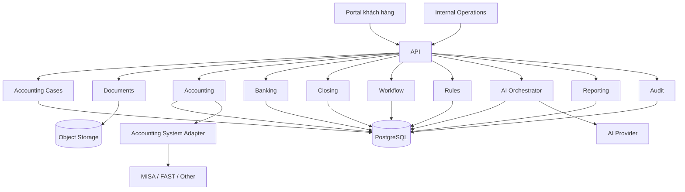

# TÀI LIỆU THIẾT KẾ NGHIỆP VỤ & KỸ THUẬT
# Hệ thống vận hành dịch vụ kế toán cho doanh nghiệp nhỏ
## Thiết kế theo luồng nghiệp vụ trước, kỹ thuật sau

**Phiên bản:** 3.0  
**Trạng thái:** Đề xuất thiết kế  
**Đối tượng đọc:** Founder, Product, Dev, Kế toán trưởng, Kế toán viên  
**Khách hàng mục tiêu ban đầu:** Doanh nghiệp dịch vụ nhỏ và rất nhỏ  
**Nguyên tắc:** Hiểu nghiệp vụ trước, code sau.

---

# 1. Mục đích của tài liệu

Hệ thống này không được thiết kế theo kiểu:

```text
Nghĩ ra module
→ tạo database
→ viết API
→ sau đó mới hỏi kế toán dùng thế nào
```

Thứ tự đúng phải là:

```text
Ngoài đời kế toán đang làm gì?
        ↓
Ai làm việc đó?
        ↓
Dữ liệu đầu vào là gì?
        ↓
Cần quyết định điều gì?
        ↓
Việc nào máy làm được?
        ↓
Việc nào phải cần kế toán?
        ↓
Nghiệp vụ chuyển sang trạng thái nào?
        ↓
Sau đó mới thiết kế phần mềm
```

Sản phẩm ban đầu không phải ERP và cũng không phải phần mềm kế toán thay thế MISA/FAST.

Sản phẩm là:

> **Hệ điều hành vận hành dịch vụ kế toán — Accounting Service Operating System.**

Nó giúp một công ty dịch vụ kế toán quản lý hàng chục/hàng trăm khách hàng một cách có quy trình, có trạng thái, có kiểm soát và có khả năng tự động hóa sâu.

---

# 2. Khách hàng mục tiêu ban đầu

Tập trung trước vào:

- công ty dịch vụ;
- 1–20 nhân sự;
- khoảng 10–200 chứng từ/tháng;
- 1–3 tài khoản ngân hàng;
- không sản xuất;
- không tồn kho phức tạp;
- không nhiều pháp nhân;
- thường đang dùng MISA, FAST, Excel hoặc kế toán thuê ngoài.

Nguyên tắc:

> **Khách hàng ban đầu hẹp, nhưng nghiệp vụ lõi phải đủ tổng quát.**

---

# 3. Hiểu kế toán theo mô hình đơn giản nhất

Đối với một doanh nghiệp dịch vụ nhỏ, có thể nhìn toàn bộ vận hành kế toán thành 5 vòng:

```text
1. Thu thập
   Nhận hóa đơn, chứng từ, giao dịch ngân hàng, hợp đồng...

2. Hiểu nghiệp vụ
   Xác định chứng từ/giao dịch đó là gì.

3. Ghi nhận kế toán
   Xác định cách hạch toán.

4. Đối chiếu
   Kiểm tra sổ kế toán có khớp với thực tế không.

5. Chốt kỳ & báo cáo
   Hoàn thành tháng, thuế và báo cáo.
```

Mọi chức năng trong hệ thống đều phải phục vụ một trong 5 bước này.

---

# 4. Các vai trò trong hệ thống

## 4.1. Chủ doanh nghiệp

Quan tâm:

- tháng này kế toán làm tới đâu;
- thiếu gì;
- cần xác nhận việc gì;
- thuế dự kiến bao nhiêu;
- có vấn đề nghiêm trọng nào không;
- báo cáo tài chính cơ bản.

Họ không cần nhìn chi tiết kỹ thuật kế toán.

---

## 4.2. Nhân viên phía khách hàng

Có thể:

- tải chứng từ;
- bổ sung hợp đồng;
- trả lời câu hỏi;
- xác nhận giao dịch;
- cung cấp bảng lương.

---

## 4.3. Kế toán viên

Làm công việc hàng ngày:

- kiểm tra chứng từ;
- phân loại giao dịch;
- tạo bút toán nháp;
- đối chiếu ngân hàng;
- hỏi khách khi thiếu dữ liệu;
- thực hiện checklist cuối tháng.

---

## 4.4. Kế toán trưởng / Senior Accountant

Xử lý:

- nghiệp vụ khó;
- giao dịch lớn;
- vấn đề thuế;
- bút toán bất thường;
- hoàn tiền;
- giao dịch nước ngoài;
- review cuối kỳ;
- chốt báo cáo.

---

## 4.5. Hệ thống

Hệ thống có nhiệm vụ:

- thu thập dữ liệu;
- đọc chứng từ;
- phát hiện trùng;
- chuẩn hóa dữ liệu;
- áp dụng rule;
- gợi ý nghiệp vụ;
- tạo task;
- theo dõi deadline;
- phát hiện exception.

Hệ thống không được tự quyết các nghiệp vụ rủi ro cao.

---

# 5. Một tháng kế toán ngoài đời diễn ra thế nào?

Ví dụ khách hàng:

```text
Công ty ABC Digital
15 nhân viên
2 tài khoản ngân hàng
80 chứng từ/tháng
đang dùng MISA
```

Trong tháng phát sinh:

```text
- xuất hóa đơn bán hàng;
- nhận hóa đơn đầu vào;
- khách hàng thanh toán;
- công ty trả tiền nhà cung cấp;
- nhân viên thanh toán chi phí;
- trả lương;
- ký hợp đồng;
- phát sinh thu/chi ngân hàng.
```

Cuối tháng:

```text
- kiểm tra đã đủ chứng từ chưa;
- đối chiếu ngân hàng;
- kiểm tra công nợ phải thu;
- kiểm tra công nợ phải trả;
- kiểm tra lương;
- kiểm tra doanh thu;
- kiểm tra chi phí;
- kiểm tra thuế;
- xử lý ngoại lệ;
- kế toán trưởng review;
- chốt tháng.
```

Đây chính là workflow mà phần mềm phải mô hình hóa.

---

# 6. Đối tượng trung tâm: Accounting Case

Thay vì coi hóa đơn là trung tâm, hệ thống nên dùng khái niệm:

> **Accounting Case = một vụ việc kế toán cần được xử lý đến khi hoàn tất.**

Ví dụ một Accounting Case có thể là:

```text
- một hóa đơn mua hàng;
- một hóa đơn bán hàng;
- một giao dịch ngân hàng;
- một khoản hoàn tiền;
- một bộ lương;
- một khoản chi không rõ mục đích;
- một bút toán điều chỉnh;
- một chứng từ thiếu hợp đồng.
```

Mỗi case có trạng thái rõ ràng.

---

# 7. Vòng đời của Accounting Case

```text
NEW
↓
DATA_READY
↓
UNDERSTOOD
↓
ACCOUNTING_PREPARED
↓
REVIEW_REQUIRED / READY
↓
APPROVED
↓
RECORDED
↓
RECONCILED
↓
CLOSED
```

Các trạng thái ngoại lệ:

```text
WAITING_CLIENT
NEED_ACCOUNTANT
NEED_SENIOR
BLOCKED
REJECTED
```

Ý nghĩa:

- `NEW`: vừa phát sinh.
- `DATA_READY`: đã có đủ dữ liệu nguồn cơ bản.
- `UNDERSTOOD`: đã hiểu nghiệp vụ là gì.
- `ACCOUNTING_PREPARED`: đã có phương án hạch toán nháp.
- `REVIEW_REQUIRED`: cần người kiểm tra.
- `APPROVED`: đã được duyệt.
- `RECORDED`: đã ghi nhận vào hệ thống kế toán.
- `RECONCILED`: đã đối chiếu.
- `CLOSED`: hoàn tất.

---

# 8. Bước 1 — Thu thập dữ liệu

Nguồn dữ liệu:

```text
- hóa đơn đầu vào;
- hóa đơn đầu ra;
- sao kê ngân hàng;
- hợp đồng;
- bảng lương;
- phiếu chi;
- chứng từ thanh toán;
- biên bản nghiệm thu;
- tài liệu khác.
```

Nguồn có thể đến từ:

```text
Upload
Email
MISA
FAST
Excel
CSV
XML hóa đơn điện tử
API
```

---

# 9. Luồng thu thập

```text
Dữ liệu đi vào
    ↓
Tạo bản ghi tiếp nhận
    ↓
Lưu file gốc
    ↓
Tính fingerprint/hash
    ↓
Đã tồn tại?
 ┌────┴────┐
Có        Không
↓           ↓
Đánh dấu   Tiếp tục
trùng
            ↓
Xác định loại tài liệu
            ↓
Tạo Accounting Case
```

Quy tắc:

> File gốc luôn phải được giữ lại để audit.

---

# 10. Xử lý chứng từ trùng

Ví dụ khách tải cùng một hóa đơn 3 lần.

Hệ thống kiểm tra:

```text
số hóa đơn
+
mã số thuế người bán
+
ngày
+
số tiền
```

Nếu giống:

```text
DUPLICATE_CANDIDATE
```

Hệ thống không được tự tạo 3 bút toán.

Kế toán có thể xác nhận nếu đây thật sự là 2 nghiệp vụ khác nhau.

---

# 11. Bước 2 — Hiểu chứng từ

Ví dụ hệ thống nhận:

```text
Nhà cung cấp: AWS
Số tiền: 22.000.000
Nội dung: Cloud Services
Thuế: ...
Ngày: ...
```

Hệ thống phải xác định được:

```text
- đây là loại chứng từ gì;
- bên giao dịch là ai;
- số tiền;
- tiền tệ;
- số hóa đơn;
- ngày;
- thuế;
- nội dung;
- có liên quan hợp đồng/dự án nào không.
```

---

# 12. Ưu tiên dữ liệu có cấu trúc

Không dùng AI nếu dữ liệu đã có cấu trúc.

Thứ tự:

```text
XML
→ API
→ CSV/XLSX
→ PDF có text
→ PDF scan
→ ảnh
```

Lý do:

- chính xác hơn;
- rẻ hơn;
- dễ audit;
- ít hallucination hơn.

---

# 13. Chuẩn hóa chứng từ

Mọi nguồn phải chuyển về một format chung.

Ví dụ:

```json
{
  "type": "PURCHASE_INVOICE",
  "invoiceNumber": "000123",
  "documentDate": "2026-09-05",
  "seller": {
    "name": "ABC Cloud",
    "taxCode": "031..."
  },
  "currency": "VND",
  "subtotal": 20000000,
  "tax": 2000000,
  "total": 22000000,
  "description": "Cloud service"
}
```

Đây mới chỉ là:

> **Dữ liệu chứng từ nói gì.**

Chưa phải:

> **Hạch toán thế nào.**

---

# 14. Kiểm tra dữ liệu chứng từ

Code kiểm tra:

```text
- có đủ trường bắt buộc không;
- subtotal + tax = total không;
- ngày hợp lệ không;
- currency hợp lệ không;
- invoice number có không;
- nhận diện được supplier không.
```

Nếu lỗi:

```text
NEED_ACCOUNTANT
```

hoặc:

```text
WAITING_CLIENT
```

---

# 15. Bước 3 — Xác định nghiệp vụ kế toán

Ví dụ:

```text
Hóa đơn AWS
↓
chi phí cloud
↓
chi phí vận hành CNTT
↓
công nợ phải trả nhà cung cấp
```

Đây mới là bước kế toán thực sự.

---

# 16. Thứ tự ra quyết định

Hệ thống phải xử lý theo thứ tự:

```text
1. Rule chắc chắn
2. Mapping lịch sử
3. Business rule
4. AI gợi ý
5. Kế toán viên quyết định
6. Kế toán trưởng quyết định
```

AI không được đứng đầu.

---

# 17. Ví dụ phân loại

```text
Nhận hóa đơn
    ↓
Nhà cung cấp đã biết?
   ┌────┴────┐
  Có        Không
  ↓           ↓
Mapping cũ   Rule/AI gợi ý
  ↓           ↓
Số tiền bất thường?
   ┌────┴────┐
 Không       Có
 ↓            ↓
Ready       Review
```

---

# 18. Journal Draft — Bút toán nháp

AI hoặc rule không được ghi thẳng vào sổ.

Chỉ tạo:

> **Journal Draft = bút toán nháp.**

Ví dụ:

```text
Nợ: Chi phí cloud
Có: Phải trả nhà cung cấp
Số tiền: 22.000.000
Nhà cung cấp: AWS
Nguồn: Invoice 000123
```

---

# 19. Kiểm tra bút toán nháp

Hệ thống tự kiểm tra:

```text
Nợ = Có
Tài khoản tồn tại
Tài khoản được phép hạch toán
Kỳ chưa khóa
Số tiền khớp chứng từ
Đối tượng công nợ đầy đủ
Thông tin thuế hợp lệ
```

Nếu không đạt:

```text
BLOCKED
```

---

# 20. Phân loại rủi ro

## Thấp

Ví dụ:

```text
- vendor quen thuộc;
- cùng tài khoản như các tháng trước;
- số tiền nhỏ;
- chứng từ đầy đủ.
```

## Trung bình

```text
- vendor mới;
- loại chi phí mới;
- số tiền khác thường;
- thiếu thông tin phụ.
```

## Cao

```text
- giao dịch nước ngoài;
- bên liên quan;
- hoàn tiền;
- bút toán tay lớn;
- điều chỉnh doanh thu;
- vấn đề thuế;
- hợp đồng bất thường.
```

---

# 21. Điều hướng review

```text
LOW
→ kế toán viên review nhanh

MEDIUM
→ kế toán viên review đầy đủ

HIGH
→ kế toán trưởng review
```

Mục tiêu:

> Người giỏi chỉ tập trung vào việc thật sự cần judgment.

---

# 22. Khi cần hỏi khách hàng

Ví dụ:

```text
Chuyển khoản: 18.000.000
Nội dung: "CK THANH TOAN"
Không match hóa đơn
Không rõ đối tượng
```

Kế toán không biết.

Hệ thống tạo:

```text
Client Action
```

Ví dụ nội dung khách nhìn thấy:

> Vui lòng xác nhận khoản chuyển 18.000.000 ngày 12/09 dùng để thanh toán cho nội dung nào.

Accounting Case chuyển:

```text
WAITING_CLIENT
```

Khách trả lời xong → tiếp tục xử lý.

---

# 23. Client Action là object riêng

Fields:

```text
id
tenant_id
case_id
action_type
question
status
due_date
assigned_client_user
response
created_at
resolved_at
```

Trạng thái:

```text
OPEN
ANSWERED
RESOLVED
CANCELLED
```

---

# 24. Bước 4 — Đối chiếu ngân hàng

Ý nghĩa:

> Giao dịch thực tế trên ngân hàng phải được giải thích bằng nghiệp vụ kế toán.

Ví dụ:

```text
Ngân hàng:

+55m Client ABC
-18m XYZ
-5.2m AWS
```

Trong kế toán:

```text
ABC invoice 55m
AWS invoice 5.2m
XYZ chưa rõ
```

Kết quả:

```text
ABC → MATCHED
AWS → MATCHED
XYZ → UNMATCHED
```

---

# 25. Luồng match ngân hàng

```text
Bank Transaction
      ↓
Tìm candidate
      ↓
So sánh:
- số tiền
- đối tượng
- invoice number
- ngày
- description
      ↓
Tính match score
      ↓
Confidence cao?
 ┌────┴────┐
Có        Không
↓           ↓
Gợi ý     Review Queue
```

---

# 26. Công nợ phải thu — AR

AR = tiền khách hàng còn nợ doanh nghiệp.

Ví dụ:

```text
Hóa đơn: 100m
Khách trả: 60m
Còn phải thu: 40m
```

Theo dõi:

```text
customer
invoice
due_date
original_amount
paid_amount
outstanding_amount
days_overdue
```

Trạng thái:

```text
OPEN
PARTIALLY_PAID
PAID
OVERDUE
WRITTEN_OFF
```

---

# 27. Công nợ phải trả — AP

AP = tiền doanh nghiệp còn phải trả nhà cung cấp.

Theo dõi:

```text
supplier
invoice
due_date
paid_amount
outstanding_amount
```

---

# 28. Luồng bảng lương

MVP không cần tự tính payroll.

Flow:

```text
Nhận bảng lương đã duyệt
↓
Kiểm tra tổng
↓
Tạo Accounting Case
↓
Tạo Journal Draft
↓
Review
↓
Ghi nhận
```

Dữ liệu lương phải có quyền truy cập nghiêm ngặt hơn.

---

# 29. Luồng chi phí

```text
Nhận invoice/receipt
↓
Vendor là ai?
↓
Chi phí gì?
↓
Có phục vụ hoạt động kinh doanh không?
↓
Đủ chứng từ chưa?
↓
Đề xuất hạch toán
↓
Review
```

Thiếu hồ sơ:

```text
Client Action
```

Không được âm thầm ghi nhận.

---

# 30. Luồng doanh thu

Mô hình đơn giản:

```text
Hợp đồng
↓
Dịch vụ thực hiện
↓
Xuất hóa đơn
↓
Công nợ phải thu
↓
Khách thanh toán
```

Các case phức tạp về revenue recognition đưa cho Senior review.

---

# 31. Chốt sổ cuối tháng — Month-End Closing

Closing nghĩa là:

> Xác nhận dữ liệu tháng đã đủ, đã đối chiếu và đã review để có thể hoàn tất báo cáo/thuế.

---

# 32. Workflow Closing

```text
BẮT ĐẦU CHỐT THÁNG
        ↓
1. Chứng từ đủ chưa?
        ↓
2. Ngân hàng đã đối chiếu?
        ↓
3. AR đã review?
        ↓
4. AP đã review?
        ↓
5. Lương đã ghi nhận?
        ↓
6. Doanh thu đủ?
        ↓
7. Chi phí đủ?
        ↓
8. Tax checklist?
        ↓
9. Exception đã xử lý?
        ↓
10. Senior review
        ↓
CHỐT THÁNG
```

---

# 33. Trạng thái Closing

```text
NOT_STARTED
↓
IN_PROGRESS
↓
WAITING_CLIENT
↓
READY_FOR_REVIEW
↓
UNDER_REVIEW
↓
APPROVED
↓
CLOSED
```

Không được `CLOSED` nếu còn blocker bắt buộc.

---

# 34. Checklist ví dụ

```text
Tháng 09/2026

[✓] Đã thu đủ hóa đơn bán ra
[✓] Đã thu đủ hóa đơn mua vào
[✓] Bank 001 đã reconcile
[!] Bank 002 còn 2 giao dịch chưa rõ
[✓] AR đã review
[✓] AP đã review
[ ] Chưa có payroll confirmation
[ ] Chưa review VAT
[ ] Chưa Senior review
```

---

# 35. Màn hình kế toán viên

Khi login:

```text
HÔM NAY

Critical              2
Đến hạn hôm nay       8
Đang chờ khách        12
Cần review            6

ABC Co.
- 2 bank transaction chưa match
- Closing tháng 09: 78%
- đang chờ 1 hợp đồng

XYZ Co.
- 3 invoice cần review
- VAT checklist hết hạn ngày mai
```

Kế toán không cần nhớ việc từ Zalo.

---

# 36. Màn hình quản lý

```text
KHÁCH HÀNG

50 active

CÔNG VIỆC
17 waiting client
11 review required
4 closing at risk

DEADLINE
6 tax deadlines tuần này

CAPACITY
Accountant A: 12 clients
Accountant B: 18 clients
Accountant C: 10 clients
```

Đây là nơi thay Excel quản lý nội bộ.

---

# 37. Portal khách hàng

MVP chỉ cần 4 màn hình:

```text
1. Tổng quan
2. Chứng từ
3. Việc cần tôi xử lý
4. Báo cáo
```

Không cần build quá nhiều.

---

# 38. Màn hình tổng quan của khách

Ví dụ:

```text
Kế toán tháng 09

Tiến độ: 82%

Cần bạn xử lý: 2
Thiếu chứng từ: 3
Thuế dự kiến: 18.5m
Mục tiêu closing: 10/10

Cần chú ý:
- 1 công nợ khách hàng quá hạn
- 2 giao dịch ngân hàng cần xác nhận
```

---

# 39. Internal Workflow và Client Workflow

Bên trong:

```text
extract
validate
account mapping
VAT check
bank match
review
closing
```

Khách chỉ thấy:

```text
Đã nhận
Đang xử lý
Cần bạn xác nhận
Hoàn tất
```

Nguyên tắc:

> Complexity inside. Simplicity outside.

---

# 40. Domain Model lõi

```text
Tenant
User
TenantMembership

Document
DocumentVersion
NormalizedDocument

AccountingCase
CaseEvent

Party

Account
JournalDraft
JournalDraftLine

BankAccount
BankTransaction
Reconciliation

Receivable
Payable

ClientAction

Review

ClosingPeriod
ClosingTask

Rule
RuleVersion

AISuggestion

AuditEvent
```

---

# 41. AccountingCase entity

```text
id
tenant_id
case_type
source_type
source_id
status
risk_level
assigned_to
period
priority
created_at
updated_at
```

`case_type`:

```text
PURCHASE
SALE
BANK_TRANSACTION
PAYROLL
REFUND
MANUAL_ADJUSTMENT
OTHER
```

---

# 42. Case Event

Phải lưu lịch sử:

```text
CASE_CREATED
SOURCE_PARSED
CLASSIFICATION_SUGGESTED
CLIENT_INFO_REQUESTED
CLIENT_RESPONDED
REVIEW_REQUESTED
APPROVED
RECORDED
RECONCILED
CLOSED
```

Không chỉ lưu trạng thái cuối.

---

# 43. Quy tắc chuyển trạng thái

Ví dụ:

```text
NEW → DATA_READY
```

chỉ khi đã có source cần thiết.

```text
DATA_READY → UNDERSTOOD
```

chỉ khi parse + validate xong.

```text
UNDERSTOOD → ACCOUNTING_PREPARED
```

chỉ khi có Journal Draft.

```text
ACCOUNTING_PREPARED → APPROVED
```

chỉ khi đúng người đã review.

Backend phải reject transition sai.

---

# 44. Rule Engine

Rule dùng cho logic chắc chắn.

Ví dụ:

```yaml
id: KNOWN_VENDOR_AWS

when:
  vendor_tax_code: "..."

then:
  category: CLOUD_SERVICE
  suggested_account: "642"
  risk: LOW
```

Rule phải version.

---

# 45. AI dùng ở đâu?

AI phù hợp cho:

```text
- đọc scan;
- phân loại nội dung khó;
- gợi ý match;
- giải thích anomaly;
- viết summary dễ hiểu cho khách.
```

AI không dùng cho:

```text
- tính Debit = Credit;
- kiểm soát quyền;
- check period closed;
- unique invoice;
- arithmetic.
```

---

# 46. Contract đầu ra của AI

AI phải trả structured output:

```json
{
  "decision": "CLOUD_SERVICE",
  "confidence": 0.94,
  "evidence": [
    {
      "field": "description",
      "value": "AWS infrastructure services"
    }
  ]
}
```

Không có evidence → không được trust cao.

---

# 47. Review Object

```text
id
case_id
review_type
required_role
status
decision
reviewed_by
comment
created_at
reviewed_at
```

Types:

```text
ACCOUNTING_REVIEW
TAX_REVIEW
SENIOR_REVIEW
CLIENT_CONFIRMATION
```

---

# 48. Ai được duyệt gì?

Ví dụ policy:

```text
LOW
→ Accountant

MEDIUM
→ Accountant

HIGH
→ Senior Accountant

PERIOD_CLOSE
→ Senior Accountant
```

Sau này cấu hình được.

---

# 49. Service Operations

Ngoài accounting nghiệp vụ, công ty dịch vụ còn phải quản:

```text
- ai phụ trách khách nào;
- workload;
- deadline;
- khách đang chờ gì;
- closing tiến độ bao nhiêu;
- SLA;
- chất lượng.
```

Đây là một domain riêng.

---

# 50. Work Queue

Nhân viên làm việc qua queue:

```text
1. Critical overdue
2. Due today
3. High-risk review
4. Closing blocker
5. Normal work
```

Không dựa vào trí nhớ.

---

# 51. Tạo task tự động

```text
Document invalid
→ Review Task

Bank transaction unknown
→ Reconciliation Task

Missing contract
→ Client Action

Closing blocked
→ Closing Task
```

Nếu hệ thống đã biết cần làm gì thì không bắt người tạo task tay.

---

# 52. Deadline

Nguồn deadline:

```text
Tax calendar
Closing policy
Client SLA
Task due date
```

Fields:

```text
due_at
priority
escalation_at
owner
```

---

# 53. Escalation

Ví dụ:

```text
Còn 2 ngày
→ nhắc accountant

Quá hạn
→ accountant + manager

Khách chưa trả lời
→ reminder khách

Closing có nguy cơ trễ
→ manager alert
```

---

# 54. Kiến trúc hệ thống

MVP dùng Modular Monolith.



---

# 55. Backend modules

```text
identity
tenants
clients
documents
cases
parties
accounting
banking
receivables
payables
reviews
client-actions
closing
workflow
rules
ai
reporting
integrations
audit
```

---

# 56. Tables ban đầu

```text
tenants
users
tenant_memberships

documents
document_versions
normalized_documents

accounting_cases
case_events

parties

accounts
journal_drafts
journal_draft_lines

bank_accounts
bank_transactions
reconciliations

receivables
payables

client_actions
reviews

closing_periods
closing_tasks

rules
rule_versions

ai_suggestions

audit_events
```

---

# 57. System of Record

Giai đoạn đầu:

```text
MISA / FAST / phần mềm khách đang dùng
=
System of Record
```

Hệ thống của mình:

```text
workflow
control
automation
review
visibility
```

Không rebuild toàn bộ ledger ngay.

---

# 58. Integration Adapter

```java
interface AccountingSystemAdapter {

    List<Account> fetchAccounts();

    List<Party> fetchParties();

    List<JournalEntry> fetchJournalEntries(
        AccountingPeriod period
    );

    SyncResult syncApprovedDraft(
        JournalDraft draft
    );
}
```

MVP có thể export/import thủ công trước.

---

# 59. API cơ bản

```text
POST /v1/documents

GET /v1/work-items

GET /v1/accounting-cases/{id}

POST /v1/reviews/{id}/decision

POST /v1/client-actions/{id}/response

POST /v1/closing-periods/{period}/start
```

---

# 60. Async Processing

Các việc nặng chạy background:

```text
document extraction
AI
bank matching
report generation
anomaly scan
```

Flow:

```text
API
↓
save
↓
outbox/job
↓
return
↓
worker xử lý
↓
update Accounting Case
```

---

# 61. Idempotency

Bắt buộc cho:

```text
upload
bank import
integration sync
callback
```

Dùng:

```text
source ID
hash
idempotency key
```

---

# 62. Multi-Tenant

Mọi bảng nghiệp vụ phải có:

```text
tenant_id
```

Tenant lấy từ auth context.

Không tin `tenant_id` gửi lên từ frontend.

---

# 63. Audit Trail

Phải biết:

```text
ai
làm gì
trên object nào
lúc nào
trước đó là gì
sau đó là gì
vì sao
```

Đặc biệt với:

```text
review
journal change
close period
permission
rule change
client response
AI suggestion
```

---

# 64. Accounting Invariants

Luôn đúng:

```text
Debit = Credit
Closed period không sửa bình thường
Posted entry không biến mất
Mọi approval có actor
Mọi AI suggestion có provenance
Source document trace được
Tenant không được lẫn dữ liệu
```

---

# 65. Security

Tối thiểu:

```text
TLS
RBAC
MFA cho nhân viên nội bộ
encrypted storage
secret manager
audit log
signed URL
backup
rate limiting
```

---

# 66. Metrics quan trọng

Không chỉ đo CPU/RAM.

Business metrics:

```text
human_minutes_per_client
human_minutes_per_document
automation_rate
exception_rate
review_rate
AI correction rate
closing_duration
client_response_time
clients_per_accountant
```

Nếu thời gian con người/client không giảm thì automation chưa tạo lợi thế.

---

# 67. MVP 1 — Nền vận hành

Build:

```text
Tenant
User
Client
Document
Accounting Case
Work Queue
Client Action
Review
Audit
```

Mục tiêu:

> Biến vận hành dịch vụ kế toán thành quy trình có trạng thái.

---

# 68. MVP 2 — Document Intelligence

Thêm:

```text
XML parsing
PDF/image extraction
classification
duplicate detection
normalized document
```

---

# 69. MVP 3 — Accounting Assistance

Thêm:

```text
chart of accounts
parties
rules
journal draft
validation
human review
```

---

# 70. MVP 4 — Banking

```text
bank import
transaction normalization
matching
reconciliation queue
```

---

# 71. MVP 5 — Closing

```text
monthly closing
checklist
blocking rule
senior approval
progress
```

---

# 72. MVP 6 — Portal khách hàng

Chỉ cần:

```text
status
documents
actions
reports
```

Internal OS phải ổn trước.

---

# 73. Ví dụ end-to-end: hóa đơn AWS

```text
1. Khách upload hóa đơn.
2. Lưu file gốc.
3. Tính hash.
4. Check duplicate.
5. Xác định PURCHASE_INVOICE.
6. Extract dữ liệu.
7. Validate tổng tiền.
8. Tạo Accounting Case.
9. Match Party = AWS.
10. Tìm mapping lịch sử/rule.
11. Gợi ý chi phí cloud.
12. Tạo Journal Draft.
13. Validate Nợ = Có.
14. Risk = LOW.
15. Đưa vào review queue.
16. Accountant approve.
17. Sync/export sang MISA/FAST.
18. Sau đó bank transaction xuất hiện.
19. Matching engine tìm payment tương ứng.
20. Accountant confirm.
21. Case → RECONCILED.
22. Closing checklist được cập nhật.
23. Audit lưu toàn bộ lịch sử.
```

Nếu không thiếu gì:

```text
Khách không cần làm gì.
```

Nếu thiếu:

```text
Client Action:
"Vui lòng cung cấp hợp đồng."
```

---

# 74. Ví dụ end-to-end: giao dịch ngân hàng không rõ

```text
1. Import bank CSV.
2. Có transaction 18m chưa match.
3. Matching engine không tìm được candidate đủ confidence.
4. Tạo Accounting Case.
5. Case → NEED_ACCOUNTANT.
6. Accountant xem nhưng vẫn không rõ.
7. Tạo Client Action.
8. Case → WAITING_CLIENT.
9. Khách trả lời: "Thanh toán freelancer Nguyễn A".
10. Case tiếp tục.
11. Phân loại chi phí.
12. Tạo Journal Draft.
13. Review.
14. Recorded.
15. Reconciled.
16. Closed.
```

---

# 75. Cách dev phải tư duy

Mỗi feature phải trả lời được:

```text
Object nghiệp vụ nào đang di chuyển?

Nó đang ở state nào?

Event gì vừa xảy ra?

Cần quyết định điều gì?

Ai sở hữu quyết định đó?

Rule/code có quyết định được không?

AI chỉ gợi ý hay được tự động?

Có cần human review không?

State tiếp theo là gì?

Audit phải lưu gì?
```

Nếu chưa trả lời được:

> Chưa nên code.

---

# 76. Product Principle cuối cùng

Sản phẩm không phải:

```text
"Phần mềm AI kế toán"
```

Mà là:

> **Một hệ thống kiểm soát toàn bộ workflow của công ty dịch vụ kế toán.**

AI chỉ là một thành phần trong workflow.

---

# 77. Luồng lõi cuối cùng

```text
SOURCE DATA
    ↓
DOCUMENT / TRANSACTION
    ↓
ACCOUNTING CASE
    ↓
HIỂU NGHIỆP VỤ
    ↓
RULE / AI GỢI Ý
    ↓
JOURNAL DRAFT
    ↓
RISK ROUTING
    ↓
HUMAN REVIEW
    ↓
GHI NHẬN
    ↓
ĐỐI CHIẾU
    ↓
CHỐT THÁNG
    ↓
BÁO CÁO
```

Bao quanh toàn bộ:

```text
Task
Deadline
Client Action
Audit
Permission
Metrics
```

---

# 78. Quyết định thiết kế quan trọng nhất

Trong năm đầu:

> **Xây hệ điều hành vận hành công ty dịch vụ kế toán trước.**

Không bắt đầu bằng portal lớn.

Không rebuild MISA.

Không bắt đầu bằng chatbot AI.

Bắt đầu từ workflow thật:

```text
Thu thập
→ Hiểu
→ Chuẩn bị
→ Review
→ Đối chiếu
→ Chốt
```

Sau đó mới tự động hóa từng bước.

Đây mới là nền tảng để dev code đúng, kế toán kiểm soát được, và business scale được.
