# TDD — ACCOUNTING SERVICE OPERATING SYSTEM
## Thiết kế kỹ thuật theo hướng Domain-Discovery-First cho dịch vụ kế toán thuê ngoài

**Phiên bản:** 1.0  
**Trạng thái:** Proposed  
**Đối tượng đọc:** Founder/CTO, Accounting Lead, Product, Backend, Frontend, QA  
**Khách hàng mục tiêu ban đầu:** Doanh nghiệp dịch vụ nhỏ và rất nhỏ  
**Nguyên tắc cốt lõi:** Founder không cần biết toàn bộ kế toán trước khi build; hệ thống phải được xây từ workflow thật do Accounting Lead xác nhận.

---

# 1. Mục tiêu của tài liệu

Tài liệu này trả lời câu hỏi:

> **Một người mạnh về công nghệ nhưng không phải dân kế toán phải thiết kế và build hệ thống dịch vụ kế toán như thế nào mà không làm sai domain?**

Không bắt đầu từ `Database → API → UI → AI`.

Bắt đầu từ:

```text
Case thật
→ Workflow thật
→ Decision point
→ Rule
→ Human review
→ State transition
→ Data model
→ API
→ Code
```

---

# 2. Sản phẩm đang xây là gì?

Không xây phần mềm kế toán mới thay thế MISA/FAST ngay từ đầu.

Sản phẩm là:

> **Accounting Service Operating System — hệ thống vận hành dịch vụ kế toán thuê ngoài.**

Nó giúp công ty dịch vụ kế toán:

- tiếp nhận dữ liệu;
- quản lý chứng từ;
- hiểu nghiệp vụ;
- chuẩn bị bút toán;
- review;
- đối chiếu;
- chốt tháng;
- theo dõi deadline;
- hỏi khách đúng lúc;
- quản lý workload;
- tự động hóa phần việc lặp lại;
- giữ human accountability.

---

# 3. Separation of Responsibility

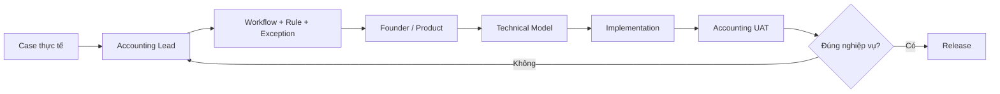

**Accounting Lead chịu trách nhiệm:**

- xác nhận flow;
- xác nhận rule;
- phân loại risk;
- xác nhận acceptance criteria;
- test case thật.

**Founder/CTO chịu trách nhiệm:**

- state machine;
- data model;
- rule engine;
- workflow engine;
- AI orchestration;
- audit;
- observability;
- security;
- scalability.

---

# 4. Học domain theo case

Không học toàn bộ kế toán trước rồi mới code.

Mỗi feature bắt đầu bằng một case thật.

Ví dụ:

```text
Khách gửi hóa đơn AWS 22 triệu.
```

Cần hỏi Accounting Lead:

1. Nhận được chứng từ thì làm gì đầu tiên?
2. Kiểm tra các trường nào?
3. Làm sao biết chứng từ đủ điều kiện xử lý?
4. Xác định nghiệp vụ thế nào?
5. Khi nào tự xử lý được?
6. Khi nào hỏi khách?
7. Khi nào cần kế toán trưởng?
8. Output của bước này là gì?
9. Sau đó có cần đối chiếu ngân hàng không?
10. Khi nào case được coi là hoàn tất?

---

# 5. Scope

## In Scope

```text
Document intake
Accounting case
Client action
Review
Journal draft
Bank reconciliation
Month-end closing
Work queue
Audit trail
Basic reporting
Rule engine
AI assistance
```

## Out of Scope

```text
Full ERP
Inventory
Manufacturing costing
Full payroll engine
POS
Full tax engine
Multi-country accounting
Consolidation
Complex revenue recognition engine
Generic chatbot
```

---

# 6. Actors

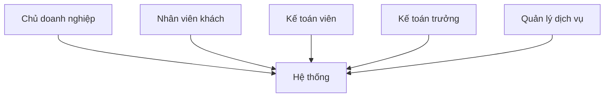

**Client Owner**: xem status, action, report.  
**Client Staff**: upload chứng từ, trả lời yêu cầu.  
**Accountant**: xử lý case, review, reconcile, closing.  
**Senior Accountant**: high-risk review, closing approval.  
**Service Manager**: workload, deadline, SLA, capacity.

---

# 7. Backbone nghiệp vụ

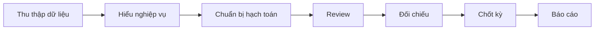

Toàn bộ hệ thống phải phục vụ backbone này.

---

# 8. Aggregate trung tâm — AccountingCase

`AccountingCase` = một vụ việc kế toán cần xử lý đến khi hoàn tất.

Case type:

```text
PURCHASE
SALE
BANK_TRANSACTION
PAYROLL
REFUND
MANUAL_ADJUSTMENT
MISSING_DOCUMENT
OTHER
```

---

# 9. State Machine

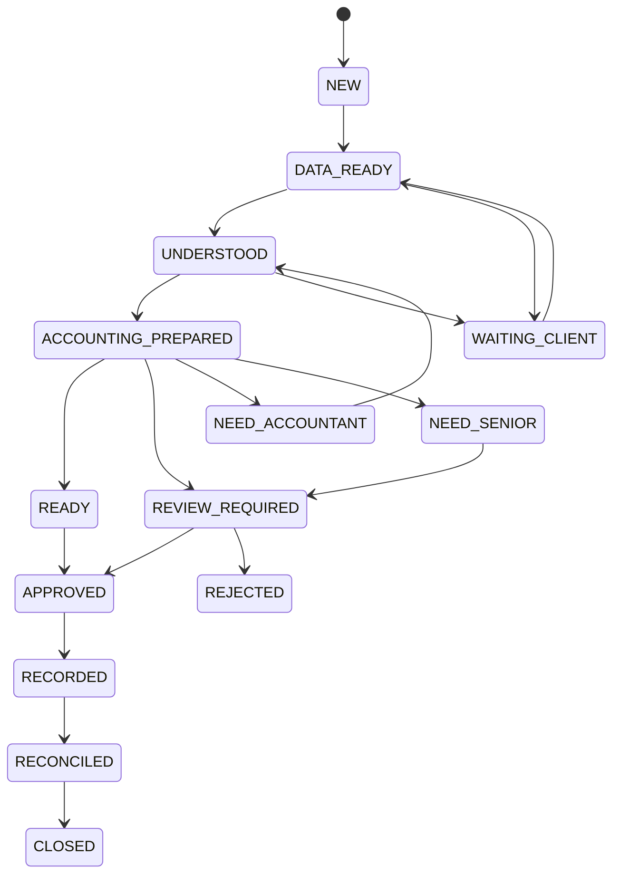

Ý nghĩa:

```text
NEW                  vừa tạo
DATA_READY           có đủ data cơ bản
UNDERSTOOD           hiểu nghiệp vụ là gì
ACCOUNTING_PREPARED  có phương án hạch toán nháp
REVIEW_REQUIRED      cần review
APPROVED             đã duyệt
RECORDED             đã ghi nhận vào system of record
RECONCILED           đã đối chiếu
CLOSED               hoàn tất
```

---

# 10. Event Model

State chỉ đổi vì event.

```text
CASE_CREATED
SOURCE_RECEIVED
DOCUMENT_PARSED
DOCUMENT_VALIDATED
CLASSIFICATION_COMPLETED
JOURNAL_DRAFT_CREATED
CLIENT_INFO_REQUESTED
CLIENT_RESPONDED
REVIEW_REQUESTED
REVIEW_APPROVED
RECORDED
BANK_MATCHED
CASE_CLOSED
```

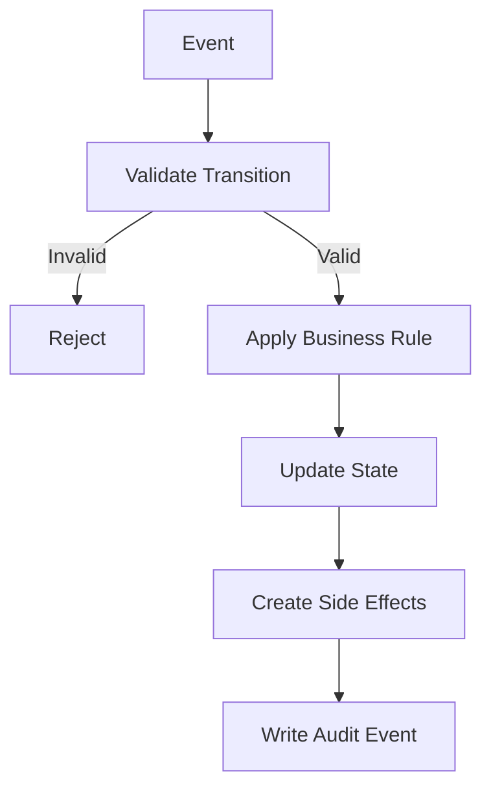

---

# 11. End-to-End tổng thể

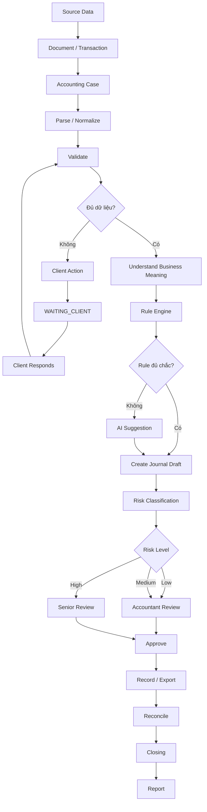

---

# 12. Use Case 1 — Purchase Invoice

Ví dụ hóa đơn AWS 22 triệu.

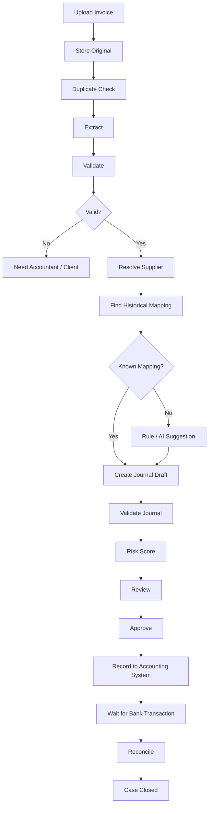

---

# 13. Use Case 2 — Unknown Bank Transaction

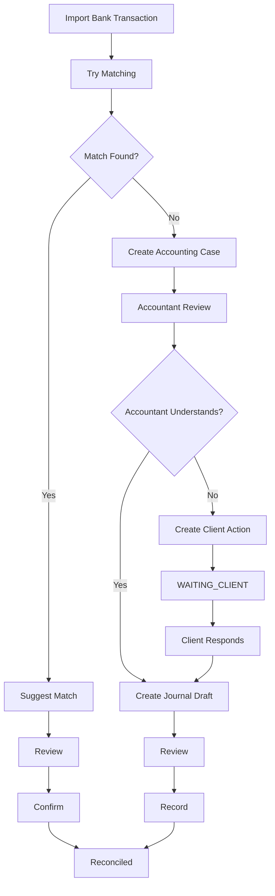

---

# 14. Use Case 3 — Missing Document

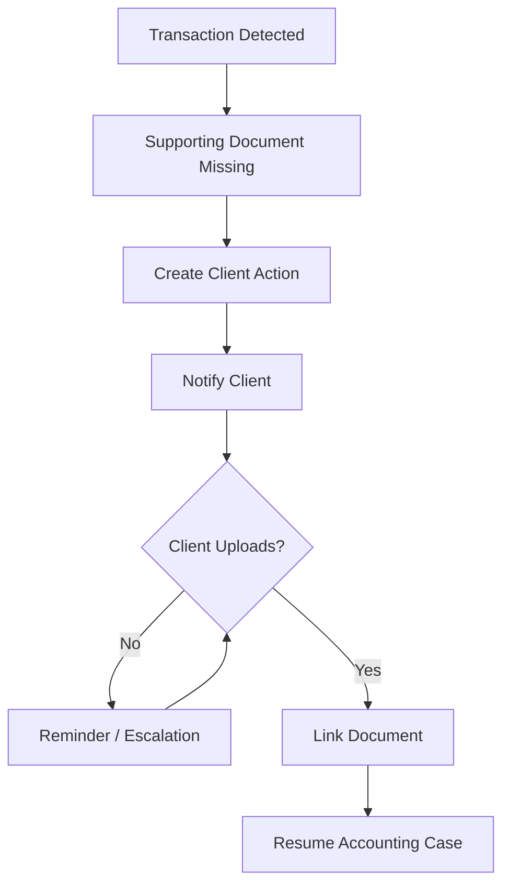

---

# 15. Use Case 4 — Month-End Closing

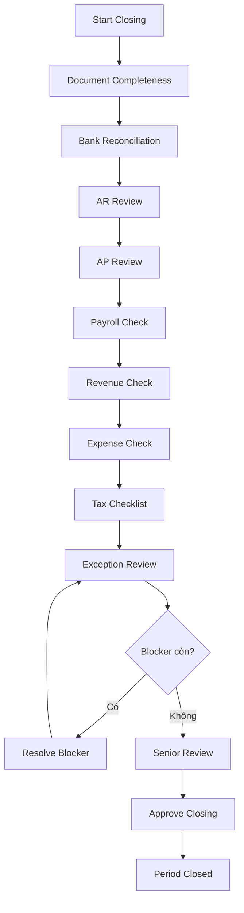

---

# 16. ER Diagram

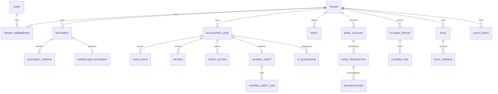

---

# 17. Core Entities

## AccountingCase

```text
id
tenant_id
case_type
source_type
source_id
status
risk_level
assigned_to
period
priority
created_at
updated_at
```

Index:

```text
tenant_id + status
tenant_id + period
assigned_to + status
tenant_id + risk_level
```

## Document

```text
id
tenant_id
document_type
source
original_filename
mime_type
storage_key
sha256
status
uploaded_by
uploaded_at
```

## JournalDraft

```text
id
tenant_id
accounting_case_id
status
risk_level
source
created_by_type
created_at
```

JournalDraftLine:

```text
account_code
debit
credit
party_id
description
project_id
cost_center
```

---

# 18. Accounting Invariants

Luôn enforce bằng code:

```text
sum(debit) == sum(credit)
account tồn tại
account active
period open
amount hợp lệ
party có nếu bắt buộc
posted data không bị xóa im lặng
closed period không sửa bình thường
```

---

# 19. Rule Engine

Rule engine lưu kiến thức chắc chắn.

```yaml
id: KNOWN_VENDOR_AWS
version: 1

when:
  vendor_tax_code: "031..."
  document_type: PURCHASE_INVOICE

then:
  category: CLOUD_SERVICE
  suggested_account: "642"
  risk: LOW
```

Rule phải có:

```text
version
effective_from
effective_to
status
approved_by
audit
```

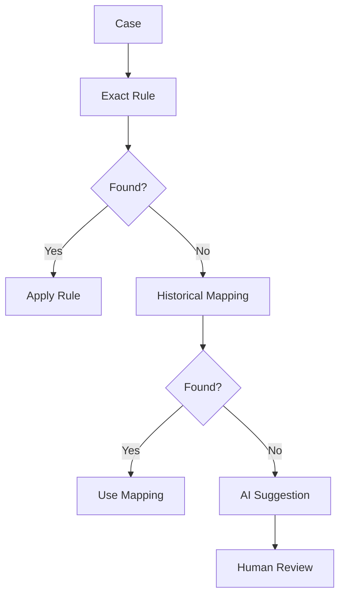

---

# 20. AI Layer

AI chỉ xử lý ambiguity.

Phù hợp:

```text
document extraction
classification
semantic matching
anomaly explanation
client-friendly summary
```

Không dùng AI cho:

```text
arithmetic
permission
period locking
unique constraints
state transition rules
```

AI output bắt buộc structured:

```json
{
  "decision": "CLOUD_SERVICE",
  "confidence": 0.94,
  "evidence": [
    {
      "field": "description",
      "value": "AWS infrastructure services"
    }
  ]
}
```

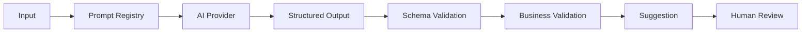

---

# 21. Risk Engine

Risk inputs:

```text
amount deviation
new vendor
new category
foreign transaction
manual journal
tax-sensitive
missing document
related party
historical correction frequency
```

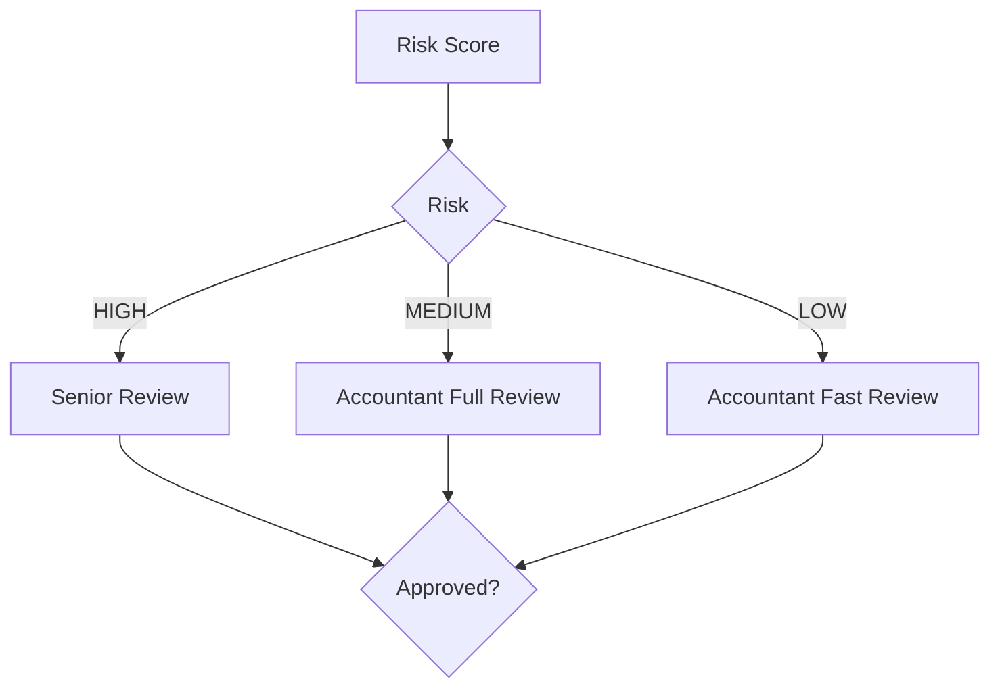

---

# 22. ClientAction

Các loại:

```text
UPLOAD_DOCUMENT
CONFIRM_TRANSACTION
ANSWER_QUESTION
APPROVE_INFORMATION
```

Fields:

```text
id
tenant_id
accounting_case_id
action_type
question
status
due_date
assigned_client_user
response
created_at
resolved_at
```

---

# 23. Work Queue

Ưu tiên:

```text
1. Critical overdue
2. Due today
3. High-risk review
4. Closing blocker
5. Normal tasks
```

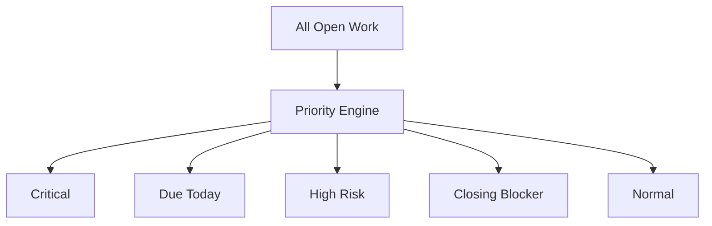

---

# 24. Internal Dashboard

Manager cần thấy:

```text
Active clients
Open cases
Waiting client
Review required
Closing at risk
Tax deadlines
Accountant capacity
SLA breaches
```

Ví dụ:

```text
50 active clients
17 waiting client
11 review required
4 closing at risk

Accountant A: 12 clients
Accountant B: 18 clients
Accountant C: 10 clients
```

---

# 25. Client Portal

MVP chỉ cần:

```text
Home
Documents
Actions
Reports
```

Bên trong hệ thống:

```text
VAT validation
journal draft
mapping
reconciliation
review
```

Khách chỉ thấy:

```text
Đã nhận
Đang xử lý
Cần bạn xử lý
Hoàn tất
```

---

# 26. System Architecture

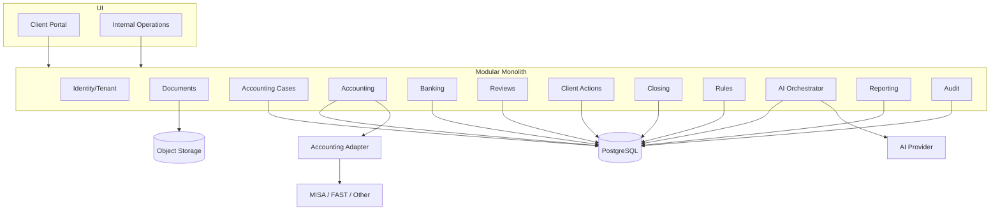

---

# 27. Tech Stack đề xuất

```text
Backend: Java 21 + Spring Boot + Gradle + jOOQ
Database: PostgreSQL
Frontend: React / Next.js / TypeScript
Storage: S3-compatible
Observability: OpenTelemetry + Prometheus + Grafana
Async MVP: PostgreSQL Outbox / Job Queue
Scale later: Kafka/SQS nếu cần
```

---

# 28. Backend Modules

```text
identity
tenants
clients
documents
cases
parties
accounting
banking
receivables
payables
reviews
client-actions
closing
workflow
rules
ai
reporting
integrations
audit
```

---

# 29. Async Processing + Outbox

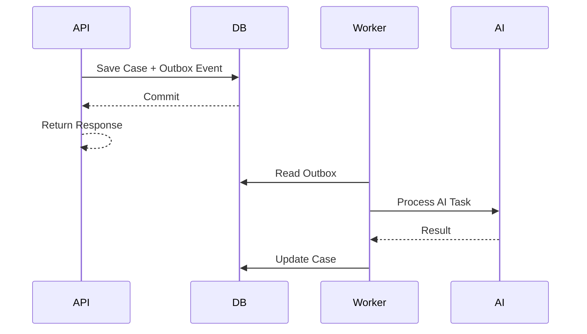

Các job chạy async:

```text
document extraction
AI calls
bank matching
report generation
anomaly scan
```

---

# 30. API Design

```http
POST /v1/documents
GET  /v1/documents/{id}

GET  /v1/accounting-cases/{id}
GET  /v1/accounting-cases?status=...

GET  /v1/work-items

POST /v1/reviews/{id}/decision

POST /v1/client-actions/{id}/response

POST /v1/closing-periods/{period}/start
POST /v1/closing-periods/{period}/approve
```

---

# 31. Multi-Tenancy

Mọi business table có:

```text
tenant_id
```

Tenant lấy từ authenticated context.

Không tin tenant ID gửi từ frontend.

Bắt buộc test:

```text
User tenant A không được đọc/ghi tenant B.
```

---

# 32. Audit Trail

AuditEvent:

```text
id
tenant_id
actor_type
actor_id
event_type
entity_type
entity_id
before_json
after_json
reason
timestamp
```

Audit bắt buộc cho:

```text
review
journal changes
rule changes
permission changes
closing
client response
AI suggestion
```

---

# 33. Security Baseline

```text
TLS
RBAC
MFA cho internal users
encrypted object storage
secret manager
signed URLs
audit log
backups
rate limiting
PII access control
```

Không gửi lên AI:

```text
password
bank credential
API secret
private key
authentication token
```

---

# 34. Data Ownership

Nguyên tắc:

> **Data belongs to customer.**

Phải có:

```text
export
access revoke
audit
retention policy
termination process
```

---

# 35. System of Record Strategy

Giai đoạn đầu:

```text
MISA / FAST / Existing System
=
System of Record
```

Our Platform:

```text
System of Work
+
System of Control
+
System of Intelligence
```

Không rebuild full accounting ledger quá sớm.

---

# 36. Accounting System Adapter

```java
interface AccountingSystemAdapter {

    List<Account> fetchAccounts();

    List<Party> fetchParties();

    List<JournalEntry> fetchJournalEntries(
        AccountingPeriod period
    );

    SyncResult syncApprovedDraft(
        JournalDraft draft
    );
}
```

MVP có thể import/export file trước, API integration sau.

---

# 37. Testing Strategy

## Unit

```text
rule engine
state transition
risk calculation
journal validation
```

## Integration

```text
database
storage
external adapters
AI schema validation
```

## E2E

```text
upload
→ case
→ classify
→ draft
→ review
→ record
→ reconcile
→ close
```

---

# 38. Accounting Acceptance Tests

Mỗi feature phải có acceptance test do Accounting Lead xác nhận.

Ví dụ:

```text
GIVEN:
AWS invoice 22m

WHEN:
system processes invoice

THEN:
- supplier resolved correctly
- total validated
- journal draft created
- risk LOW
- accountant review requested
- source document linked
```

Không release nếu chỉ pass technical test.

---

# 39. Golden Dataset

Case thật đã được senior xác nhận có thể trở thành golden record.

```text
input
expected classification
expected journal
expected risk
expected reviewer
reason
```

Dùng để regression test rule + AI.

---

# 40. Metrics

Technical:

```text
API p95
job latency
AI latency
AI schema failure
document processing time
error rate
```

Business/Operations:

```text
human_minutes_per_client
human_minutes_per_document
automation_rate
exception_rate
review_rate
closing_duration
client_response_time
rework_rate
clients_per_accountant
```

---

# 41. Definition of Done

Một automation feature chưa Done nếu thiếu:

```text
[ ] workflow nghiệp vụ được Accounting Lead xác nhận
[ ] state transition rõ
[ ] input/output rõ
[ ] rule rõ
[ ] exception rõ
[ ] human fallback
[ ] audit
[ ] permission
[ ] metrics
[ ] test case thật
[ ] acceptance test
```

---

# 42. MVP Roadmap

## Phase 0 — Domain Discovery

Chưa code automation.

Làm:

```text
20–50 case thật
workflow mapping
decision table
exception catalog
```

Output:

```text
Domain Playbook
```

## Phase 1 — Operational Backbone

```text
Tenant
User
Document
AccountingCase
Work Queue
ClientAction
Review
Audit
```

## Phase 2 — Document Intelligence

```text
XML parsing
PDF/image extraction
duplicate check
normalized document
classification
```

## Phase 3 — Accounting Assistance

```text
chart of accounts
party
rule engine
historical mapping
journal draft
validation
human review
```

## Phase 4 — Banking

```text
bank import
matching
reconciliation
unmatched queue
```

## Phase 5 — Closing

```text
closing period
closing checklist
blocker
senior review
close
```

## Phase 6 — Client Portal

```text
Home
Documents
Actions
Reports
```

---

# 43. Domain Discovery Workshop

Mỗi buổi 60–90 phút, chỉ xử lý **một case thật**.

Template:

```text
1. Trigger là gì?
2. Input là gì?
3. Accountant làm gì?
4. Quyết định gì?
5. Rule nào chắc chắn?
6. Exception nào hay gặp?
7. Khi nào hỏi khách?
8. Khi nào cần senior?
9. Output là gì?
10. Khi nào Done?
```

---

# 44. Decision Table

Ví dụ:

| Điều kiện | Kết quả |
|---|---|
| Vendor đã biết + amount bình thường + đủ chứng từ | LOW risk |
| Vendor mới + đủ chứng từ | MEDIUM |
| Foreign transaction | HIGH |
| Thiếu hợp đồng bắt buộc | WAITING_CLIENT |
| Không xác định được nghiệp vụ | NEED_ACCOUNTANT |

Mỗi bảng phải được Accounting Lead approve.

---

# 45. Exception Catalog

Exception là first-class concept.

```text
MISSING_DOCUMENT
UNKNOWN_PARTY
UNMATCHED_BANK_TRANSACTION
DUPLICATE_INVOICE
INVALID_TOTAL
CLOSED_PERIOD
HIGH_AMOUNT_DEVIATION
FOREIGN_TRANSACTION
MANUAL_JOURNAL
```

Mỗi exception có:

```text
severity
owner
resolution_flow
SLA
escalation
```

---

# 46. Domain Knowledge Registry

Không để knowledge nằm trong Zalo/chat.

Repo:

```text
docs/
└── accounting-domain/
    ├── purchase-invoice.md
    ├── sales-invoice.md
    ├── bank-reconciliation.md
    ├── closing.md
    ├── exceptions.md
    └── decisions/
```

---

# 47. Repository đề xuất

```text
accounting-os/
├── apps/
│   ├── backend/
│   └── web/
├── modules/
│   ├── documents/
│   ├── cases/
│   ├── accounting/
│   ├── banking/
│   ├── closing/
│   ├── reviews/
│   ├── client-actions/
│   ├── rules/
│   ├── ai/
│   └── audit/
├── docs/
│   ├── domain/
│   ├── architecture/
│   ├── adr/
│   └── api/
├── rules/
├── prompts/
├── schemas/
├── evals/
└── scripts/
```

---

# 48. ADR cần viết

```text
ADR-001 Modular Monolith
ADR-002 PostgreSQL
ADR-003 External System of Record
ADR-004 Human-in-the-loop
ADR-005 Rule Before AI
ADR-006 AccountingCase Aggregate
ADR-007 Immutable Audit
ADR-008 Rule Versioning
```

---

# 49. Sequence — Invoice Processing

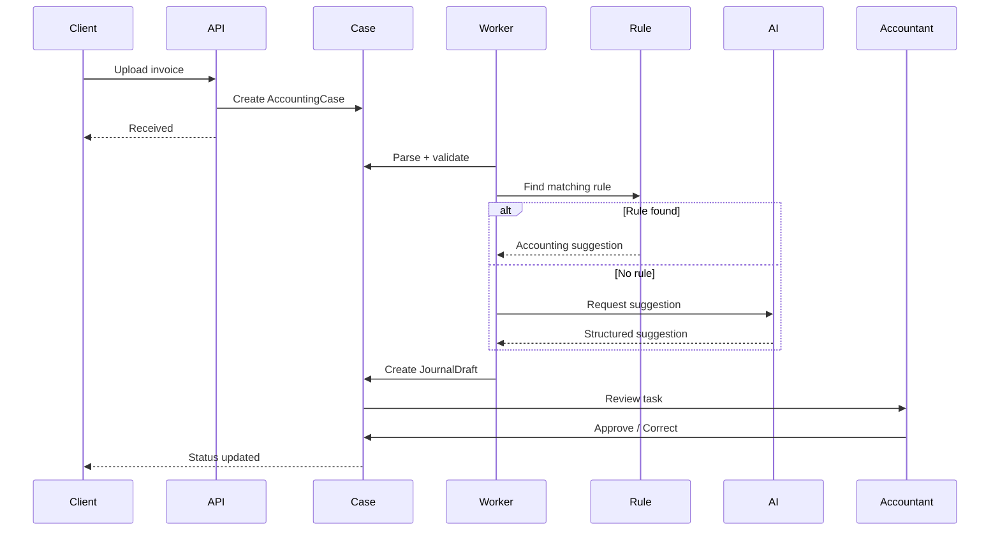

---

# 50. Sequence — Client Missing Info

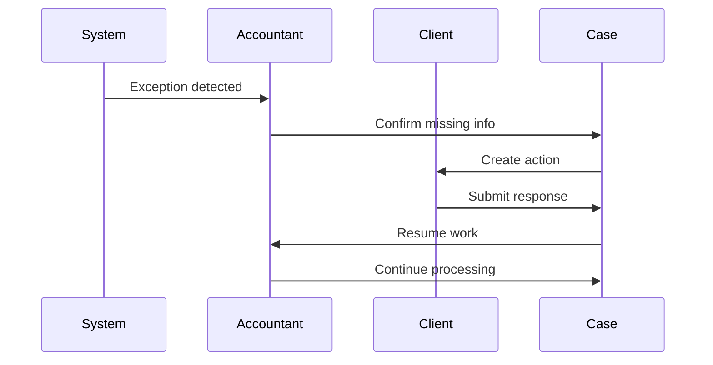

---

# 51. Sequence — Closing

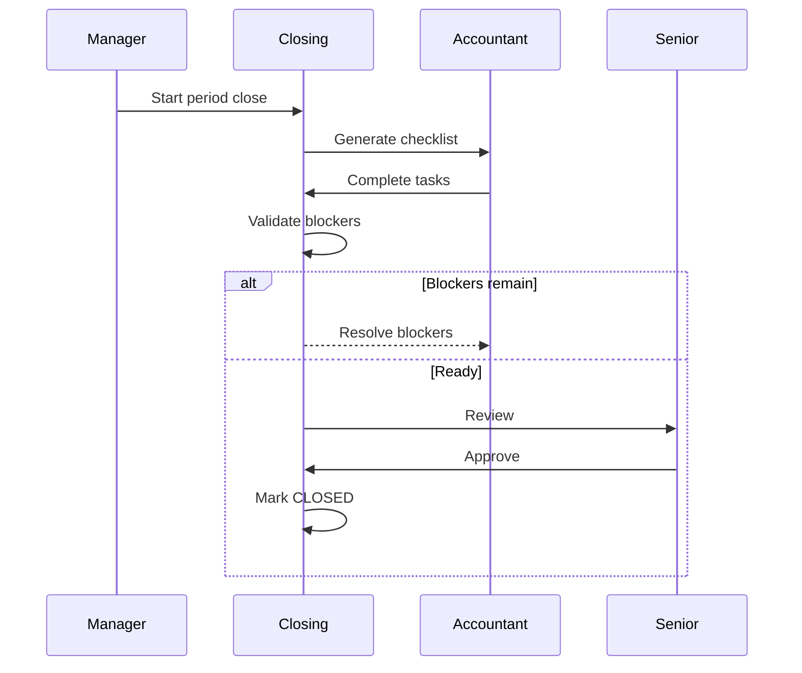

---

# 52. Component Diagram

```mermaid
flowchart LR
    UI[Web UI]

    UI --> API[Backend API]

    API --> CASE[Case Module]
    API --> DOC[Document Module]
    API --> ACC[Accounting Module]
    API --> BANK[Banking Module]
    API --> CLOSE[Closing Module]
    API --> REVIEW[Review Module]
    API --> RULE[Rule Module]
    API --> AI[AI Module]

    DOC --> S3[(Object Storage)]
    CASE --> PG[(PostgreSQL)]
    ACC --> PG
    BANK --> PG
    CLOSE --> PG
    REVIEW --> PG
    RULE --> PG
    AI --> PG

    AI --> MODEL[AI Provider]
    ACC --> EXT[Accounting Adapter]
```

---

# 53. Deployment Diagram

```mermaid
flowchart TB
    USER[Users]
    LB[Load Balancer]
    WEB[Web App]
    API[Backend]
    WORKER[Background Worker]
    DB[(PostgreSQL)]
    OBJ[(Object Storage)]
    AI[AI Provider]
    EXT[Accounting System]

    USER --> LB
    LB --> WEB
    WEB --> API
    API --> DB
    API --> OBJ
    API --> WORKER
    WORKER --> DB
    WORKER --> AI
    WORKER --> EXT
```

---

# 54. Failure Handling

**AI unavailable**

```text
retry limited
→ manual review queue
```

**Integration unavailable**

```text
store pending sync
→ retry
→ alert nếu quá SLA
```

**Document parsing failed**

```text
NEED_ACCOUNTANT
```

Workflow không được chết im lặng.

---

# 55. Quy tắc phát triển cuối cùng

Mọi feature mới phải bắt đầu bằng:

```text
Case thật
↓
Accounting Lead giải thích
↓
Workflow
↓
Decision Table
↓
Exception
↓
State Machine
↓
Acceptance Test
↓
Technical Design
↓
Code
```

Không được đảo ngược.

---

# 56. Kết luận

Hệ thống có thể được build bởi founder không phải dân kế toán nếu separation of responsibility rõ:

```text
Accounting Lead
= định nghĩa đúng nghiệp vụ

Founder/CTO
= biến nghiệp vụ thành hệ thống
```

Technical core:

```text
AccountingCase
+
State Machine
+
Rule Engine
+
Review
+
Client Action
+
Reconciliation
+
Closing
+
Audit
```

AI chỉ là lớp hỗ trợ.

> **Không code kế toán từ trí nhớ. Code workflow đã được domain expert xác nhận.**
