# TDD DỄ HIỂU — HỆ THỐNG VẬN HÀNH DỊCH VỤ KẾ TOÁN
## Viết cho người làm phần mềm nhưng không phải dân kế toán

**Phiên bản:** 1.0  
**Mục tiêu:** Đọc từ đầu đến cuối là hình dung được hệ thống phải làm gì trước khi nhìn thấy database/API/code.

---

# 1. Trước tiên: Chúng ta đang xây cái gì?

Không xây MISA mới.

Không xây phần mềm để khách tự làm kế toán.

Chúng ta đang mở **công ty dịch vụ kế toán**.

Ví dụ có 100 công ty nhỏ thuê chúng ta làm kế toán hàng tháng.

Vấn đề là:

```text
100 khách
↓
mỗi khách gửi rất nhiều file
↓
kế toán phải nhớ rất nhiều việc
↓
thiếu chứng từ
↓
nhắn Zalo hỏi khách
↓
đối chiếu ngân hàng
↓
làm thuế
↓
chốt tháng
↓
gửi báo cáo
```

Nếu làm thủ công hoàn toàn:

```text
khách tăng
→ phải tuyển thêm kế toán gần như tuyến tính
```

Hệ thống mình xây có nhiệm vụ:

> **Quản toàn bộ công việc đó và tự động hóa những phần máy làm được.**

---

# 2. Hãy bỏ kế toán sang một bên một chút

Hình dung nó giống một hệ thống xử lý đơn hàng.

Một đơn hàng có:

```text
nhận đơn
→ kiểm tra thông tin
→ thiếu thì hỏi khách
→ xử lý
→ kiểm tra
→ hoàn tất
```

Dịch vụ kế toán cũng gần như vậy:

```text
nhận chứng từ/giao dịch
→ kiểm tra
→ hiểu nó là gì
→ thiếu thì hỏi khách
→ kế toán xử lý
→ kiểm tra lại
→ hoàn tất
```

Đây là mental model quan trọng nhất.

---

# 3. Một khách hàng thực tế

Giả sử:

```text
Công ty ABC Marketing

10 nhân viên
1 tài khoản ngân hàng
30 hóa đơn đầu vào/tháng
10 hóa đơn đầu ra/tháng
không có kho
không sản xuất
```

ABC thuê chúng ta làm kế toán.

Một tháng của ABC sẽ phát sinh:

```text
Khách hàng trả tiền cho ABC
ABC trả tiền nhà cung cấp
ABC mua laptop
ABC trả tiền Facebook Ads
ABC trả tiền AWS
ABC trả lương
ABC xuất hóa đơn cho khách
ABC nhận hóa đơn từ supplier
```

Cuối tháng, công ty kế toán phải biến đống giao dịch này thành:

```text
sổ sách đầy đủ
+
công nợ rõ ràng
+
ngân hàng khớp
+
thuế
+
báo cáo
```

Đó là toàn bộ bài toán.

---

# 4. Hệ thống phải theo dõi 4 loại đầu vào

Ban đầu chỉ cần hiểu bốn loại này.

```text
1. HÓA ĐƠN / CHỨNG TỪ

2. GIAO DỊCH NGÂN HÀNG

3. THÔNG TIN TỪ KHÁCH

4. DỮ LIỆU KẾ TOÁN HIỆN CÓ
```

Không cần phức tạp hơn ở MVP.

---

# 5. Luồng số 1: Khách gửi một hóa đơn

Ví dụ:

```text
AWS
22.000.000 đồng
Cloud Service
```

Khách upload file.

Hệ thống đầu tiên phải làm gì?

```text
Nhận file
↓
Lưu file
↓
Đọc thông tin trên hóa đơn
↓
Kiểm tra xem đã nhận hóa đơn này chưa
↓
Đưa cho kế toán xử lý
```

Sơ đồ:

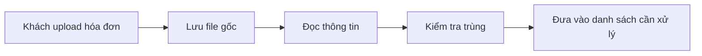

Chưa cần AI hạch toán gì ở đây.

---

# 6. Hệ thống đọc gì từ hóa đơn?

Ví dụ:

```text
Tên nhà cung cấp: AWS
Số hóa đơn: INV001
Ngày: 05/09/2026
Tiền hàng: 20.000.000
Thuế: 2.000.000
Tổng: 22.000.000
Nội dung: Cloud Service
```

Nguồn có XML:

```text
đọc XML bằng code
```

Chỉ có PDF/ảnh:

```text
AI đọc giúp
```

Mục tiêu của bước này chỉ là:

> **Biến file thành dữ liệu có cấu trúc.**

Không ra quyết định kế toán.

---

# 7. Sau khi đọc hóa đơn thì chuyện gì xảy ra?

Kế toán cần trả lời:

> Đây là khoản gì?

Ví dụ:

```text
AWS
→ dịch vụ cloud
→ chi phí CNTT
```

Nếu tháng trước AWS đã được xử lý rồi:

```text
Hệ thống biết lịch sử
↓
đề xuất giống tháng trước
```

Nếu chưa từng gặp:

```text
AI có thể gợi ý
↓
kế toán xác nhận
```

Flow:

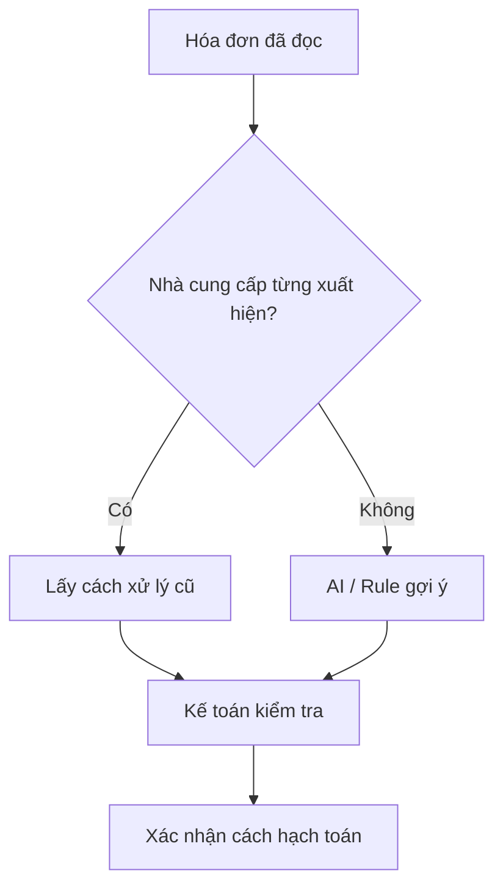

---

# 8. Anh cần hiểu "hạch toán" ở mức nào?

Chỉ cần hiểu:

> Hạch toán = quyết định nghiệp vụ này được ghi vào đâu trong sổ kế toán.

Ví dụ đời thường:

```text
Mua cloud
→ chi phí CNTT

Khách chưa trả tiền
→ công ty còn khoản phải thu

Công ty chưa trả supplier
→ công ty còn khoản phải trả
```

Còn cụ thể tài khoản kế toán nào:

```text
Accounting Lead định nghĩa.
```

Dev không tự nghĩ.

---

# 9. Bút toán nháp là gì?

Hệ thống không cho AI ghi thẳng vào sổ.

Nó tạo:

```text
ĐỀ XUẤT HẠCH TOÁN
```

Ví dụ:

```text
Hóa đơn AWS 22m

Đề xuất:
Chi phí Cloud: 22m
Phải trả AWS: 22m
```

Kế toán nhìn và bấm:

```text
Đồng ý
```

hoặc:

```text
Sửa
```

Sau đó mới ghi vào phần mềm kế toán thật.

---

# 10. Luồng hoàn chỉnh của một hóa đơn

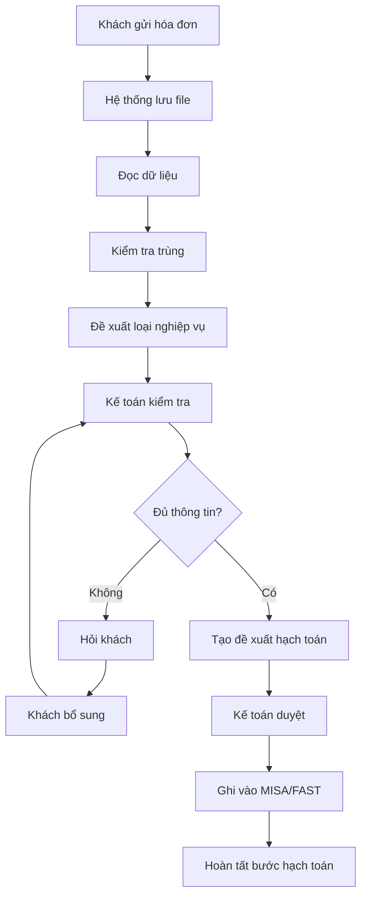

Nếu anh hiểu chart này thì đã hiểu feature đầu tiên.

---

# 11. Luồng số 2: Giao dịch ngân hàng

Ví dụ bank:

```text
05/09  +50m  Công ty XYZ
06/09  -22m  AWS
07/09  -18m  Nguyen Van A
```

Kế toán cần biết mỗi dòng ngân hàng liên quan nghiệp vụ nào.

---

# 12. Match ngân hàng nghĩa là gì?

Ví dụ:

```text
Bank:
-22m AWS
```

Hệ thống đã có:

```text
Invoice AWS 22m
```

Vậy:

```text
Bank AWS 22m
↔
Invoice AWS 22m
```

Có thể match.

Đây gọi là đối chiếu.

---

# 13. Flow đối chiếu ngân hàng

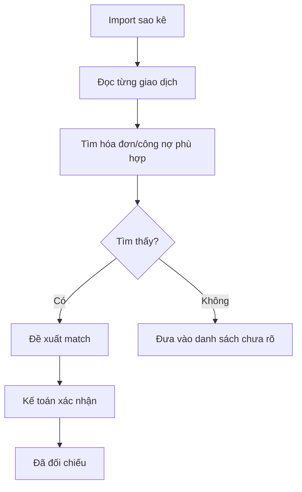

---

# 14. Giao dịch không rõ thì sao?

Ví dụ:

```text
07/09
-18m
Nguyen Van A
```

Không invoice.

Không biết là gì.

Kế toán xem cũng không biết.

Lúc này:

```text
Hỏi khách:
"Khoản 18 triệu ngày 07/09 là chi gì?"
```

Khách trả lời:

```text
"Tiền freelancer thiết kế."
```

Hệ thống tiếp tục xử lý.

---

# 15. Flow hỏi khách

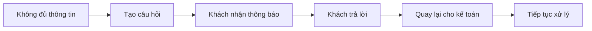

Đây là một feature cực quan trọng.

Không nên dùng Zalo để quản phần này lâu dài.

---

# 16. Portal khách ban đầu chỉ cần làm việc này

Khách login thấy:

```text
Bạn có 3 việc cần xử lý

1. Giao dịch 18m ngày 07/09 là gì?
2. Vui lòng upload hợp đồng ABC.
3. Vui lòng xác nhận bảng lương tháng 09.
```

Không cần build portal phức tạp.

---

# 17. Luồng số 3: Công nợ phải thu

Ví dụ:

```text
ABC xuất hóa đơn cho XYZ: 100m

XYZ trả:
60m

Vậy XYZ còn nợ:
40m
```

Hệ thống phải biết:

```text
Hóa đơn: 100m
Đã nhận: 60m
Còn: 40m
```

Đó là công nợ phải thu.

---

# 18. Luồng công nợ phải thu

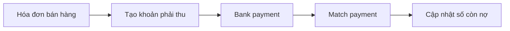

Owner có thể xem:

```text
XYZ còn nợ 40m
quá hạn 15 ngày
```

---

# 19. Công nợ phải trả

Ngược lại:

```text
AWS gửi invoice 22m
ABC chưa trả
```

ABC đang nợ AWS:

```text
22m
```

Khi bank có:

```text
-22m AWS
```

match xong:

```text
nợ AWS = 0
```

---

# 20. Luồng số 4: Cuối tháng

Đây là thứ rất quan trọng.

Kế toán không thể cứ nhập xong vài hóa đơn là hoàn tất.

Cuối tháng phải kiểm tra:

```text
Đủ hóa đơn chưa?
Ngân hàng khớp chưa?
Khách còn nợ ai?
Ai còn nợ khách?
Lương đã ghi chưa?
Có giao dịch nào chưa rõ?
Thuế đã chuẩn bị chưa?
```

Đó gọi là:

> **Month-End Closing — chốt sổ tháng.**

---

# 21. Closing hiểu đơn giản thế nào?

Closing giống checklist trước khi "khóa" tháng.

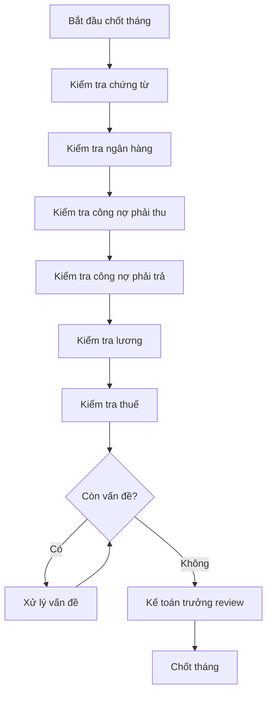

Hệ thống chỉ cần biến checklist này thành workflow.

---

# 22. Màn hình kế toán viên thực sự cần gì?

Không phải dashboard đẹp.

Kế toán login và thấy:

```text
VIỆC HÔM NAY

ABC
- 2 hóa đơn cần kiểm tra
- 1 giao dịch bank chưa rõ
- đang chờ khách trả lời 1 câu

XYZ
- closing tháng 09 còn 3 việc
- 1 hóa đơn cần senior review
```

Đó là screen quan trọng nhất.

---

# 23. Màn hình quản lý cần gì?

Người quản lý phải biết:

```text
Có bao nhiêu khách?
Ai phụ trách ai?
Khách nào đang trễ?
Ai đang quá tải?
Khách nào chờ phản hồi?
Tháng nào chưa closing?
```

Ví dụ:

```text
50 khách active

Kế toán A: 12 khách
Kế toán B: 18 khách ⚠
Kế toán C: 10 khách

4 khách có nguy cơ trễ closing
11 case cần review
17 case đang chờ khách
```

---

# 24. Bây giờ mới nói về object trong code

Sau khi hiểu flow trên, hệ thống chỉ cần vài object chính.

## Customer

Doanh nghiệp thuê mình.

## Document

File khách gửi.

## BankTransaction

Một dòng sao kê ngân hàng.

## AccountingWork

Một việc kế toán cần xử lý.

Ví dụ:

```text
"Hóa đơn AWS cần xử lý"
```

hoặc:

```text
"Giao dịch 18m chưa rõ"
```

## ClientQuestion

Câu hỏi cần khách trả lời.

## Review

Việc kế toán/senior cần duyệt.

## ClosingMonth

Checklist chốt một tháng.

---

# 25. Không cần gọi AccountingCase nếu khó hiểu

Trong code có thể đặt:

```text
AccountingWork
```

thay vì:

```text
AccountingCase
```

Ý nghĩa:

> Một đơn vị công việc kế toán.

Ví dụ:

```text
AccountingWork #001
type = PURCHASE_INVOICE
status = WAITING_REVIEW
customer = ABC
```

Tên code phải giúp dev hiểu domain, không phải làm domain trông phức tạp hơn.

---

# 26. Trạng thái AccountingWork

Chỉ cần bắt đầu bằng 7 trạng thái:

```text
NEW
PROCESSING
WAITING_CLIENT
WAITING_REVIEW
APPROVED
DONE
FAILED
```

Diagram:

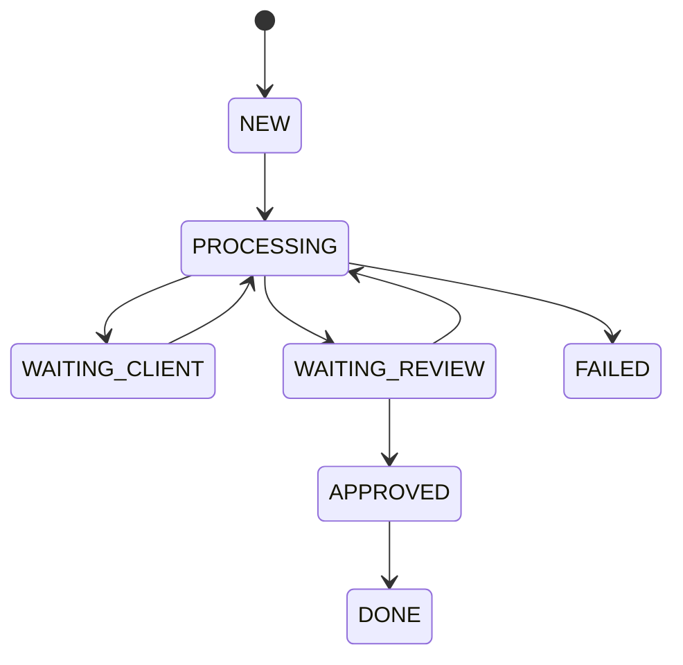

Đơn giản trước.

Không cần 15 states.

---

# 27. Khi nào tạo AccountingWork?

Ví dụ:

```text
Upload invoice
→ tạo AccountingWork

Import bank transaction chưa match
→ tạo AccountingWork

Missing document
→ tạo AccountingWork

Closing task
→ tạo AccountingWork
```

Toàn bộ work queue của kế toán dựa trên object này.

---

# 28. Kiến trúc đơn giản

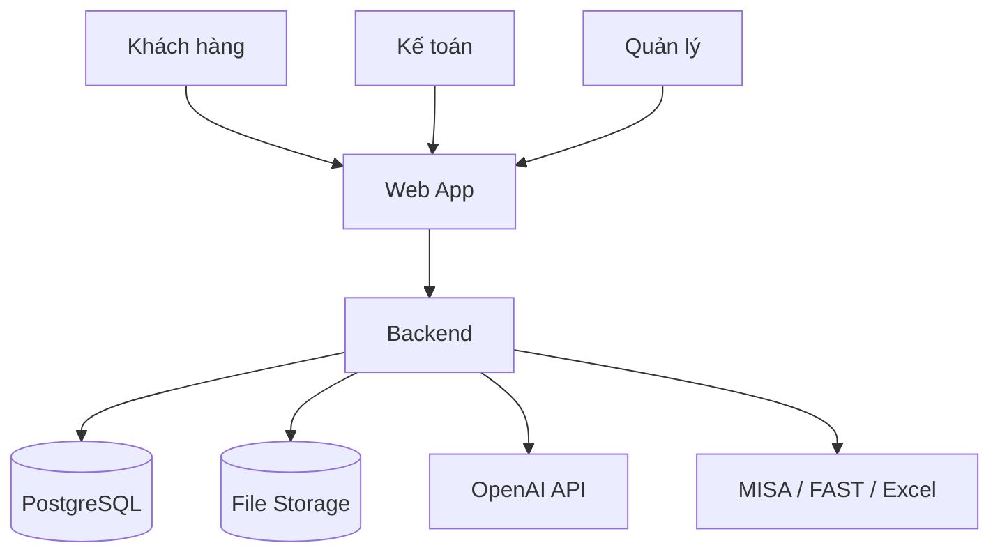

MVP chỉ vậy.

Không microservice.

Không Kafka.

Không cần workflow engine riêng.

---

# 29. Module backend

Ban đầu:

```text
customers
documents
accounting-work
banking
client-questions
reviews
closing
users
audit
ai
```

Chỉ 9 module.

---

# 30. Database tối thiểu

```text
customers

users
customer_users

documents

accounting_works

client_questions

reviews

bank_accounts
bank_transactions
bank_matches

closing_months
closing_tasks

audit_logs
```

Chưa cần database kế toán đồ sộ.

---

# 31. AI dùng chính xác ở đâu?

## 1. Đọc hóa đơn PDF/ảnh

```text
file
→ AI
→ JSON
```

## 2. Gợi ý loại chi phí

```text
"AWS Cloud Service"
→ AI
→ "cloud/IT expense"
```

## 3. Gợi ý match

```text
bank description
+
invoice
→ AI/rule
→ possible match
```

## 4. Viết câu hỏi dễ hiểu cho khách

## 5. Tóm tắt vấn đề cho owner

Không cho AI tự chốt nghiệp vụ quan trọng.

---

# 32. Rule và AI khác nhau thế nào?

Ví dụ:

```text
AWS tháng nào cũng hạch toán giống nhau
```

Không cần AI.

Dùng rule:

```text
IF vendor = AWS
THEN category = CLOUD
```

Nếu:

```text
Vendor mới
description mơ hồ
```

AI gợi ý.

Nguyên tắc:

```text
Biết chắc
→ code/rule

Không chắc
→ AI

Rủi ro
→ human
```

---

# 33. Luồng đầy đủ của hệ thống

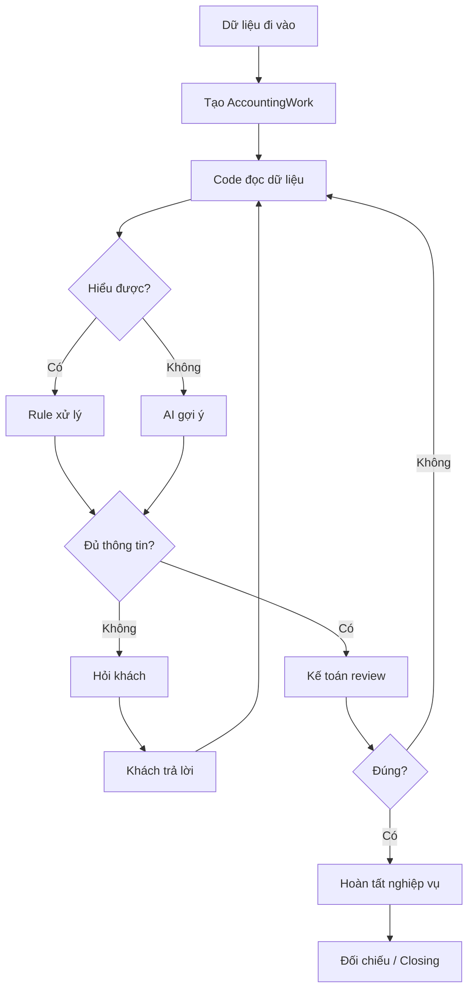

Đây là architecture nghiệp vụ quan trọng nhất.

---

# 34. API MVP

## Upload

```http
POST /documents
```

## Work queue

```http
GET /accounting-works
```

## Work detail

```http
GET /accounting-works/{id}
```

## Ask client

```http
POST /accounting-works/{id}/questions
```

## Client answer

```http
POST /client-questions/{id}/answer
```

## Review

```http
POST /accounting-works/{id}/review
```

## Import bank

```http
POST /bank-transactions/import
```

## Closing

```http
POST /closing-months/{month}/start
```

Không cần hơn nhiều để bắt đầu.

---

# 35. MVP đầu tiên nên làm gì?

Không build toàn bộ TDD.

MVP 1:

```text
Customer
Document Upload
AccountingWork
Work Queue
Client Question
Review
Audit
```

Use case duy nhất:

```text
Khách gửi hóa đơn
→ hệ thống đọc
→ kế toán review
→ thiếu thì hỏi khách
→ done
```

Nếu luồng này chưa chạy tốt:

> Không làm bank reconciliation.

---

# 36. MVP 2

Sau khi Invoice Flow ổn:

```text
Import bank
→ match invoice
→ unmatched queue
→ hỏi khách
```

---

# 37. MVP 3

Sau khi bank ổn:

```text
Month-End Closing
```

---

# 38. Roadmap dễ hiểu

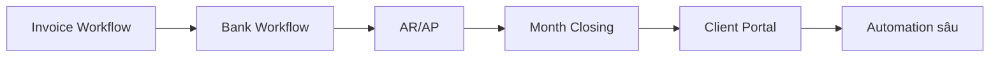

---

# 39. Cách anh làm việc với Accounting Lead

Không hỏi:

> "Em giải thích kế toán cho anh đi."

Hỏi một case cụ thể:

> "Khách gửi hóa đơn Facebook Ads thì từ lúc nhận file đến lúc xong em làm từng bước nào?"

Ghi lại:

```text
Bước 1
Bước 2
Bước 3
...
```

Sau đó hỏi:

```text
Ở bước nào em phải suy nghĩ?
Ở bước nào lúc nào cũng giống nhau?
Khi nào phải hỏi khách?
Khi nào em không dám tự quyết?
```

Từ câu trả lời:

```text
lúc nào giống nhau
→ Rule

cần suy nghĩ nhưng low-risk
→ AI suggestion

phải hỏi khách
→ ClientQuestion

không dám tự quyết
→ Senior Review
```

Đó chính là product discovery.

---

# 40. Template lấy nghiệp vụ

Mỗi case chỉ cần điền bảng:

| Câu hỏi | Nội dung |
|---|---|
| Case là gì? | Ví dụ AWS invoice |
| Input? | PDF/XML |
| Bước đầu tiên? | Check hóa đơn |
| Kiểm tra gì? | ... |
| Quyết định gì? | ... |
| Có rule không? | ... |
| Khi nào hỏi khách? | ... |
| Khi nào cần senior? | ... |
| Output? | ... |
| Khi nào Done? | ... |

Không cần viết UML trước.

---

# 41. Definition of Done của một feature

Ví dụ feature "Purchase Invoice".

Chỉ Done khi:

```text
Accounting Lead nói flow đúng
+
có 10 case thật test
+
developer hiểu input/output
+
có path khi thiếu dữ liệu
+
có review
+
có audit
```

AI accuracy cao mà workflow sai:

```text
feature vẫn fail
```

---

# 42. Thứ anh thực sự cần học

Không cần học kế toán từ A-Z.

Học đúng thứ tự:

```text
1. Hóa đơn/chứng từ
2. Thu/chi ngân hàng
3. Doanh thu/chi phí
4. Phải thu/phải trả
5. Hạch toán cơ bản
6. Đối chiếu
7. Closing
8. Tax workflow
```

Học mỗi phần khi build tới.

---

# 43. Cái gì Accounting Lead phải chịu trách nhiệm?

Accounting Lead quyết định:

```text
nghiệp vụ này là gì
cách hạch toán
rule nào đúng
risk nào cao
chứng từ nào bắt buộc
closing cần check gì
tax treatment
```

Anh không tự đoán.

---

# 44. Cái gì anh chịu trách nhiệm?

Anh quyết định:

```text
workflow model
state
database
API
permissions
automation
AI integration
audit
performance
observability
UX
```

Đó đúng sở trường software engineering.

---

# 45. Mental model cuối cùng

Đừng nghĩ:

```text
"Tôi đang build phần mềm kế toán."
```

Hãy nghĩ:

> **"Tôi đang build một hệ thống quản lý hàng nghìn công việc kế toán."**

Mỗi việc:

```text
có input
có người phụ trách
có trạng thái
có decision
có exception
có output
```

Đây là bài toán workflow mà anh đã quen thuộc trong software engineering.

---

# 46. Một câu chốt

Toàn bộ hệ thống ban đầu có thể hiểu bằng một diagram:

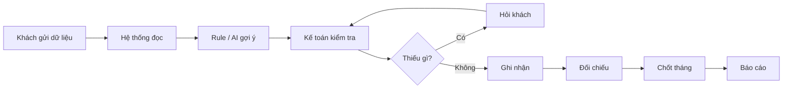

Nếu anh hiểu diagram này, anh đã có đủ mental model để bắt đầu product discovery.

Chi tiết kế toán sẽ được bổ sung từng case một, không phải học hết trước.
