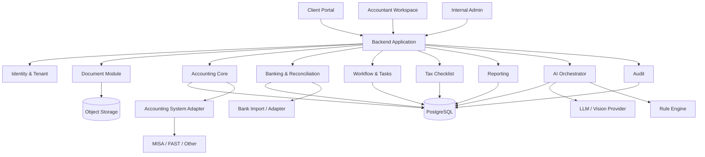
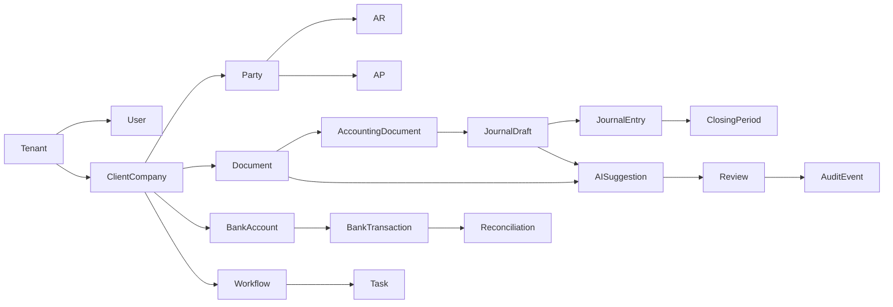
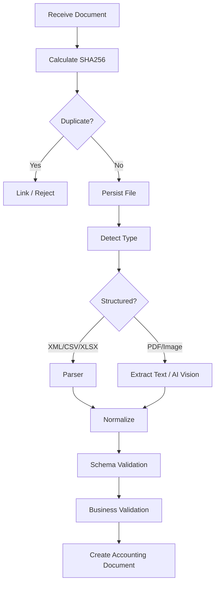
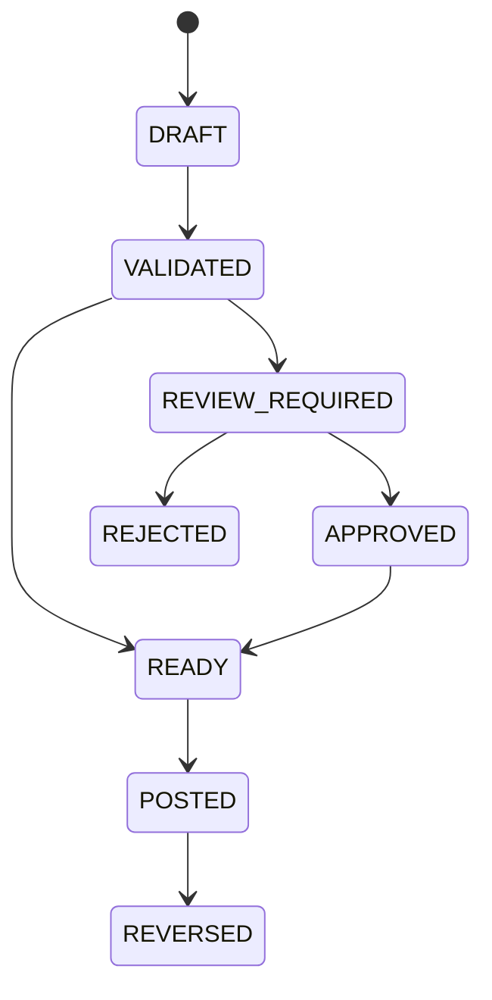
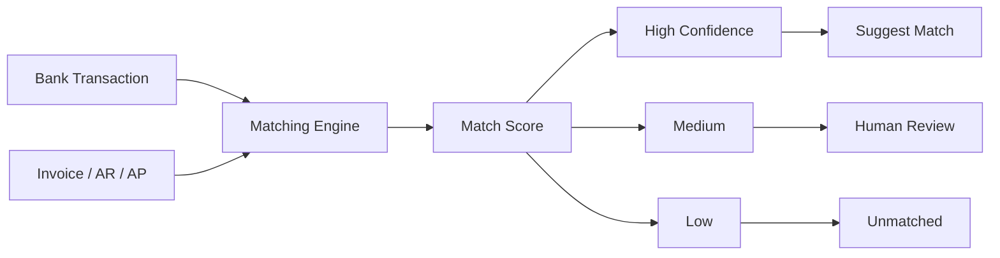
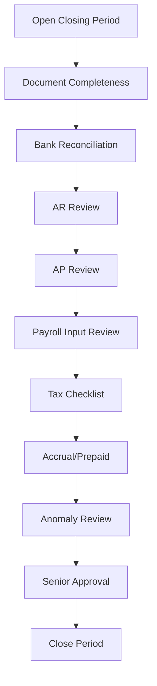
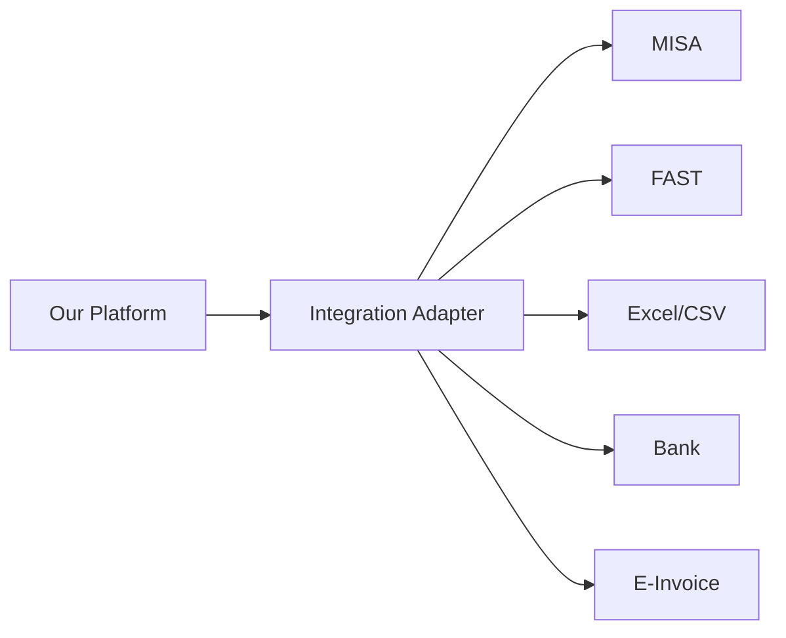

# TECHNICAL DESIGN DOCUMENT
# AI-First Accounting Operations Platform
## Narrow Market Entry, Broad Accounting Core

> **Version:** 1.0  
> **Status:** Proposed Architecture  
> **Primary Market:** Doanh nghiệp dịch vụ nhỏ và rất nhỏ  
> **Core Principle:** Narrow market entry, broad accounting core  
> **Primary Goal:** Xây nền tảng vận hành dịch vụ kế toán thuê ngoài có khả năng tự động hóa sâu, kiểm soát tốt và mở rộng sang nhiều loại hình doanh nghiệp mà không phải thiết kế lại core.

---

# 1. Executive Summary

Hệ thống được xây dựng để hỗ trợ một mô hình kinh doanh:

> **Phòng kế toán thuê ngoài cho doanh nghiệp nhỏ, trong đó phần lớn công việc lặp lại được hệ thống và AI chuẩn bị; kế toán viên tập trung review, xử lý ngoại lệ và chịu trách nhiệm nghiệp vụ.**

Đối tượng khách hàng ban đầu là:

- doanh nghiệp dịch vụ 1–20 nhân sự;
- 10–200 chứng từ/tháng;
- 1–3 tài khoản ngân hàng;
- nghiệp vụ kế toán tương đối đơn giản;
- không sản xuất;
- không inventory/costing phức tạp;
- không consolidation nhiều pháp nhân.

Tuy nhiên, accounting domain không được hard-code theo một ngành cụ thể.

Kiến trúc phải đảm bảo:

```text
Market entry:
Service Businesses

Accounting Core:
Generic

Industry-specific behavior:
Configuration / Rules / Extensions
```

Hệ thống không cố thay thế MISA/FAST ngay từ đầu.

Chiến lược kỹ thuật:

```text
Our Platform
=
System of Work
+
System of Control
+
System of Intelligence

MISA / FAST / Existing Accounting System
=
System of Record
```

---

# 2. Mục tiêu hệ thống

## 2.1. Business Goals

Hệ thống phải giúp công ty dịch vụ kế toán:

1. giảm thời gian xử lý trên mỗi khách hàng;
2. giảm thao tác nhập liệu thủ công;
3. phát hiện thiếu chứng từ sớm;
4. tự động hóa bank reconciliation;
5. chuẩn hóa quy trình closing;
6. giảm phụ thuộc vào từng kế toán viên;
7. cho khách hàng biết trạng thái công việc theo thời gian thực;
8. hỗ trợ kế toán xử lý exception thay vì kiểm tra tất cả giao dịch;
9. tạo nền tảng để sau này phát triển Finance Control và Virtual CFO;
10. tích lũy dữ liệu, rule và correction thành intellectual property.

---

## 2.2. Technical Goals

Hệ thống cần:

- multi-tenant;
- audit được toàn bộ thay đổi;
- configurable theo từng khách hàng;
- có accounting core tổng quát;
- hỗ trợ AI nhưng không phụ thuộc AI;
- có human-in-the-loop;
- deterministic với những nghiệp vụ có rule rõ ràng;
- idempotent khi ingest dữ liệu;
- có khả năng tích hợp nhiều accounting system;
- có khả năng chạy batch/async;
- quan sát được cost, latency, error và AI quality.

---

# 3. Non-Goals — Những gì không làm trong MVP

MVP không nhằm:

- thay thế hoàn toàn MISA/FAST;
- xây ERP;
- xây payroll engine hoàn chỉnh;
- inventory management;
- manufacturing costing;
- POS;
- CRM;
- payment gateway;
- banking core;
- tự train OCR model;
- tự train LLM;
- microservices ngay từ đầu;
- autonomous tax filing;
- autonomous accounting posting không có kiểm soát.

---

# 4. Product Principles

## 4.1. Narrow Market Entry, Broad Core

Khách hàng ban đầu:

```text
Service company nhỏ
```

nhưng accounting core gồm:

```text
Documents
Invoices
Bank
AR
AP
Expenses
Revenue
Payroll Input
Journal
Closing
Tax Checklist
Reporting
```

Các vertical khác nhau chỉ thêm:

```text
Rules
Templates
Dimensions
Workflow
Reports
```

---

## 4.2. AI Handles Ambiguity

AI phù hợp với:

```text
document understanding
classification
matching support
natural-language explanation
anomaly reasoning
```

Không dùng AI cho:

```text
arithmetic
duplicate uniqueness
ledger balance
account validity
period locking
permission enforcement
```

---

## 4.3. Human Owns Accountability

AI có thể:

```text
READ
EXTRACT
CLASSIFY
SUGGEST
EXPLAIN
FLAG
```

AI không được mặc định:

```text
FINAL APPROVE
SUBMIT TAX
DELETE POSTED JOURNAL
TRANSFER MONEY
CHANGE CLOSED PERIOD
```

---

## 4.4. Evidence First

Mọi AI suggestion cần có:

```text
decision
confidence
evidence
rule references
source document references
```

Không có evidence:

```text
suggestion = invalid
```

---

# 5. High-Level Architecture



---

# 6. Architecture Style

## 6.1. MVP: Modular Monolith

Không dùng microservices trong giai đoạn đầu.

Lý do:

- team nhỏ;
- domain còn thay đổi;
- cần transaction đơn giản;
- cần debug nhanh;
- giảm DevOps complexity;
- tránh distributed transaction;
- tránh premature scaling.

Đề xuất:

```text
accounting-platform/
├── identity
├── tenants
├── documents
├── parties
├── banking
├── accounting
├── receivables
├── payables
├── closing
├── tax
├── workflow
├── ai
├── rules
├── reporting
├── integrations
└── audit
```

Các module giao tiếp qua interface/domain events nội bộ.

---

# 7. Suggested Technology Stack

## Backend

```text
Java 21
Spring Boot
Gradle
jOOQ
```

## Database

```text
PostgreSQL
```

## Frontend

```text
React / Next.js
TypeScript
```

## Object Storage

```text
S3 compatible
```

## Async Jobs

MVP:

```text
PostgreSQL job/outbox queue
```

Khi scale:

```text
Kafka / SQS
```

## AI

```text
OpenAI API hoặc provider abstraction
```

## Observability

```text
OpenTelemetry
Prometheus
Grafana
Centralized logs
```

---

# 8. Domain Model Overview



---

# 9. Core Entities

## 9.1. Tenant

Đại diện khách hàng/pháp nhân.

Fields:

```text
id
code
legal_name
tax_code
country
base_currency
timezone
status
created_at
```

---

## 9.2. User

```text
id
email
name
status
```

User không chứa tenant trực tiếp nếu một user có thể truy cập nhiều tenant.

---

## 9.3. TenantMembership

```text
user_id
tenant_id
role
status
```

Roles ví dụ:

```text
CLIENT_OWNER
CLIENT_STAFF
ACCOUNTANT
SENIOR_ACCOUNTANT
ACCOUNTING_MANAGER
ADMIN
```

---

# 10. Document Domain

## 10.1. Document

Đại diện file gốc.

```text
id
tenant_id
document_type
source
original_filename
mime_type
storage_key
sha256
status
uploaded_by
uploaded_at
```

---

## 10.2. DocumentVersion

Không overwrite document.

```text
document_id
version
storage_key
sha256
created_at
```

---

## 10.3. Document Types

Core:

```text
PURCHASE_INVOICE
SALES_INVOICE
CONTRACT
BANK_STATEMENT
PAYROLL
PAYMENT_REQUEST
RECEIPT
ACCEPTANCE_RECORD
OTHER
```

Vertical-specific document types có thể thêm qua config.

---

# 11. Document Ingestion Flow



---

# 12. Source Priority

Không dùng AI nếu dữ liệu đã structured.

Priority:

```text
1. XML
2. API
3. CSV/XLSX
4. PDF text layer
5. Scanned PDF
6. Image
```

Lý do:

- deterministic hơn;
- rẻ hơn;
- dễ audit;
- giảm hallucination.

---

# 13. Canonical Accounting Document

Mọi nguồn được normalize về schema chung.

```json
{
  "id": "uuid",
  "tenantId": "uuid",
  "type": "PURCHASE_INVOICE",
  "source": "EMAIL",
  "externalReference": "INV-001",
  "documentDate": "2026-09-01",
  "currency": "VND",
  "supplier": {
    "name": "ABC Company",
    "taxCode": "031..."
  },
  "subtotal": 10000000,
  "tax": 1000000,
  "total": 11000000,
  "items": [],
  "evidence": [],
  "extractionMethod": "XML",
  "confidence": 1.0
}
```

---

# 14. Party Domain

Party có thể là:

```text
CUSTOMER
SUPPLIER
EMPLOYEE
PARTNER
OTHER
```

Fields:

```text
id
tenant_id
party_type
code
name
tax_code
bank_accounts
status
```

---

# 15. Chart of Accounts

Hệ thống cần accounting abstraction nhưng không cần trở thành general ledger system đầy đủ ở MVP.

```text
Account
- id
- tenant_id
- account_code
- account_name
- type
- parent_id
- status
```

Mapping có thể sync từ MISA/FAST hoặc import.

---

# 16. Journal Draft

AI/rule engine không ghi trực tiếp JournalEntry.

Nó tạo:

```text
JournalDraft
```

Fields:

```text
id
tenant_id
source_document_id
status
risk_level
created_by_type
created_at
```

Lines:

```text
account
debit
credit
party
cost_center
project
description
```

---

# 17. Journal Lifecycle



AI chỉ tạo:

```text
DRAFT
```

Không POST trực tiếp trong MVP.

---

# 18. Accounting Validation Engine

Mọi journal draft đi qua validation.

## Mathematical

```text
sum(debit) == sum(credit)
```

## Account

```text
account exists
account active
posting allowed
```

## Period

```text
period open
```

## Business

```text
document exists
party exists if required
tax data consistent
```

---

# 19. Rule Engine

Rule engine là một trong các core assets quan trọng nhất.

Example:

```yaml
id: EXPENSE-CLOUD-001
version: 3

when:
  document_type: PURCHASE_INVOICE
  supplier_group: CLOUD_PROVIDER

then:
  expense_account: "642"
  cost_center: "TECHNOLOGY"

review:
  risk: LOW
```

---

# 20. Rule Versioning

Rule không overwrite.

Fields:

```text
rule_id
version
effective_from
effective_to
status
created_by
approved_by
```

Lý do:

- audit;
- regulatory change;
- reproducibility;
- rollback.

---

# 21. AI Suggestion Domain

```text
AI_SUGGESTION
```

Fields:

```text
id
tenant_id
use_case
entity_type
entity_id
model_provider
model_name
prompt_version
input_hash
output_json
confidence
risk_level
created_at
```

---

# 22. AI Evidence

```text
ai_suggestion_id
source_type
source_id
field
value
page
position
```

Ví dụ:

```text
source = invoice.pdf
field = description
value = "AWS Cloud Service"
```

---

# 23. AI Use Cases

MVP:

```text
DOCUMENT_CLASSIFICATION
DOCUMENT_EXTRACTION
ACCOUNTING_CLASSIFICATION
RECONCILIATION_ASSIST
ANOMALY_EXPLANATION
CLIENT_SUMMARY
```

Không xây chatbot generic trước.

---

# 24. AI Provider Abstraction

Không khóa business logic vào một provider.

```java
interface AiProvider {
    ExtractionResult extract(DocumentInput input);
    ClassificationResult classify(ClassificationInput input);
    ExplanationResult explain(ExplanationInput input);
}
```

AI Orchestrator quyết định:

```text
which model
which prompt
retry
timeout
fallback
schema
cost
```

---

# 25. Prompt Registry

Prompt phải version.

```text
prompt_key
version
use_case
system_prompt
schema
model_policy
status
created_at
```

Không hard-code prompt rải rác.

---

# 26. Structured Output

Không nhận plain text cho nghiệp vụ machine-consumable.

Example:

```json
{
  "classification": "CLOUD_EXPENSE",
  "suggestedAccount": "642",
  "confidence": 0.96,
  "evidence": [
    {
      "field": "description",
      "value": "Cloud Infrastructure"
    }
  ]
}
```

---

# 27. Human Review

Review entity:

```text
id
tenant_id
entity_type
entity_id
review_type
status
assigned_to
reviewed_by
decision
comment
created_at
reviewed_at
```

Statuses:

```text
OPEN
IN_REVIEW
APPROVED
REJECTED
NEED_INFO
```

---

# 28. Risk Routing

## Low

```text
known vendor
known rule
valid document
normal amount
high historical consistency
```

→ junior/fast review.

## Medium

```text
new vendor
new category
amount deviation
missing optional context
```

→ accountant review.

## High

```text
foreign payment
related party
large manual journal
tax-sensitive
refund
unusual revenue
```

→ senior review.

---

# 29. Banking Module

## BankAccount

```text
id
tenant_id
bank_name
account_number_masked
currency
status
```

## BankTransaction

```text
id
bank_account_id
external_id
transaction_date
value_date
amount
currency
description
counterparty
reference
import_batch_id
```

---

# 30. Bank Import

MVP hỗ trợ:

```text
CSV
XLSX
manual upload
```

Sau:

```text
bank APIs
open banking if available
```

Mọi import phải idempotent.

Unique fingerprint có thể dựa trên:

```text
account
date
amount
reference
description_hash
```

---

# 31. Reconciliation Engine



---

# 32. Matching Signals

Ví dụ:

```text
amount           40%
party            20%
invoice number   15%
date proximity   15%
description      10%
```

Không hard-code score vĩnh viễn.

Weights configurable/versioned.

---

# 33. AR — Accounts Receivable

Entities:

```text
Receivable
ReceivablePayment
ReceivableAgingSnapshot
```

Theo dõi:

```text
customer
invoice
due_date
outstanding_amount
days_overdue
status
```

---

# 34. AP — Accounts Payable

Entities tương tự AR.

Theo dõi:

```text
supplier
invoice
due_date
payment
outstanding
```

---

# 35. Closing Module

Closing là workflow, không phải một action đơn.



---

# 36. Closing Checklist

```text
closing_period
task_key
status
owner
due_date
completed_at
evidence
```

Statuses:

```text
NOT_STARTED
IN_PROGRESS
WAITING_CLIENT
WAITING_ACCOUNTANT
REVIEW
DONE
BLOCKED
```

---

# 37. Client Action List

Đây là feature customer-facing quan trọng nhất.

Client không thấy internal task noise.

Chỉ thấy:

```text
NEED_CLIENT_ACTION
```

Ví dụ:

```text
Upload contract ABC
Confirm bank transaction 18m
Approve payroll
Provide missing invoice
```

---

# 38. Workflow Engine

Không cần BPMN engine lớn trong MVP.

Entity:

```text
workflow_instance
workflow_step
workflow_task
```

Template-based:

```text
CLIENT_ONBOARDING
DOCUMENT_PROCESSING
MONTH_END_CLOSE
TAX_PERIOD
```

---

# 39. Tax Module

MVP không tự tính mọi loại thuế phức tạp.

Tax module quản lý:

```text
tax_period
tax_type
deadline
status
estimated_amount
submission_reference
review_status
documents
```

Focus:

```text
workflow
deadline
review
evidence
```

Không biến thành tax engine hoàn chỉnh ngay.

---

# 40. Reporting Module

Hai lớp reporting.

## Accounting Reports

```text
Trial Balance
P&L
Balance Sheet
AR Aging
AP Aging
```

Có thể import/sync từ accounting system.

## Owner Reports

```text
Cash
Revenue
Expense
Profit
AR overdue
AP due
Tax estimate
Actions
```

Owner reports phải dễ hiểu.

---

# 41. Tenant Configuration

Mỗi tenant cần config:

```text
base_currency
accounting_period
chart_of_accounts
materiality_threshold
risk_thresholds
document_sources
bank_sources
review_policy
vertical_profile
```

---

# 42. Vertical Extension Model

Không fork code theo ngành.

Use:

```text
vertical_profile
```

Ví dụ:

```text
GENERAL_SERVICE
AGENCY
SOFTWARE_SERVICE
IMMIGRATION
CONSULTING
```

Vertical profile bổ sung:

- custom rules;
- document types;
- dimensions;
- dashboard metrics;
- workflows.

---

# 43. Example: Agency Extension

Core không đổi.

Thêm dimensions:

```text
project_id
client_campaign
```

Reports:

```text
project profitability
ad spend
client margin
```

---

# 44. Example: Immigration Extension

Thêm:

```text
case_id
program
milestone
foreign_partner
refund_status
```

Core journal, AR/AP, bank vẫn giữ nguyên.

---

# 45. Multi-Tenancy

Mọi business table phải có:

```text
tenant_id
```

Tenant ID lấy từ authenticated context.

Không nhận tenant ID từ client request body nếu có thể tránh.

---

# 46. Authorization

RBAC tối thiểu:

```text
CLIENT_OWNER
CLIENT_STAFF
ACCOUNTANT
SENIOR_ACCOUNTANT
ACCOUNTING_MANAGER
SYSTEM_ADMIN
```

Ngoài role có thể thêm scope:

```text
DOCUMENT_READ
DOCUMENT_WRITE
ACCOUNTING_REVIEW
ACCOUNTING_APPROVE
TAX_REVIEW
REPORT_VIEW
```

---

# 47. Data Classification

## Level 1 — Normal Business

```text
public company data
basic invoice metadata
```

## Level 2 — Confidential

```text
contracts
ledger
bank transactions
AR/AP
```

## Level 3 — Restricted

```text
salary details
personal IDs
bank credentials
secrets
```

Restricted data cần policy riêng.

---

# 48. AI Data Policy

Không gửi lên external AI:

```text
password
API secret
bank credential
private key
authentication token
```

Có thể cần redact:

```text
personal IDs
sensitive employee data
```

tuỳ use case.

---

# 49. Audit Trail

Mọi action quan trọng tạo AuditEvent:

```text
id
tenant_id
actor_type
actor_id
event_type
entity_type
entity_id
before
after
reason
timestamp
```

Ví dụ:

```text
DOCUMENT_UPLOADED
AI_SUGGESTION_CREATED
JOURNAL_APPROVED
RECONCILIATION_CONFIRMED
PERIOD_CLOSED
PERMISSION_CHANGED
```

---

# 50. Immutable Accounting Principle

Posted accounting data không delete.

Sai:

```text
DELETE journal
```

Đúng:

```text
reverse
+
new journal
```

---

# 51. Integration Architecture



---

# 52. Accounting System Adapter

Interface:

```java
interface AccountingSystemAdapter {
    ChartOfAccounts fetchChartOfAccounts();
    List<JournalEntry> fetchJournalEntries(Period period);
    List<Party> fetchParties();
    PostResult postJournal(JournalDraft draft);
}
```

Posting có thể disabled ở MVP.

---

# 53. Bring Your Own Accounting System

Khách có thể giữ:

```text
MISA
FAST
Excel
other
```

Platform không yêu cầu migrate ngay.

Điều này giảm:

- trust barrier;
- migration cost;
- vendor resistance.

---

# 54. Event Model

Domain events ví dụ:

```text
DocumentUploaded
DocumentExtracted
DocumentValidated
JournalDraftCreated
ReviewRequested
ReviewApproved
BankTransactionImported
ReconciliationSuggested
ClientActionCreated
ClosingTaskCompleted
PeriodClosed
```

---

# 55. Outbox Pattern

Nếu cần gửi async:

```text
business transaction
+
outbox event
```

trong cùng DB transaction.

Worker đọc outbox và xử lý.

Điều này tránh mất event.

---

# 56. Background Jobs

Jobs:

```text
document processing
bank import processing
AI extraction
reconciliation
anomaly scan
closing reminders
report generation
```

Job phải:

```text
idempotent
retryable
observable
```

---

# 57. Idempotency

Các API ingest phải nhận:

```text
Idempotency-Key
```

Hoặc tự derive fingerprint.

Quan trọng với:

- upload;
- bank import;
- external sync;
- AI reprocessing.

---

# 58. Error Handling

Error categories:

```text
VALIDATION_ERROR
BUSINESS_RULE_ERROR
EXTERNAL_PROVIDER_ERROR
AI_SCHEMA_ERROR
INTEGRATION_ERROR
PERMISSION_ERROR
```

Không expose stack trace cho client.

---

# 59. AI Failure Strategy

```text
AI failed
↓
retry limited
↓
fallback model/provider if configured
↓
manual review queue
```

Accounting workflow không được block vô thời hạn vì AI outage.

---

# 60. Security Baseline

Required:

```text
TLS
Encryption at rest
RBAC
MFA for internal staff
Secrets manager
Audit log
Backups
Rate limiting
Session controls
```

---

# 61. Database Security

- separate DB user per environment;
- least privilege;
- no production shared admin;
- migration account tách riêng;
- read-only analytics user;
- encrypted backups.

---

# 62. Object Storage Security

- private bucket;
- signed URLs;
- no public ACL;
- server-side encryption;
- retention policy;
- document hash.

---

# 63. Observability

## Metrics

```text
http_requests
job_processing_time
document_processing_time
ai_requests
ai_cost
ai_schema_failure
reconciliation_rate
human_review_rate
closing_duration
```

---

# 64. Business/Operations Metrics

Phải đưa vào platform từ sớm.

```text
human_minutes_per_client
documents_per_client
exceptions_per_client
reviews_per_accountant
clients_per_accountant
support_contacts_per_client
```

Đây là metrics sống còn của business model.

---

# 65. AI Quality Metrics

```text
field_extraction_accuracy
classification_accuracy
journal_suggestion_acceptance
reconciliation_precision
human_correction_rate
false_alert_rate
```

---

# 66. Golden Dataset

Mỗi correction của accountant có thể trở thành candidate cho golden dataset.

Golden record:

```text
input
expected output
reviewer
reason
approved_at
```

Không tự động dùng mọi correction làm ground truth.

Senior review có thể cần.

---

# 67. Evaluation Pipeline

Mỗi khi đổi:

```text
prompt
model
rule
schema
```

chạy regression evaluation.

Không deploy prompt mới chỉ vì “thử thấy tốt”.

---

# 68. Performance Requirements

MVP targets tham khảo:

```text
API p95 < 500ms cho synchronous business API
Upload acknowledgement < 2s
Async document processing < 60s phổ biến
Dashboard query < 2s
```

AI latency không nằm trong synchronous transaction nếu tránh được.

---

# 69. Availability

MVP target:

```text
99.5%
```

Sau khi scale:

```text
99.9%
```

Accounting service không cần ultra-low latency, nhưng cần durability và correctness.

---

# 70. Backup & Recovery

Minimum:

```text
daily full backup
continuous WAL / PITR nếu hạ tầng hỗ trợ
object storage versioning
restore test định kỳ
```

Define:

```text
RPO
RTO
```

trước production.

---

# 71. Environment Strategy

```text
local
dev
staging
production
```

Không dùng production data thật ở dev.

Nếu cần test:

```text
masked/anonymized data
```

---

# 72. Database Migration

Dùng một migration tool chuẩn.

Requirements:

- versioned;
- immutable applied migrations;
- backward-compatible release nếu có rolling deploy;
- schema review.

---

# 73. Suggested Repository

```text
ai-accounting/
├── apps/
│   ├── backend/
│   └── web/
├── modules/
│   ├── identity/
│   ├── tenants/
│   ├── documents/
│   ├── parties/
│   ├── banking/
│   ├── accounting/
│   ├── receivables/
│   ├── payables/
│   ├── closing/
│   ├── tax/
│   ├── workflow/
│   ├── ai/
│   ├── rules/
│   ├── reporting/
│   ├── integrations/
│   └── audit/
├── docs/
│   ├── architecture/
│   ├── accounting/
│   ├── security/
│   └── adr/
├── prompts/
├── schemas/
├── rules/
├── evals/
└── scripts/
```

---

# 74. API Design Principles

REST đủ cho MVP.

Patterns:

```text
POST /v1/documents
GET  /v1/documents/{id}
GET  /v1/client-actions
GET  /v1/accounting/status
POST /v1/reviews/{id}/approve
POST /v1/bank-imports
GET  /v1/reconciliations
POST /v1/closings/{period}/start
```

---

# 75. Document Upload API

```http
POST /v1/documents
Content-Type: multipart/form-data
Idempotency-Key: ...
```

Response:

```json
{
  "id": "...",
  "status": "RECEIVED"
}
```

Processing async.

---

# 76. Review API

```http
POST /v1/reviews/{reviewId}/decision
```

```json
{
  "decision": "APPROVE",
  "comment": "..."
}
```

Backend kiểm tra permission và state transition.

---

# 77. Client Action API

```http
GET /v1/client-actions?status=OPEN
```

Output phải business friendly.

Không expose technical internal task trực tiếp.

---

# 78. State Machines

Mỗi core workflow cần explicit state machine.

Ví dụ Document:

```text
RECEIVED
PROCESSING
EXTRACTED
VALIDATED
NEED_REVIEW
READY
ARCHIVED
FAILED
```

Không dùng nhiều boolean như:

```text
isProcessed
isApproved
isFailed
```

---

# 79. Notification Module

Channels có thể:

```text
email
in-app
```

Sau có thể:

```text
Zalo OA
Teams
SMS
```

Notification phải template-based.

---

# 80. Client Status

Status tổng hợp từ actual workflow, không do user manually nhập.

Ví dụ:

```text
September completion = 
completed weighted tasks / total weighted tasks
```

Phải định nghĩa formula rõ.

---

# 81. Customer Data Ownership

Thiết kế theo nguyên tắc:

> Data belongs to customer.

Cần có:

- export;
- revocable access;
- permission log;
- retention policy;
- deletion/termination procedure theo hợp đồng và pháp luật.

---

# 82. Auditability of AI

Mỗi AI decision phải reproducible ở mức:

```text
model
prompt version
input references
output
validation
review
```

Không nhất thiết reproduce exact probabilistic output, nhưng phải biết hệ thống dựa trên cái gì.

---

# 83. Cost Control

AI routing:

```text
structured data
→ no AI

simple classification
→ cheaper model

complex document
→ stronger model

complex explanation
→ stronger model
```

Cache theo:

```text
input_hash
prompt_version
model_policy
```

---

# 84. MVP Phase 1 — Document Control

## Scope

- tenant;
- user;
- upload;
- object storage;
- duplicate;
- extraction;
- classification;
- review;
- client action;
- audit.

## Exit Criteria

- 5 pilot clients;
- >95% required field accuracy trên document set mục tiêu;
- zero cross-tenant incidents;
- measurable human minutes saved.

---

# 85. MVP Phase 2 — Accounting Suggestions

## Scope

- chart of accounts;
- parties;
- rules;
- historical mapping;
- journal draft;
- validation;
- review.

## Exit Criteria

- suggestion acceptance rate measured;
- no auto-post;
- corrections stored.

---

# 86. MVP Phase 3 — Bank Reconciliation

## Scope

- bank import;
- normalize;
- matching;
- exception queue.

## Exit Criteria

- precision cao trên high-confidence matches;
- accountant review time giảm.

---

# 87. MVP Phase 4 — Closing & Owner Dashboard

## Scope

- closing workflow;
- status;
- client actions;
- AR/AP aging;
- monthly owner summary.

---

# 88. Future Phase — Finance Control

Sau khi accounting data đủ tốt:

```text
cash forecast
budget
variance
project profitability
vertical reporting
```

---

# 89. Future Phase — Virtual CFO

Không làm trước khi có:

- clean accounting data;
- stable reporting;
- trusted workflow;
- customer demand.

---

# 90. Testing Strategy

## Unit

- rule evaluation;
- calculations;
- state transitions.

## Integration

- DB;
- storage;
- adapters;
- AI schema validation.

## Contract

- external accounting adapters.

## E2E

```text
upload invoice
→ extract
→ draft
→ review
→ reconciliation
→ closing
```

---

# 91. AI Testing

Không chỉ test HTTP 200.

Test:

```text
exact field accuracy
classification
schema adherence
evidence correctness
hallucination cases
edge cases
```

---

# 92. Security Testing

- tenant isolation tests;
- authorization tests;
- signed URL expiry;
- secrets scanning;
- dependency scanning;
- audit completeness.

---

# 93. Accounting Invariants

Examples:

```text
Debit = Credit
Closed period immutable
Posted entry cannot disappear
Tenant data cannot cross
Every approval has actor
Every AI suggestion has provenance
```

Các invariant này phải có automated tests.

---

# 94. Operational Runbooks

Cần:

```text
AI provider outage
bank import failed
document extraction stuck
incorrect posting
customer data export
user access revocation
security incident
restore database
```

---

# 95. ADRs cần viết

```text
ADR-001 Modular Monolith
ADR-002 PostgreSQL
ADR-003 jOOQ
ADR-004 AI Provider Abstraction
ADR-005 System of Record remains external initially
ADR-006 Human-in-the-loop
ADR-007 Rule Versioning
ADR-008 Audit-first design
```

---

# 96. Key Design Trade-offs

## External Ledger vs Own Ledger

### External first

Pros:

- lower scope;
- faster market;
- trust;
- legal/accounting maturity.

Cons:

- integration dependency;
- less control.

Decision:

> External system of record first.

---

# 97. AI vs Deterministic Rules

Decision:

> Deterministic first whenever possible.

AI only when ambiguity justifies cost/risk.

---

# 98. Multi-Tenant Shared DB vs Database-per-Tenant

MVP:

```text
shared database
shared schema
tenant_id
strong isolation
```

Lý do:

- simpler ops;
- lower cost;
- easier analytics.

Database-per-tenant chỉ xem xét khi:

- enterprise requirement;
- legal requirement;
- extreme isolation requirement.

---

# 99. Synchronous vs Async

Document/AI processing:

```text
async
```

CRUD/status:

```text
sync
```

Không để AI call kéo dài request thread không cần thiết.

---

# 100. Success Criteria của Technical Platform

Platform chỉ được coi là thành công nếu đồng thời:

```text
Customer effort ↓
Accountant effort ↓
Errors ↓
Visibility ↑
Auditability ↑
```

Không phải vì:

```text
AI demo đẹp
```

---

# 101. Business KPIs gắn trực tiếp vào thiết kế

Từ ngày đầu phải có ability đo:

```text
human_minutes_per_document
human_minutes_per_client
automation_rate
exception_rate
review_acceptance_rate
closing_time
support_contacts
```

Architecture phải phục vụ business learning.

---

# 102. 12-Month Engineering Roadmap

## Month 1–2

```text
Identity
Tenant
Document intake
Storage
Audit
```

## Month 3

```text
Extraction
Classification
Review
Client actions
```

## Month 4–5

```text
Accounting core
Rules
Journal draft
```

## Month 6

```text
Bank import
Reconciliation
```

## Month 7–8

```text
AR/AP
Closing workflow
```

## Month 9

```text
Owner dashboard
Monthly report
```

## Month 10–12

```text
Optimization
Vertical rules
Integrations
Evaluation
Cost reduction
```

Roadmap phải thay đổi theo pilot data.

---

# 103. Suggested Team

Giai đoạn đầu:

```text
Founder / CTO / Product
Accounting Lead
1 Full-stack Engineer
```

Sau khi có traction:

```text
Accountant(s)
Customer success
Second engineer
```

Không cần AI research team.

---

# 104. Definition of Done cho một Automation Feature

Feature chưa Done nếu chỉ “AI trả lời đúng”.

Phải có:

```text
[ ] business requirement
[ ] schema
[ ] validation
[ ] state transition
[ ] audit
[ ] metrics
[ ] test dataset
[ ] human fallback
[ ] security review
[ ] cost visibility
```

---

# 105. Example End-to-End Flow

Một purchase invoice:

```text
1. Client uploads invoice.
2. System stores immutable source.
3. SHA256 duplicate check.
4. Detect document type.
5. Parse/AI extract.
6. Normalize canonical schema.
7. Validate totals.
8. Resolve supplier.
9. Apply accounting rules.
10. Ask AI only if ambiguous.
11. Create JournalDraft.
12. Validate debit/credit.
13. Calculate risk.
14. Route accountant review.
15. Accountant approve/correct.
16. Sync/post to external accounting system.
17. Reconcile against bank if available.
18. Update closing status.
19. Update client dashboard.
20. Write audit events.
```

---

# 106. Example End-to-End Client Experience

Khách hàng không thấy 20 bước trên.

Khách chỉ thấy:

```text
Invoice received ✓
Processed ✓
No action needed
```

Hoặc:

```text
Action needed:
Please upload contract ABC.
```

Đây là nguyên tắc:

> Complexity inside. Simplicity outside.

---

# 107. Long-Term Architecture Evolution

## Stage 1

```text
System of Work
```

## Stage 2

```text
System of Control
```

## Stage 3

```text
System of Intelligence
```

## Stage 4

Có thể cân nhắc:

```text
System of Record
```

nhưng chỉ khi business cần.

---

# 108. Final Architecture Principle

```text
Generic Accounting Core
        +
Configurable Rules
        +
Human Review
        +
AI Assistance
        +
External Integrations
```

Không xây:

```text
AI Black Box
```

---

# 109. Final Summary

TDD này đề xuất xây một **Accounting Operations Platform** cho mô hình dịch vụ kế toán thuê ngoài.

Chiến lược kỹ thuật cốt lõi:

1. bắt đầu bằng modular monolith;
2. PostgreSQL làm operational database;
3. external accounting system giữ vai trò system of record giai đoạn đầu;
4. accounting core đủ tổng quát;
5. vertical specialization bằng configuration/rules;
6. AI chỉ hỗ trợ ambiguity;
7. rule engine xử lý deterministic logic;
8. mọi AI output phải có evidence;
9. human review giữ accountability;
10. platform phải đo trực tiếp hiệu quả business.

Câu chốt:

> **Khách hàng ban đầu hẹp, nhưng accounting core phải rộng; AI là leverage, không phải lõi; workflow, rules, audit và human review mới là nền tảng của sản phẩm.**
